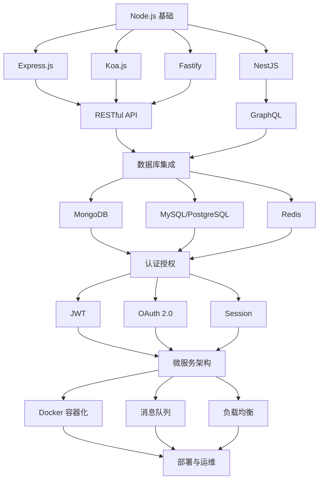

# 后端开发全栈指南

现代后端开发涵盖了从服务器基础、数据库管理到微服务架构的完整技术栈。本模块将深入探讨以 Node.js 为核心的后端技术，同时介绍 Rust 和 Go 等现代后端语言的特色与应用场景。

## 📚 学习路径

### 🟢 Node.js 核心技术栈



### 🦀 Rust vs 🐹 Go 对比

| 特性 | Node.js | Rust | Go |
|------|---------|------|-----|
| **性能** | 中等 (V8引擎) | 极高 (零成本抽象) | 高 (高效编译) |
| **内存管理** | 垃圾回收 | 所有权系统 | 垃圾回收 |
| **开发效率** | 高 (丰富生态) | 中等 (学习曲线陡) | 高 (简洁语法) |
| **并发模型** | 事件循环 | 线程 + async/await | Goroutines |
| **生态系统** | 极其丰富 | 快速发展 | 稳定成熟 |
| **适用场景** | 全栈开发、API服务 | 系统编程、高性能服务 | 云原生、微服务 |

## 🎯 核心主题概览

### 1. Node.js 基础与进阶

#### 🔧 运行时环境
- **V8 引擎原理**: JavaScript 执行机制
- **事件循环**: 单线程异步编程模型
- **模块系统**: CommonJS vs ES Modules
- **Stream API**: 流式数据处理
- **Buffer 处理**: 二进制数据操作
- **文件系统**: 异步文件操作

#### 🚀 性能优化
- **内存管理**: 垃圾回收与内存泄漏检测
- **CPU 密集任务**: Worker Threads 与 Cluster
- **缓存策略**: 内存缓存与分布式缓存
- **代码分析**: Profiling 与性能监控

### 2. Web 框架生态

#### Express.js - 简洁灵活
```javascript
// 中间件生态系统
app.use(helmet()) // 安全头部
app.use(cors()) // 跨域处理
app.use(compression()) // 响应压缩
app.use(express.json()) // JSON 解析
app.use(morgan('combined')) // 访问日志

// 路由设计
app.get('/api/users/:id', async (req, res, next) => {
  try {
    const user = await userService.findById(req.params.id)
    res.json(user)
  } catch (error) {
    next(error)
  }
})
```

#### Koa.js - 洋葱模型
```javascript
// 洋葱圈中间件
app.use(async (ctx, next) => {
  const start = Date.now()
  await next() // 执行下游中间件
  const ms = Date.now() - start
  ctx.set('X-Response-Time', `${ms}ms`)
})

// 现代 async/await
app.use(async ctx => {
  ctx.body = await userService.getUsers()
})
```

#### NestJS - 企业级架构
```typescript
// 依赖注入与装饰器
@Controller('users')
@UseGuards(AuthGuard)
export class UserController {
  constructor(private userService: UserService) {}
  
  @Get(':id')
  @UseInterceptors(TransformInterceptor)
  async findOne(@Param('id') id: string) {
    return this.userService.findOne(id)
  }
}
```

### 3. 数据库技术栈

#### 关系型数据库
- **MySQL/PostgreSQL**: ACID 事务与复杂查询
- **TypeORM/Prisma**: 现代 ORM 解决方案
- **数据库设计**: 范式化与性能优化
- **索引策略**: 查询优化与执行计划

#### NoSQL 数据库
- **MongoDB**: 文档数据库与聚合查询
- **Redis**: 内存数据库与缓存策略
- **数据建模**: 文档结构设计
- **分片集群**: 水平扩展方案

### 4. API 设计与实现

#### RESTful API 最佳实践
```javascript
// 资源命名与HTTP动词
GET    /api/v1/users           // 获取用户列表
POST   /api/v1/users           // 创建用户
GET    /api/v1/users/:id       // 获取特定用户
PUT    /api/v1/users/:id       // 更新用户
DELETE /api/v1/users/:id       // 删除用户

// 响应格式标准化
{
  "data": {...},
  "meta": {
    "page": 1,
    "limit": 20,
    "total": 100
  },
  "links": {
    "self": "/api/v1/users?page=1",
    "next": "/api/v1/users?page=2"
  }
}
```

#### GraphQL 查询语言
```graphql
# 精确数据获取
query GetUserWithPosts($userId: ID!) {
  user(id: $userId) {
    id
    name
    email
    posts(first: 10) {
      edges {
        node {
          id
          title
          publishedAt
        }
      }
    }
  }
}
```

### 5. 认证授权系统

#### JWT (JSON Web Tokens)
```javascript
// Token 生成与验证
const payload = { userId: user.id, role: user.role }
const token = jwt.sign(payload, process.env.JWT_SECRET, { 
  expiresIn: '7d',
  issuer: 'myapp',
  audience: 'myapp-users'
})

// 中间件验证
const authenticateToken = (req, res, next) => {
  const token = req.headers['authorization']?.split(' ')[1]
  
  if (!token) {
    return res.status(401).json({ error: 'Access token required' })
  }
  
  jwt.verify(token, process.env.JWT_SECRET, (err, user) => {
    if (err) return res.status(403).json({ error: 'Invalid token' })
    req.user = user
    next()
  })
}
```

#### OAuth 2.0 集成
```javascript
// Google OAuth 集成
passport.use(new GoogleStrategy({
  clientID: process.env.GOOGLE_CLIENT_ID,
  clientSecret: process.env.GOOGLE_CLIENT_SECRET,
  callbackURL: '/auth/google/callback'
}, async (accessToken, refreshToken, profile, done) => {
  const user = await User.findOrCreate({
    googleId: profile.id,
    email: profile.emails[0].value
  })
  return done(null, user)
}))
```

### 6. 微服务架构

#### 服务拆分策略
```javascript
// 按业务域拆分
const services = {
  userService: {
    port: 3001,
    endpoints: ['/users', '/auth']
  },
  orderService: {
    port: 3002,
    endpoints: ['/orders', '/payments']
  },
  notificationService: {
    port: 3003,
    endpoints: ['/notifications', '/emails']
  }
}

// 服务间通信
const orderCreated = async (orderData) => {
  // 发送到消息队列
  await messageQueue.publish('order.created', orderData)
  
  // HTTP 调用其他服务
  await notificationService.sendOrderConfirmation(orderData.userId)
}
```

#### API Gateway 模式
```javascript
// 网关路由配置
const routes = [
  {
    path: '/api/users/*',
    target: 'http://user-service:3001',
    middleware: [authenticate, rateLimit]
  },
  {
    path: '/api/orders/*',
    target: 'http://order-service:3002',
    middleware: [authenticate, authorize(['user', 'admin'])]
  }
]
```

## 🛠️ 开发工具链

### 代码质量
- **ESLint/Prettier**: 代码风格统一
- **TypeScript**: 类型安全保障
- **Jest/Mocha**: 单元测试框架
- **Supertest**: API 接口测试

### 部署运维
- **Docker**: 容器化部署
- **PM2**: 进程管理
- **Nginx**: 反向代理与负载均衡
- **监控告警**: Prometheus + Grafana

### 开发环境
- **Nodemon**: 热重载开发
- **Debug**: 调试工具
- **Environment**: 环境变量管理
- **Logging**: 结构化日志

## 🎓 学习建议

### 入门路径 (1-2月)
1. **Node.js 基础**: 掌握事件循环、模块系统
2. **Express 框架**: 构建第一个 Web API
3. **数据库连接**: MongoDB 基础操作
4. **认证实现**: JWT 基础应用

### 进阶路径 (3-6月)
1. **框架深入**: Koa、NestJS 架构对比
2. **数据库进阶**: 关系型数据库设计
3. **API 设计**: RESTful 最佳实践
4. **测试驱动**: 单元测试与集成测试

### 高级路径 (6月+)
1. **微服务拆分**: 分布式系统设计
2. **性能优化**: 高并发解决方案
3. **运维部署**: Docker + Kubernetes
4. **架构设计**: 领域驱动设计 (DDD)

---

🚀 **现代后端开发需要全栈思维，从底层原理到架构设计，从单体应用到微服务集群。掌握 Node.js 生态的同时，了解 Rust 和 Go 的特色，能够让你在技术选型时做出更明智的决策！**
