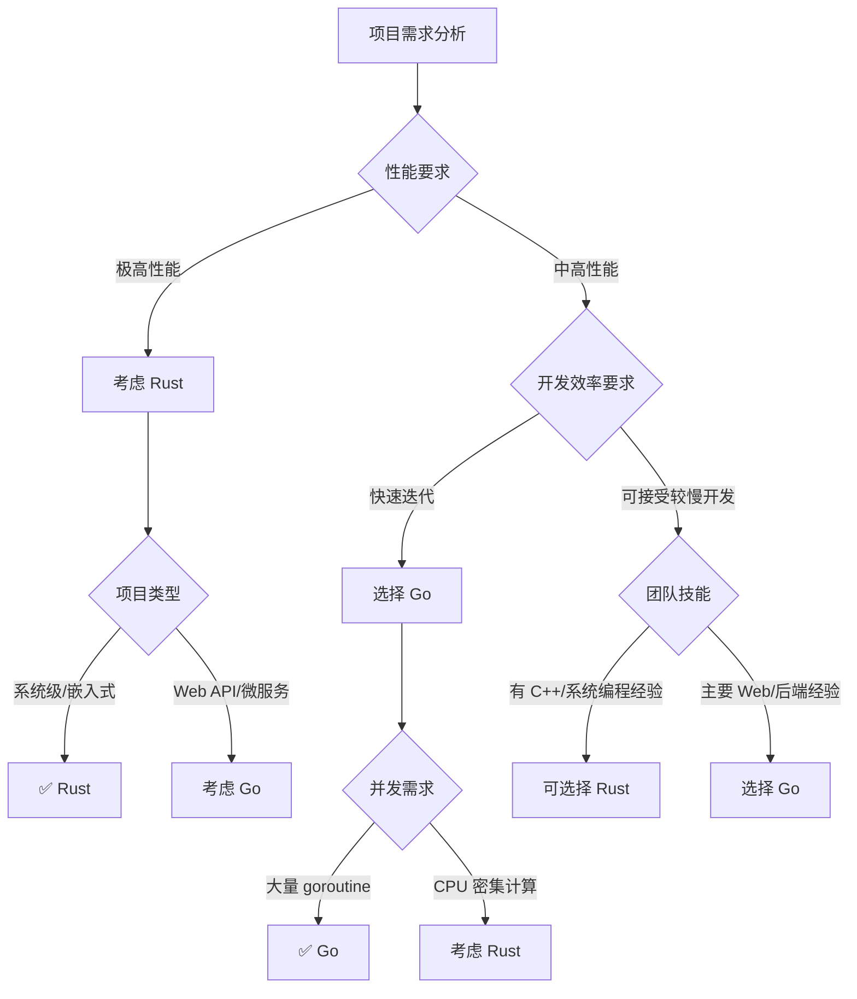

# Rust & Go 现代后端语言对比

随着云原生和高性能计算需求的增长，Rust 和 Go 作为现代系统编程语言获得了广泛关注。本文将深入对比这两种语言的特性、应用场景和最佳实践。

## 🦀 Rust 深度解析

### 核心特性与优势

```rust
// Rust 所有权系统示例
fn main() {
    // 1. 所有权转移
    let s1 = String::from("hello");
    let s2 = s1; // s1 的所有权转移给 s2
    // println!("{}", s1); // 编译错误：s1 已失效

    // 2. 借用（引用）
    let s3 = String::from("world");
    let len = calculate_length(&s3); // 借用 s3
    println!("'{}' 的长度是 {}", s3, len); // s3 仍然有效

    // 3. 可变借用
    let mut s4 = String::from("hello");
    change(&mut s4);
    println!("{}", s4);
}

fn calculate_length(s: &String) -> usize {
    s.len()
} // s 离开作用域，但不会 drop，因为它是借用

fn change(some_string: &mut String) {
    some_string.push_str(", world");
}

// 生命周期注解
fn longest<'a>(x: &'a str, y: &'a str) -> &'a str {
    if x.len() > y.len() {
        x
    } else {
        y
    }
}

// 高性能 Web 服务器示例 (使用 Actix-web)
use actix_web::{web, App, HttpResponse, HttpServer, Result, middleware::Logger};
use serde::{Deserialize, Serialize};
use sqlx::{PgPool, Row};
use std::sync::Arc;

#[derive(Serialize, Deserialize)]
struct User {
    id: i32,
    email: String,
    name: String,
}

#[derive(Deserialize)]
struct CreateUser {
    email: String,
    name: String,
}

// 应用状态
struct AppState {
    db: PgPool,
}

// 处理器函数
async fn get_users(data: web::Data<AppState>) -> Result<HttpResponse> {
    let users = sqlx::query_as!(
        User,
        "SELECT id, email, name FROM users ORDER BY id"
    )
    .fetch_all(&data.db)
    .await
    .map_err(|e| {
        eprintln!("Database error: {}", e);
        actix_web::error::ErrorInternalServerError("Database error")
    })?;

    Ok(HttpResponse::Ok().json(users))
}

async fn create_user(
    user_data: web::Json<CreateUser>,
    data: web::Data<AppState>
) -> Result<HttpResponse> {
    let user = sqlx::query_as!(
        User,
        "INSERT INTO users (email, name) VALUES ($1, $2) RETURNING id, email, name",
        user_data.email,
        user_data.name
    )
    .fetch_one(&data.db)
    .await
    .map_err(|e| {
        eprintln!("Database error: {}", e);
        actix_web::error::ErrorInternalServerError("Failed to create user")
    })?;

    Ok(HttpResponse::Created().json(user))
}

async fn get_user(path: web::Path<i32>, data: web::Data<AppState>) -> Result<HttpResponse> {
    let user_id = path.into_inner();

    let user = sqlx::query_as!(
        User,
        "SELECT id, email, name FROM users WHERE id = $1",
        user_id
    )
    .fetch_optional(&data.db)
    .await
    .map_err(|e| {
        eprintln!("Database error: {}", e);
        actix_web::error::ErrorInternalServerError("Database error")
    })?;

    match user {
        Some(user) => Ok(HttpResponse::Ok().json(user)),
        None => Ok(HttpResponse::NotFound().json(serde_json::json!({
            "error": "User not found"
        })))
    }
}

// 自定义错误处理
use actix_web::{error::ResponseError, http::StatusCode};
use std::fmt;

#[derive(Debug)]
enum ApiError {
    DatabaseError(sqlx::Error),
    ValidationError(String),
    NotFound(String),
}

impl fmt::Display for ApiError {
    fn fmt(&self, f: &mut fmt::Formatter<'_>) -> fmt::Result {
        match self {
            ApiError::DatabaseError(e) => write!(f, "Database error: {}", e),
            ApiError::ValidationError(e) => write!(f, "Validation error: {}", e),
            ApiError::NotFound(e) => write!(f, "Not found: {}", e),
        }
    }
}

impl ResponseError for ApiError {
    fn status_code(&self) -> StatusCode {
        match self {
            ApiError::DatabaseError(_) => StatusCode::INTERNAL_SERVER_ERROR,
            ApiError::ValidationError(_) => StatusCode::BAD_REQUEST,
            ApiError::NotFound(_) => StatusCode::NOT_FOUND,
        }
    }
}

// 主函数
#[actix_web::main]
async fn main() -> std::io::Result<()> {
    env_logger::init();

    // 数据库连接池
    let database_url = std::env::var("DATABASE_URL")
        .expect("DATABASE_URL must be set");

    let pool = PgPool::connect(&database_url)
        .await
        .expect("Failed to connect to database");

    // 启动服务器
    HttpServer::new(move || {
        App::new()
            .app_data(web::Data::new(AppState {
                db: pool.clone(),
            }))
            .wrap(Logger::default())
            .service(
                web::scope("/api/v1")
                    .route("/users", web::get().to(get_users))
                    .route("/users", web::post().to(create_user))
                    .route("/users/{id}", web::get().to(get_user))
            )
    })
    .bind("127.0.0.1:8080")?
    .run()
    .await
}

// 并发处理示例
use tokio::sync::{mpsc, RwLock};
use std::collections::HashMap;
use std::sync::Arc;

// 高性能缓存
type Cache = Arc<RwLock<HashMap<String, String>>>;

async fn cache_worker(mut receiver: mpsc::Receiver<(String, String)>, cache: Cache) {
    while let Some((key, value)) = receiver.recv().await {
        let mut cache_guard = cache.write().await;
        cache_guard.insert(key, value);
    }
}

async fn concurrent_example() {
    let (sender, receiver) = mpsc::channel(100);
    let cache: Cache = Arc::new(RwLock::new(HashMap::new()));

    // 启动缓存工作器
    let cache_clone = Arc::clone(&cache);
    tokio::spawn(async move {
        cache_worker(receiver, cache_clone).await;
    });

    // 并发写入缓存
    let handles: Vec<_> = (0..10).map(|i| {
        let sender = sender.clone();
        tokio::spawn(async move {
            sender.send((format!("key{}", i), format!("value{}", i))).await.unwrap();
        })
    }).collect();

    // 等待所有任务完成
    for handle in handles {
        handle.await.unwrap();
    }

    // 读取缓存
    let cache_guard = cache.read().await;
    println!("Cache size: {}", cache_guard.len());
}
```

## 🐹 Go 语言实战

### 简洁的并发模型

```go
package main

import (
    "context"
    "database/sql"
    "encoding/json"
    "fmt"
    "log"
    "net/http"
    "strconv"
    "sync"
    "time"

    "github.com/gorilla/mux"
    "github.com/lib/pq"
    _ "github.com/lib/pq"
)

// 数据模型
type User struct {
    ID    int    `json:"id"`
    Email string `json:"email"`
    Name  string `json:"name"`
}

type CreateUserRequest struct {
    Email string `json:"email"`
    Name  string `json:"name"`
}

// 数据库接口
type UserRepository interface {
    GetAll(ctx context.Context) ([]User, error)
    GetByID(ctx context.Context, id int) (*User, error)
    Create(ctx context.Context, user CreateUserRequest) (*User, error)
    Update(ctx context.Context, id int, user CreateUserRequest) (*User, error)
    Delete(ctx context.Context, id int) error
}

// PostgreSQL 实现
type PostgresUserRepository struct {
    db *sql.DB
}

func NewPostgresUserRepository(db *sql.DB) *PostgresUserRepository {
    return &PostgresUserRepository{db: db}
}

func (r *PostgresUserRepository) GetAll(ctx context.Context) ([]User, error) {
    query := "SELECT id, email, name FROM users ORDER BY id"
    rows, err := r.db.QueryContext(ctx, query)
    if err != nil {
        return nil, fmt.Errorf("failed to query users: %w", err)
    }
    defer rows.Close()

    var users []User
    for rows.Next() {
        var user User
        if err := rows.Scan(&user.ID, &user.Email, &user.Name); err != nil {
            return nil, fmt.Errorf("failed to scan user: %w", err)
        }
        users = append(users, user)
    }

    return users, nil
}

func (r *PostgresUserRepository) GetByID(ctx context.Context, id int) (*User, error) {
    query := "SELECT id, email, name FROM users WHERE id = $1"
    row := r.db.QueryRowContext(ctx, query, id)

    var user User
    err := row.Scan(&user.ID, &user.Email, &user.Name)
    if err != nil {
        if err == sql.ErrNoRows {
            return nil, nil
        }
        return nil, fmt.Errorf("failed to get user: %w", err)
    }

    return &user, nil
}

func (r *PostgresUserRepository) Create(ctx context.Context, req CreateUserRequest) (*User, error) {
    query := "INSERT INTO users (email, name) VALUES ($1, $2) RETURNING id, email, name"
    row := r.db.QueryRowContext(ctx, query, req.Email, req.Name)

    var user User
    err := row.Scan(&user.ID, &user.Email, &user.Name)
    if err != nil {
        return nil, fmt.Errorf("failed to create user: %w", err)
    }

    return &user, nil
}

// HTTP 处理器
type UserHandler struct {
    repo UserRepository
}

func NewUserHandler(repo UserRepository) *UserHandler {
    return &UserHandler{repo: repo}
}

func (h *UserHandler) GetUsers(w http.ResponseWriter, r *http.Request) {
    ctx := r.Context()

    users, err := h.repo.GetAll(ctx)
    if err != nil {
        http.Error(w, "Internal server error", http.StatusInternalServerError)
        log.Printf("Failed to get users: %v", err)
        return
    }

    w.Header().Set("Content-Type", "application/json")
    json.NewEncoder(w).Encode(map[string]interface{}{
        "data": users,
    })
}

func (h *UserHandler) GetUser(w http.ResponseWriter, r *http.Request) {
    vars := mux.Vars(r)
    id, err := strconv.Atoi(vars["id"])
    if err != nil {
        http.Error(w, "Invalid user ID", http.StatusBadRequest)
        return
    }

    ctx := r.Context()
    user, err := h.repo.GetByID(ctx, id)
    if err != nil {
        http.Error(w, "Internal server error", http.StatusInternalServerError)
        log.Printf("Failed to get user: %v", err)
        return
    }

    if user == nil {
        http.Error(w, "User not found", http.StatusNotFound)
        return
    }

    w.Header().Set("Content-Type", "application/json")
    json.NewEncoder(w).Encode(map[string]interface{}{
        "data": user,
    })
}

func (h *UserHandler) CreateUser(w http.ResponseWriter, r *http.Request) {
    var req CreateUserRequest
    if err := json.NewDecoder(r.Body).Decode(&req); err != nil {
        http.Error(w, "Invalid request body", http.StatusBadRequest)
        return
    }

    // 简单验证
    if req.Email == "" || req.Name == "" {
        http.Error(w, "Email and name are required", http.StatusBadRequest)
        return
    }

    ctx := r.Context()
    user, err := h.repo.Create(ctx, req)
    if err != nil {
        http.Error(w, "Internal server error", http.StatusInternalServerError)
        log.Printf("Failed to create user: %v", err)
        return
    }

    w.Header().Set("Content-Type", "application/json")
    w.WriteHeader(http.StatusCreated)
    json.NewEncoder(w).Encode(map[string]interface{}{
        "data": user,
    })
}

// 中间件
func LoggingMiddleware(next http.Handler) http.Handler {
    return http.HandlerFunc(func(w http.ResponseWriter, r *http.Request) {
        start := time.Now()

        // 包装 ResponseWriter 以捕获状态码
        wrapped := &responseWriter{ResponseWriter: w, statusCode: http.StatusOK}

        next.ServeHTTP(wrapped, r)

        log.Printf("%s %s %d %v", r.Method, r.URL.Path, wrapped.statusCode, time.Since(start))
    })
}

type responseWriter struct {
    http.ResponseWriter
    statusCode int
}

func (rw *responseWriter) WriteHeader(code int) {
    rw.statusCode = code
    rw.ResponseWriter.WriteHeader(code)
}

// Goroutine 池示例
type WorkerPool struct {
    workers    int
    jobQueue   chan Job
    workerPool chan chan Job
    quit       chan bool
    wg         sync.WaitGroup
}

type Job struct {
    ID      int
    Payload interface{}
    Result  chan interface{}
}

func NewWorkerPool(workers int, queueSize int) *WorkerPool {
    return &WorkerPool{
        workers:    workers,
        jobQueue:   make(chan Job, queueSize),
        workerPool: make(chan chan Job, workers),
        quit:       make(chan bool),
    }
}

func (wp *WorkerPool) Start() {
    for i := 0; i < wp.workers; i++ {
        worker := NewWorker(wp.workerPool, wp.quit)
        worker.Start()
    }

    go wp.dispatch()
}

func (wp *WorkerPool) dispatch() {
    for {
        select {
        case job := <-wp.jobQueue:
            // 获取可用的 worker
            worker := <-wp.workerPool
            worker <- job
        case <-wp.quit:
            return
        }
    }
}

func (wp *WorkerPool) Submit(job Job) {
    wp.jobQueue <- job
}

func (wp *WorkerPool) Stop() {
    close(wp.quit)
    wp.wg.Wait()
}

type Worker struct {
    workerPool chan chan Job
    jobChannel chan Job
    quit       chan bool
}

func NewWorker(workerPool chan chan Job, quit chan bool) *Worker {
    return &Worker{
        workerPool: workerPool,
        jobChannel: make(chan Job),
        quit:       quit,
    }
}

func (w *Worker) Start() {
    go func() {
        for {
            // 将自己加入工作池
            w.workerPool <- w.jobChannel

            select {
            case job := <-w.jobChannel:
                // 处理任务
                result := w.processJob(job)
                job.Result <- result

            case <-w.quit:
                return
            }
        }
    }()
}

func (w *Worker) processJob(job Job) interface{} {
    // 模拟工作
    time.Sleep(time.Millisecond * 100)
    return fmt.Sprintf("Processed job %d", job.ID)
}

// 优雅关闭
func gracefulShutdown(server *http.Server) {
    quit := make(chan os.Signal, 1)
    signal.Notify(quit, syscall.SIGINT, syscall.SIGTERM)

    <-quit
    log.Println("Shutting down server...")

    ctx, cancel := context.WithTimeout(context.Background(), 30*time.Second)
    defer cancel()

    if err := server.Shutdown(ctx); err != nil {
        log.Fatal("Server forced to shutdown:", err)
    }

    log.Println("Server exiting")
}

// 主函数
func main() {
    // 数据库连接
    db, err := sql.Open("postgres", os.Getenv("DATABASE_URL"))
    if err != nil {
        log.Fatal("Failed to connect to database:", err)
    }
    defer db.Close()

    // 初始化仓库和处理器
    userRepo := NewPostgresUserRepository(db)
    userHandler := NewUserHandler(userRepo)

    // 路由设置
    r := mux.NewRouter()
    r.Use(LoggingMiddleware)

    api := r.PathPrefix("/api/v1").Subrouter()
    api.HandleFunc("/users", userHandler.GetUsers).Methods("GET")
    api.HandleFunc("/users", userHandler.CreateUser).Methods("POST")
    api.HandleFunc("/users/{id:[0-9]+}", userHandler.GetUser).Methods("GET")

    // 健康检查
    r.HandleFunc("/health", func(w http.ResponseWriter, r *http.Request) {
        w.Header().Set("Content-Type", "application/json")
        json.NewEncoder(w).Encode(map[string]string{
            "status": "healthy",
            "time":   time.Now().Format(time.RFC3339),
        })
    })

    // 启动工作池
    workerPool := NewWorkerPool(10, 100)
    workerPool.Start()
    defer workerPool.Stop()

    // 启动服务器
    server := &http.Server{
        Addr:    ":8080",
        Handler: r,
        ReadTimeout:  15 * time.Second,
        WriteTimeout: 15 * time.Second,
        IdleTimeout:  60 * time.Second,
    }

    go gracefulShutdown(server)

    log.Println("Server starting on :8080")
    if err := server.ListenAndServe(); err != nil && err != http.ErrServerClosed {
        log.Fatal("Server failed to start:", err)
    }
}
```

## 📊 性能与特性对比

### 基准测试对比

```bash
# Rust 性能测试
cargo bench

# Go 性能测试
go test -bench=. -benchmem

# 内存使用对比
echo "=== Rust 内存使用 ==="
valgrind --tool=massif ./target/release/rust_server

echo "=== Go 内存使用 ==="
go build -o go_server main.go
valgrind --tool=massif ./go_server
```

### 详细特性对比表

| 特性维度       | Rust       | Go         | 评价                                  |
| -------------- | ---------- | ---------- | ------------------------------------- |
| **性能**       | ⭐⭐⭐⭐⭐ | ⭐⭐⭐⭐   | Rust 零成本抽象，Go GC 带来轻微开销   |
| **内存安全**   | ⭐⭐⭐⭐⭐ | ⭐⭐⭐     | Rust 编译时保证，Go 运行时检查        |
| **并发模型**   | ⭐⭐⭐⭐   | ⭐⭐⭐⭐⭐ | Rust async/await，Go goroutine 更简洁 |
| **学习曲线**   | ⭐⭐       | ⭐⭐⭐⭐   | Rust 概念复杂，Go 语法简单            |
| **开发效率**   | ⭐⭐⭐     | ⭐⭐⭐⭐⭐ | Go 编译快，开发迭代快                 |
| **生态系统**   | ⭐⭐⭐     | ⭐⭐⭐⭐   | Go 生态更成熟，Rust 快速发展          |
| **部署简便性** | ⭐⭐⭐⭐   | ⭐⭐⭐⭐⭐ | 都是单文件部署，Go 交叉编译更方便     |
| **错误处理**   | ⭐⭐⭐⭐   | ⭐⭐⭐     | Rust Result 类型，Go 显式错误检查     |

## 🎯 应用场景选择指南

### Rust 适用场景

```rust
// 1. 系统级编程
// 操作系统、驱动程序、嵌入式系统

// 2. 高性能计算
use rayon::prelude::*;

fn parallel_computation(data: Vec<i32>) -> i32 {
    data.par_iter()
        .map(|&x| x * x)
        .sum()
}

// 3. 区块链和加密货币
use sha2::{Sha256, Digest};

fn calculate_hash(data: &str) -> String {
    let mut hasher = Sha256::new();
    hasher.update(data);
    format!("{:x}", hasher.finalize())
}

// 4. WebAssembly 应用
use wasm_bindgen::prelude::*;

#[wasm_bindgen]
pub fn fibonacci(n: u32) -> u32 {
    if n <= 1 {
        n
    } else {
        fibonacci(n - 1) + fibonacci(n - 2)
    }
}

// 5. 数据库和存储引擎
// 如 TiKV, Sled 等
```

### Go 适用场景

```go
// 1. 微服务架构
func main() {
    // 服务发现、负载均衡、API 网关等
}

// 2. 云原生应用
// Kubernetes, Docker, Terraform 等都用 Go 开发

// 3. 网络服务和 API
func apiServer() {
    // RESTful API, gRPC 服务等
}

// 4. DevOps 工具
func deploymentTool() {
    // CI/CD 工具、监控系统、日志收集等
}

// 5. 分布式系统
func distributedService() {
    // etcd, Consul, NATS 等
}
```

### 技术选型决策树



## 🚀 最佳实践建议

### Rust 项目结构

```
my-rust-api/
├── Cargo.toml
├── src/
│   ├── main.rs
│   ├── lib.rs
│   ├── handlers/
│   │   ├── mod.rs
│   │   └── users.rs
│   ├── models/
│   │   ├── mod.rs
│   │   └── user.rs
│   ├── repository/
│   │   ├── mod.rs
│   │   └── postgres.rs
│   └── utils/
│       ├── mod.rs
│       └── error.rs
├── migrations/
├── tests/
└── benches/
```

### Go 项目结构

```
my-go-api/
├── go.mod
├── go.sum
├── main.go
├── cmd/
│   └── server/
├── internal/
│   ├── handlers/
│   ├── models/
│   ├── repository/
│   └── middleware/
├── pkg/
│   └── utils/
├── migrations/
├── deployments/
└── tests/
```

---

🌟 **Rust 和 Go 都是优秀的现代后端语言。Rust 以内存安全和极致性能著称，适合系统级编程和性能敏感应用；Go 以简洁语法和高效并发模型闻名，适合云原生和微服务架构。选择哪种语言应该基于项目需求、团队技能和长期维护考虑！**
