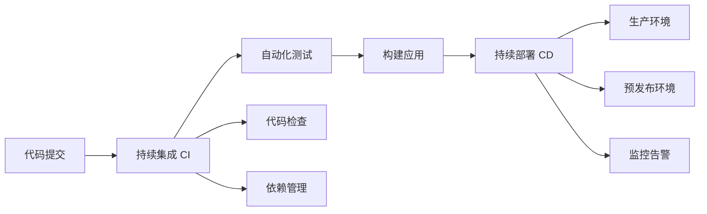

# CI/CD 完全指南：GitHub Actions 与 Jenkins 深度解析

持续集成/持续部署（CI/CD）是现代软件开发的核心实践。本文深入解析两大主流 CI/CD 平台：GitHub Actions 和 Jenkins 的原理、配置和最佳实践。

## 🎯 CI/CD 基础概念

### 什么是 CI/CD



### CI/CD 核心价值

- **提高代码质量**：自动化测试和代码检查
- **加速交付速度**：自动化构建和部署流程
- **降低部署风险**：标准化部署流程和回滚机制
- **提升开发效率**：减少手动操作和重复工作

## 🚀 GitHub Actions 深度解析

### GitHub Actions 架构原理

```yaml
# .github/workflows/comprehensive-ci.yml
name: 🚀 Comprehensive CI/CD Pipeline

on:
  push:
    branches: [main, develop]
  pull_request:
    branches: [main]
  schedule:
    # 每天凌晨 2 点执行
    - cron: "0 2 * * *"
  workflow_dispatch:
    inputs:
      environment:
        description: "Deployment environment"
        required: true
        default: "staging"
        type: choice
        options:
          - staging
          - production

env:
  NODE_VERSION: "18"
  DOCKER_REGISTRY: ghcr.io
  IMAGE_NAME: ${{ github.repository }}

jobs:
  # 1. 代码质量检查
  code-quality:
    name: 📋 Code Quality Analysis
    runs-on: ubuntu-latest

    steps:
      - name: 📥 Checkout Code
        uses: actions/checkout@v4
        with:
          fetch-depth: 0

      - name: 🔧 Setup Node.js
        uses: actions/setup-node@v4
        with:
          node-version: ${{ env.NODE_VERSION }}
          cache: "npm"

      - name: 📦 Install Dependencies
        run: npm ci

      - name: 🔍 ESLint Check
        run: npm run lint

      - name: 🎨 Prettier Check
        run: npm run format:check

      - name: 🔒 Security Audit
        run: npm audit --audit-level high

      - name: 📊 SonarCloud Scan
        uses: SonarSource/sonarcloud-github-action@master
        env:
          GITHUB_TOKEN: ${{ secrets.GITHUB_TOKEN }}
          SONAR_TOKEN: ${{ secrets.SONAR_TOKEN }}

      - name: 📈 Upload Coverage to Codecov
        uses: codecov/codecov-action@v3
        with:
          token: ${{ secrets.CODECOV_TOKEN }}
          file: ./coverage/lcov.info

  # 2. 多环境测试
  test-matrix:
    name: 🧪 Test Suite
    runs-on: ${{ matrix.os }}
    needs: code-quality

    strategy:
      matrix:
        os: [ubuntu-latest, windows-latest, macos-latest]
        node-version: [16, 18, 20]
        exclude:
          - os: windows-latest
            node-version: 16

    steps:
      - name: 📥 Checkout Code
        uses: actions/checkout@v4

      - name: 🔧 Setup Node.js ${{ matrix.node-version }}
        uses: actions/setup-node@v4
        with:
          node-version: ${{ matrix.node-version }}
          cache: "npm"

      - name: 📦 Install Dependencies
        run: npm ci

      - name: 🧪 Run Unit Tests
        run: npm run test:unit

      - name: 🔗 Run Integration Tests
        run: npm run test:integration
        env:
          DATABASE_URL: ${{ secrets.DATABASE_URL }}
          REDIS_URL: ${{ secrets.REDIS_URL }}

      - name: 🌐 Run E2E Tests
        run: npm run test:e2e
        env:
          PLAYWRIGHT_BROWSERS_PATH: 0

      - name: 📊 Generate Test Report
        uses: dorny/test-reporter@v1
        if: success() || failure()
        with:
          name: Test Results (${{ matrix.os }}, Node ${{ matrix.node-version }})
          path: "test-results/*.xml"
          reporter: jest-junit

  # 3. 构建和打包
  build:
    name: 🏗️ Build Application
    runs-on: ubuntu-latest
    needs: test-matrix

    outputs:
      version: ${{ steps.version.outputs.version }}
      build-number: ${{ steps.version.outputs.build-number }}

    steps:
      - name: 📥 Checkout Code
        uses: actions/checkout@v4

      - name: 🔧 Setup Node.js
        uses: actions/setup-node@v4
        with:
          node-version: ${{ env.NODE_VERSION }}
          cache: "npm"

      - name: 📦 Install Dependencies
        run: npm ci

      - name: 🏷️ Generate Version
        id: version
        run: |
          VERSION=$(node -p "require('./package.json').version")
          BUILD_NUMBER=${{ github.run_number }}
          echo "version=${VERSION}" >> $GITHUB_OUTPUT
          echo "build-number=${BUILD_NUMBER}" >> $GITHUB_OUTPUT
          echo "::notice::Building version ${VERSION}-${BUILD_NUMBER}"

      - name: 🏗️ Build Application
        run: npm run build
        env:
          NODE_ENV: production
          VERSION: ${{ steps.version.outputs.version }}
          BUILD_NUMBER: ${{ steps.version.outputs.build-number }}

      - name: 📦 Create Build Archive
        run: |
          tar -czf build-${{ steps.version.outputs.version }}.tar.gz dist/
          ls -la build-*.tar.gz

      - name: 📤 Upload Build Artifacts
        uses: actions/upload-artifact@v3
        with:
          name: build-artifacts
          path: |
            build-*.tar.gz
            dist/
          retention-days: 30

  # 4. Docker 镜像构建
  docker-build:
    name: 🐳 Docker Build & Push
    runs-on: ubuntu-latest
    needs: build
    if: github.event_name == 'push' || github.event_name == 'workflow_dispatch'

    permissions:
      contents: read
      packages: write

    steps:
      - name: 📥 Checkout Code
        uses: actions/checkout@v4

      - name: 📥 Download Build Artifacts
        uses: actions/download-artifact@v3
        with:
          name: build-artifacts

      - name: 🔑 Login to Container Registry
        uses: docker/login-action@v3
        with:
          registry: ${{ env.DOCKER_REGISTRY }}
          username: ${{ github.actor }}
          password: ${{ secrets.GITHUB_TOKEN }}

      - name: 🏷️ Extract Metadata
        id: meta
        uses: docker/metadata-action@v5
        with:
          images: ${{ env.DOCKER_REGISTRY }}/${{ env.IMAGE_NAME }}
          tags: |
            type=ref,event=branch
            type=ref,event=pr
            type=semver,pattern={{version}}
            type=semver,pattern={{major}}.{{minor}}
            type=raw,value=latest,enable={{is_default_branch}}

      - name: 🔨 Set up Docker Buildx
        uses: docker/setup-buildx-action@v3

      - name: 🐳 Build and Push Docker Image
        uses: docker/build-push-action@v5
        with:
          context: .
          push: true
          tags: ${{ steps.meta.outputs.tags }}
          labels: ${{ steps.meta.outputs.labels }}
          cache-from: type=gha
          cache-to: type=gha,mode=max
          build-args: |
            VERSION=${{ needs.build.outputs.version }}
            BUILD_NUMBER=${{ needs.build.outputs.build-number }}

  # 5. 安全扫描
  security-scan:
    name: 🔒 Security Scanning
    runs-on: ubuntu-latest
    needs: docker-build

    steps:
      - name: 📥 Checkout Code
        uses: actions/checkout@v4

      - name: 🔍 Run Trivy Vulnerability Scanner
        uses: aquasecurity/trivy-action@master
        with:
          image-ref: ${{ env.DOCKER_REGISTRY }}/${{ env.IMAGE_NAME }}:latest
          format: "sarif"
          output: "trivy-results.sarif"

      - name: 📤 Upload Trivy Scan Results
        uses: github/codeql-action/upload-sarif@v2
        with:
          sarif_file: "trivy-results.sarif"

      - name: 🔐 OWASP Dependency Check
        uses: dependency-check/Dependency-Check_Action@main
        with:
          project: "my-project"
          path: "."
          format: "ALL"

      - name: 📤 Upload OWASP Results
        uses: actions/upload-artifact@v3
        with:
          name: dependency-check-report
          path: reports/

  # 6. 部署到预发布环境
  deploy-staging:
    name: 🚀 Deploy to Staging
    runs-on: ubuntu-latest
    needs: [build, docker-build, security-scan]
    if: github.ref == 'refs/heads/develop' || github.event.inputs.environment == 'staging'

    environment:
      name: staging
      url: https://staging.example.com

    steps:
      - name: 📥 Checkout Code
        uses: actions/checkout@v4

      - name: ⚙️ Configure AWS Credentials
        uses: aws-actions/configure-aws-credentials@v4
        with:
          aws-access-key-id: ${{ secrets.AWS_ACCESS_KEY_ID }}
          aws-secret-access-key: ${{ secrets.AWS_SECRET_ACCESS_KEY }}
          aws-region: us-east-1

      - name: 🚀 Deploy to ECS
        run: |
          aws ecs update-service \
            --cluster staging-cluster \
            --service my-app-service \
            --force-new-deployment

      - name: ⏳ Wait for Deployment
        run: |
          aws ecs wait services-stable \
            --cluster staging-cluster \
            --services my-app-service

      - name: 🔍 Health Check
        run: |
          curl -f https://staging.example.com/health || exit 1

      - name: 📨 Notify Slack
        uses: 8398a7/action-slack@v3
        with:
          status: ${{ job.status }}
          channel: "#deployments"
          webhook_url: ${{ secrets.SLACK_WEBHOOK }}

  # 7. 生产环境部署
  deploy-production:
    name: 🌟 Deploy to Production
    runs-on: ubuntu-latest
    needs: [build, docker-build, security-scan]
    if: github.ref == 'refs/heads/main' || github.event.inputs.environment == 'production'

    environment:
      name: production
      url: https://example.com

    steps:
      - name: 📥 Checkout Code
        uses: actions/checkout@v4

      - name: ⚙️ Configure AWS Credentials
        uses: aws-actions/configure-aws-credentials@v4
        with:
          aws-access-key-id: ${{ secrets.AWS_ACCESS_KEY_ID }}
          aws-secret-access-key: ${{ secrets.AWS_SECRET_ACCESS_KEY }}
          aws-region: us-east-1

      - name: 🎯 Blue-Green Deployment
        run: |
          # 获取当前活跃的目标组
          CURRENT_TG=$(aws elbv2 describe-listeners \
            --load-balancer-arn ${{ secrets.ALB_ARN }} \
            --query 'Listeners[0].DefaultActions[0].TargetGroupArn' \
            --output text)

          # 确定蓝绿部署的目标组
          if [[ $CURRENT_TG == *"blue"* ]]; then
            NEW_TG=${{ secrets.GREEN_TARGET_GROUP_ARN }}
            OLD_TG=${{ secrets.BLUE_TARGET_GROUP_ARN }}
          else
            NEW_TG=${{ secrets.BLUE_TARGET_GROUP_ARN }}
            OLD_TG=${{ secrets.GREEN_TARGET_GROUP_ARN }}
          fi

          echo "Deploying to target group: $NEW_TG"

          # 更新 ECS 服务
          aws ecs update-service \
            --cluster production-cluster \
            --service my-app-service \
            --task-definition my-app:latest

          # 等待服务稳定
          aws ecs wait services-stable \
            --cluster production-cluster \
            --services my-app-service

          # 切换负载均衡器流量
          aws elbv2 modify-listener \
            --listener-arn ${{ secrets.LISTENER_ARN }} \
            --default-actions Type=forward,TargetGroupArn=$NEW_TG

      - name: 🔍 Production Health Check
        run: |
          for i in {1..10}; do
            if curl -f https://example.com/health; then
              echo "Health check passed"
              break
            fi
            echo "Health check failed, attempt $i/10"
            sleep 30
          done

      - name: 📊 Update Deployment Metrics
        run: |
          curl -X POST "https://api.datadog.com/api/v1/events" \
            -H "Content-Type: application/json" \
            -H "DD-API-KEY: ${{ secrets.DATADOG_API_KEY }}" \
            -d '{
              "title": "Production Deployment Successful",
              "text": "Version ${{ needs.build.outputs.version }} deployed to production",
              "tags": ["deployment", "production", "success"]
            }'

  # 8. 性能测试
  performance-test:
    name: ⚡ Performance Testing
    runs-on: ubuntu-latest
    needs: deploy-staging

    steps:
      - name: 📥 Checkout Code
        uses: actions/checkout@v4

      - name: 🔧 Setup Node.js
        uses: actions/setup-node@v4
        with:
          node-version: ${{ env.NODE_VERSION }}

      - name: 📦 Install K6
        run: |
          sudo gpg -k
          sudo gpg --no-default-keyring --keyring /usr/share/keyrings/k6-archive-keyring.gpg --keyserver hkp://keyserver.ubuntu.com:80 --recv-keys C5AD17C747E3415A3642D57D77C6C491D6AC1D69
          echo "deb [signed-by=/usr/share/keyrings/k6-archive-keyring.gpg] https://dl.k6.io/deb stable main" | sudo tee /etc/apt/sources.list.d/k6.list
          sudo apt-get update
          sudo apt-get install k6

      - name: 🚀 Run Load Test
        run: |
          k6 run --out json=results.json scripts/load-test.js

      - name: 📊 Analyze Performance Results
        run: |
          node scripts/analyze-performance.js results.json

      - name: 📤 Upload Performance Report
        uses: actions/upload-artifact@v3
        with:
          name: performance-report
          path: |
            results.json
            performance-report.html

  # 9. 通知和清理
  notify-and-cleanup:
    name: 📢 Notification & Cleanup
    runs-on: ubuntu-latest
    needs: [deploy-staging, deploy-production, performance-test]
    if: always()

    steps:
      - name: 📊 Collect Job Status
        id: job-status
        run: |
          echo "staging-status=${{ needs.deploy-staging.result }}" >> $GITHUB_OUTPUT
          echo "production-status=${{ needs.deploy-production.result }}" >> $GITHUB_OUTPUT
          echo "performance-status=${{ needs.performance-test.result }}" >> $GITHUB_OUTPUT

      - name: 📧 Send Email Notification
        uses: dawidd6/action-send-mail@v3
        with:
          server_address: smtp.gmail.com
          server_port: 587
          username: ${{ secrets.EMAIL_USERNAME }}
          password: ${{ secrets.EMAIL_PASSWORD }}
          subject: "CI/CD Pipeline Results - ${{ github.repository }}"
          body: |
            CI/CD Pipeline completed for commit ${{ github.sha }}

            Results:
            - Staging Deployment: ${{ steps.job-status.outputs.staging-status }}
            - Production Deployment: ${{ steps.job-status.outputs.production-status }}
            - Performance Test: ${{ steps.job-status.outputs.performance-status }}

            View details: ${{ github.server_url }}/${{ github.repository }}/actions/runs/${{ github.run_id }}
          to: devops@example.com
          from: ci-cd@example.com

      - name: 🧹 Cleanup Old Artifacts
        run: |
          echo "Cleaning up artifacts older than 30 days..."
          # 这里可以添加清理逻辑
```

### GitHub Actions 高级特性

#### 1. 可重用工作流

```yaml
# .github/workflows/reusable-build.yml
name: Reusable Build Workflow

on:
  workflow_call:
    inputs:
      node-version:
        required: true
        type: string
      environment:
        required: true
        type: string
    outputs:
      build-version:
        description: "Built application version"
        value: ${{ jobs.build.outputs.version }}
    secrets:
      NPM_TOKEN:
        required: true

jobs:
  build:
    runs-on: ubuntu-latest
    outputs:
      version: ${{ steps.version.outputs.version }}

    steps:
      - uses: actions/checkout@v4

      - name: Setup Node.js
        uses: actions/setup-node@v4
        with:
          node-version: ${{ inputs.node-version }}
          registry-url: "https://registry.npmjs.org"

      - name: Install dependencies
        run: npm ci
        env:
          NODE_AUTH_TOKEN: ${{ secrets.NPM_TOKEN }}

      - name: Build for ${{ inputs.environment }}
        run: npm run build:${{ inputs.environment }}

      - name: Get version
        id: version
        run: echo "version=$(npm version --json | jq -r '.version')" >> $GITHUB_OUTPUT
```

#### 2. 自定义 Actions

```javascript
// .github/actions/setup-project/action.yml
name: 'Setup Project Environment'
description: 'Setup Node.js and install dependencies with caching'

inputs:
  node-version:
    description: 'Node.js version to use'
    required: true
    default: '18'
  cache-dependency-path:
    description: 'Path to dependency file for cache key'
    required: false
    default: 'package-lock.json'

outputs:
  cache-hit:
    description: 'Whether cache was hit'
    value: ${{ steps.cache.outputs.cache-hit }}

runs:
  using: 'composite'
  steps:
    - name: Setup Node.js
      uses: actions/setup-node@v4
      with:
        node-version: ${{ inputs.node-version }}

    - name: Cache dependencies
      id: cache
      uses: actions/cache@v3
      with:
        path: ~/.npm
        key: ${{ runner.os }}-node-${{ hashFiles(inputs.cache-dependency-path) }}
        restore-keys: |
          ${{ runner.os }}-node-

    - name: Install dependencies
      shell: bash
      run: |
        if [ "${{ steps.cache.outputs.cache-hit }}" != "true" ]; then
          npm ci
        else
          echo "Dependencies restored from cache"
        fi
```

#### 3. 矩阵策略和动态矩阵

```yaml
name: Dynamic Matrix Testing

on: [push]

jobs:
  generate-matrix:
    runs-on: ubuntu-latest
    outputs:
      matrix: ${{ steps.generate.outputs.matrix }}

    steps:
      - uses: actions/checkout@v4

      - name: Generate test matrix
        id: generate
        run: |
          # 动态生成测试矩阵
          MATRIX=$(cat << EOF
          {
            "include": [
              {
                "os": "ubuntu-latest",
                "node": "16",
                "env": "development"
              },
              {
                "os": "ubuntu-latest", 
                "node": "18",
                "env": "production"
              },
              {
                "os": "macos-latest",
                "node": "18", 
                "env": "production"
              }
            ]
          }
          EOF
          )
          echo "matrix=$MATRIX" >> $GITHUB_OUTPUT

  test:
    needs: generate-matrix
    runs-on: ${{ matrix.os }}

    strategy:
      matrix: ${{ fromJSON(needs.generate-matrix.outputs.matrix) }}

    steps:
      - uses: actions/checkout@v4

      - name: Setup Node.js ${{ matrix.node }}
        uses: actions/setup-node@v4
        with:
          node-version: ${{ matrix.node }}

      - name: Run tests in ${{ matrix.env }} environment
        run: npm run test:${{ matrix.env }}
```

## 🔧 Jenkins 深度解析

### Jenkins 架构和核心概念

```groovy
// Jenkinsfile - 声明式 Pipeline
pipeline {
    agent {
        kubernetes {
            yaml """
                apiVersion: v1
                kind: Pod
                spec:
                  containers:
                  - name: node
                    image: node:18
                    command:
                    - sleep
                    args:
                    - 99d
                  - name: docker
                    image: docker:20.10
                    command:
                    - sleep
                    args:
                    - 99d
                    volumeMounts:
                    - mountPath: /var/run/docker.sock
                      name: docker-sock
                  - name: kubectl
                    image: bitnami/kubectl:latest
                    command:
                    - sleep
                    args:
                    - 99d
                  volumes:
                  - name: docker-sock
                    hostPath:
                      path: /var/run/docker.sock
            """
        }
    }

    environment {
        // 全局环境变量
        NODE_VERSION = '18'
        DOCKER_REGISTRY = 'harbor.example.com'
        IMAGE_NAME = 'my-app'
        KUBECONFIG = credentials('kubeconfig')
        DOCKER_CREDENTIALS = credentials('docker-registry-credentials')
        SONAR_TOKEN = credentials('sonar-token')
        SLACK_WEBHOOK = credentials('slack-webhook')
    }

    options {
        // Pipeline 选项
        buildDiscarder(logRotator(numToKeepStr: '10'))
        timeout(time: 1, unit: 'HOURS')
        skipStagesAfterUnstable()
        parallelsAlwaysFailFast()
        disableConcurrentBuilds()
    }

    parameters {
        // 构建参数
        choice(
            name: 'ENVIRONMENT',
            choices: ['staging', 'production'],
            description: 'Target deployment environment'
        )
        booleanParam(
            name: 'SKIP_TESTS',
            defaultValue: false,
            description: 'Skip test execution'
        )
        string(
            name: 'VERSION_TAG',
            defaultValue: '',
            description: 'Custom version tag (optional)'
        )
    }

    triggers {
        // 触发器配置
        cron('H 2 * * *') // 每天凌晨2点
        pollSCM('H/5 * * * *') // 每5分钟检查一次代码变更
    }

    stages {
        stage('🏗️ Preparation') {
            steps {
                script {
                    // 设置构建信息
                    currentBuild.displayName = "#${BUILD_NUMBER} - ${params.ENVIRONMENT}"
                    currentBuild.description = "Branch: ${env.BRANCH_NAME}"

                    // 计算版本号
                    def version = sh(
                        script: "node -p \"require('./package.json').version\"",
                        returnStdout: true
                    ).trim()

                    env.BUILD_VERSION = params.VERSION_TAG ?: "${version}-${BUILD_NUMBER}"

                    echo "Building version: ${env.BUILD_VERSION}"
                }
            }
        }

        stage('📥 Checkout & Setup') {
            parallel {
                stage('Code Checkout') {
                    steps {
                        checkout scm

                        script {
                            // 获取 Git 信息
                            env.GIT_COMMIT_SHORT = sh(
                                script: 'git rev-parse --short HEAD',
                                returnStdout: true
                            ).trim()

                            env.GIT_AUTHOR = sh(
                                script: 'git log -1 --pretty=format:"%an"',
                                returnStdout: true
                            ).trim()
                        }
                    }
                }

                stage('Environment Setup') {
                    steps {
                        container('node') {
                            sh '''
                                echo "Node.js version: $(node --version)"
                                echo "NPM version: $(npm --version)"

                                # 配置 npm registry
                                npm config set registry https://registry.npmjs.org/

                                # 安装全局工具
                                npm install -g @angular/cli@latest
                            '''
                        }
                    }
                }
            }
        }

        stage('📦 Dependencies') {
            steps {
                container('node') {
                    script {
                        // 缓存依赖
                        def cacheKey = "npm-${env.NODE_VERSION}-${hashFiles('package-lock.json')}"

                        cache(maxCacheSize: 250, caches: [
                            arbitraryFileCache(
                                path: 'node_modules',
                                fingerprinting: true,
                                includes: '**/*',
                                excludes: ''
                            )
                        ]) {
                            sh '''
                                if [ ! -d "node_modules" ]; then
                                    echo "Installing dependencies..."
                                    npm ci --production=false
                                else
                                    echo "Using cached dependencies"
                                fi
                            '''
                        }
                    }
                }
            }
        }

        stage('🔍 Code Quality') {
            parallel {
                stage('Linting') {
                    steps {
                        container('node') {
                            sh 'npm run lint'
                        }
                    }
                    post {
                        always {
                            publishHTML([
                                allowMissing: false,
                                alwaysLinkToLastBuild: true,
                                keepAll: true,
                                reportDir: 'lint-results',
                                reportFiles: 'index.html',
                                reportName: 'ESLint Report'
                            ])
                        }
                    }
                }

                stage('Security Audit') {
                    steps {
                        container('node') {
                            script {
                                try {
                                    sh 'npm audit --audit-level high'
                                } catch (Exception e) {
                                    currentBuild.result = 'UNSTABLE'
                                    echo "Security vulnerabilities found: ${e.getMessage()}"
                                }
                            }
                        }
                    }
                }

                stage('SonarQube Analysis') {
                    steps {
                        container('node') {
                            withSonarQubeEnv('SonarQube') {
                                sh '''
                                    npx sonar-scanner \
                                      -Dsonar.projectKey=my-project \
                                      -Dsonar.sources=src \
                                      -Dsonar.tests=tests \
                                      -Dsonar.javascript.lcov.reportPaths=coverage/lcov.info
                                '''
                            }
                        }
                    }
                }
            }
        }

        stage('🧪 Testing') {
            when {
                not { params.SKIP_TESTS }
            }

            parallel {
                stage('Unit Tests') {
                    steps {
                        container('node') {
                            sh '''
                                npm run test:unit -- --coverage --ci
                                npm run test:unit -- --reporters=jest-junit
                            '''
                        }
                    }
                    post {
                        always {
                            junit 'test-results/unit/junit.xml'
                            publishCoverage adapters: [
                                istanbulCoberturaAdapter('coverage/cobertura-coverage.xml')
                            ], sourceFileResolver: sourceFiles('STORE_LAST_BUILD')
                        }
                    }
                }

                stage('Integration Tests') {
                    steps {
                        container('node') {
                            sh '''
                                # 启动测试数据库
                                docker run -d --name test-db \
                                  -e POSTGRES_PASSWORD=test \
                                  -e POSTGRES_DB=testdb \
                                  -p 5432:5432 \
                                  postgres:13

                                # 等待数据库启动
                                sleep 10

                                # 运行集成测试
                                npm run test:integration
                            '''
                        }
                    }
                    post {
                        always {
                            sh 'docker rm -f test-db || true'
                            junit 'test-results/integration/junit.xml'
                        }
                    }
                }

                stage('E2E Tests') {
                    steps {
                        container('node') {
                            sh '''
                                # 构建应用
                                npm run build:test

                                # 启动应用
                                npm run start:test &
                                APP_PID=$!

                                # 等待应用启动
                                sleep 30

                                # 运行 E2E 测试
                                npm run test:e2e

                                # 停止应用
                                kill $APP_PID
                            '''
                        }
                    }
                    post {
                        always {
                            archiveArtifacts artifacts: 'e2e-results/**/*', allowEmptyArchive: true
                        }
                    }
                }
            }
        }

        stage('📊 Quality Gate') {
            steps {
                script {
                    timeout(time: 10, unit: 'MINUTES') {
                        def qg = waitForQualityGate()
                        if (qg.status != 'OK') {
                            error "Pipeline aborted due to quality gate failure: ${qg.status}"
                        }
                    }
                }
            }
        }

        stage('🏗️ Build') {
            parallel {
                stage('Application Build') {
                    steps {
                        container('node') {
                            sh '''
                                echo "Building for environment: ${ENVIRONMENT}"
                                npm run build:${ENVIRONMENT}

                                # 创建构建信息文件
                                cat > dist/build-info.json << EOF
                                {
                                  "version": "${BUILD_VERSION}",
                                  "buildNumber": "${BUILD_NUMBER}",
                                  "gitCommit": "${GIT_COMMIT_SHORT}",
                                  "buildDate": "$(date -u +%Y-%m-%dT%H:%M:%SZ)",
                                  "environment": "${ENVIRONMENT}"
                                }
                                EOF
                            '''
                        }
                    }
                    post {
                        success {
                            archiveArtifacts artifacts: 'dist/**/*', fingerprint: true
                        }
                    }
                }

                stage('Docker Image') {
                    steps {
                        container('docker') {
                            script {
                                def image = docker.build(
                                    "${DOCKER_REGISTRY}/${IMAGE_NAME}:${BUILD_VERSION}",
                                    "--build-arg VERSION=${BUILD_VERSION} ."
                                )

                                docker.withRegistry("https://${DOCKER_REGISTRY}", env.DOCKER_CREDENTIALS) {
                                    image.push()
                                    image.push("latest")
                                }
                            }
                        }
                    }
                }
            }
        }

        stage('🔒 Security Scan') {
            parallel {
                stage('Container Security') {
                    steps {
                        container('docker') {
                            sh '''
                                # 使用 Trivy 扫描镜像
                                docker run --rm -v /var/run/docker.sock:/var/run/docker.sock \
                                  aquasec/trivy image \
                                  --format json \
                                  --output trivy-report.json \
                                  ${DOCKER_REGISTRY}/${IMAGE_NAME}:${BUILD_VERSION}
                            '''
                        }
                    }
                    post {
                        always {
                            archiveArtifacts artifacts: 'trivy-report.json', allowEmptyArchive: true
                        }
                    }
                }

                stage('OWASP Dependency Check') {
                    steps {
                        container('node') {
                            sh '''
                                # 下载 OWASP Dependency Check
                                wget -O dependency-check.zip https://github.com/jeremylong/DependencyCheck/releases/download/v7.4.4/dependency-check-7.4.4-release.zip
                                unzip dependency-check.zip

                                # 运行扫描
                                ./dependency-check/bin/dependency-check.sh \
                                  --project "My Project" \
                                  --scan . \
                                  --format ALL \
                                  --out dependency-check-report
                            '''
                        }
                    }
                    post {
                        always {
                            publishHTML([
                                allowMissing: false,
                                alwaysLinkToLastBuild: true,
                                keepAll: true,
                                reportDir: 'dependency-check-report',
                                reportFiles: 'dependency-check-report.html',
                                reportName: 'OWASP Dependency Check Report'
                            ])
                        }
                    }
                }
            }
        }

        stage('🚀 Deploy') {
            when {
                anyOf {
                    branch 'main'
                    branch 'develop'
                    expression { params.ENVIRONMENT != null }
                }
            }

            steps {
                script {
                    def deploymentEnv = params.ENVIRONMENT ?: (env.BRANCH_NAME == 'main' ? 'production' : 'staging')

                    echo "Deploying to ${deploymentEnv} environment"

                    container('kubectl') {
                        withCredentials([file(credentialsId: 'kubeconfig', variable: 'KUBECONFIG')]) {
                            sh '''
                                # 更新 Kubernetes 部署
                                kubectl set image deployment/my-app \
                                  my-app=${DOCKER_REGISTRY}/${IMAGE_NAME}:${BUILD_VERSION} \
                                  -n ${deploymentEnv}

                                # 等待部署完成
                                kubectl rollout status deployment/my-app -n ${deploymentEnv}

                                # 验证部署
                                kubectl get pods -n ${deploymentEnv} -l app=my-app
                            '''
                        }
                    }
                }
            }
        }

        stage('✅ Post-Deploy Tests') {
            parallel {
                stage('Health Check') {
                    steps {
                        script {
                            def healthUrl = params.ENVIRONMENT == 'production' ?
                                'https://api.example.com/health' :
                                'https://staging-api.example.com/health'

                            retry(5) {
                                sh "curl -f ${healthUrl}"
                                sleep(10)
                            }
                        }
                    }
                }

                stage('Smoke Tests') {
                    steps {
                        container('node') {
                            sh '''
                                # 运行冒烟测试
                                npm run test:smoke -- --env=${ENVIRONMENT}
                            '''
                        }
                    }
                }

                stage('Performance Test') {
                    when {
                        expression { params.ENVIRONMENT == 'staging' }
                    }

                    steps {
                        container('node') {
                            sh '''
                                # 安装 K6
                                curl -s https://dl.k6.io/key.gpg | apt-key add -
                                echo "deb https://dl.k6.io/deb stable main" | tee /etc/apt/sources.list.d/k6.list
                                apt-get update && apt-get install -y k6

                                # 运行性能测试
                                k6 run --out json=performance-results.json scripts/performance-test.js
                            '''
                        }
                    }
                    post {
                        always {
                            archiveArtifacts artifacts: 'performance-results.json', allowEmptyArchive: true
                        }
                    }
                }
            }
        }
    }

    post {
        always {
            script {
                // 清理工作空间
                cleanWs()

                // 发送通知
                def status = currentBuild.result ?: 'SUCCESS'
                def color = status == 'SUCCESS' ? 'good' : 'danger'
                def message = """
                    *${status}*: Job `${env.JOB_NAME}` build `${env.BUILD_NUMBER}`

                    *Environment*: ${params.ENVIRONMENT ?: 'N/A'}
                    *Version*: ${env.BUILD_VERSION}
                    *Branch*: ${env.BRANCH_NAME}
                    *Commit*: ${env.GIT_COMMIT_SHORT}
                    *Author*: ${env.GIT_AUTHOR}

                    *Build URL*: ${env.BUILD_URL}
                """.stripIndent()

                slackSend(
                    channel: '#ci-cd',
                    color: color,
                    message: message,
                    teamDomain: 'myteam',
                    token: env.SLACK_WEBHOOK
                )
            }
        }

        success {
            echo 'Pipeline succeeded!'

            script {
                if (params.ENVIRONMENT == 'production') {
                    // 生产部署成功后的额外操作
                    build job: 'update-documentation',
                          parameters: [string(name: 'VERSION', value: env.BUILD_VERSION)]
                }
            }
        }

        failure {
            echo 'Pipeline failed!'

            emailext (
                subject: "FAILED: Job '${env.JOB_NAME} [${env.BUILD_NUMBER}]'",
                body: """
                    <p>Build failed for job '${env.JOB_NAME}' [${env.BUILD_NUMBER}]</p>
                    <p>Check console output at <a href='${env.BUILD_URL}'>${env.JOB_NAME} [${env.BUILD_NUMBER}]</a></p>
                """,
                to: "${env.CHANGE_AUTHOR_EMAIL}, devops@example.com"
            )
        }

        unstable {
            echo 'Pipeline is unstable!'
        }
    }
}
```

### Jenkins 高级配置

#### 1. 共享库 (Shared Libraries)

```groovy
// vars/deployToKubernetes.groovy
def call(Map config) {
    pipeline {
        agent any

        stages {
            stage('Deploy to Kubernetes') {
                steps {
                    script {
                        // 验证必需参数
                        if (!config.image || !config.namespace || !config.deployment) {
                            error "Missing required parameters: image, namespace, deployment"
                        }

                        // 执行部署
                        sh """
                            kubectl set image deployment/${config.deployment} \
                              ${config.container ?: config.deployment}=${config.image} \
                              -n ${config.namespace}

                            kubectl rollout status deployment/${config.deployment} \
                              -n ${config.namespace} \
                              --timeout=${config.timeout ?: '300s'}
                        """

                        // 验证部署
                        if (config.healthCheck) {
                            retry(5) {
                                sh "curl -f ${config.healthCheck}"
                                sleep(10)
                            }
                        }
                    }
                }
            }
        }
    }
}

// vars/buildAndPushDocker.groovy
def call(Map config) {
    script {
        def image = docker.build(
            "${config.registry}/${config.name}:${config.tag}",
            config.buildArgs ? "--build-arg ${config.buildArgs.collect { k, v -> "${k}=${v}" }.join(' --build-arg ')} ${config.context ?: '.'}" : config.context ?: '.'
        )

        docker.withRegistry("https://${config.registry}", config.credentials) {
            image.push()

            if (config.pushLatest) {
                image.push("latest")
            }

            if (config.additionalTags) {
                config.additionalTags.each { tag ->
                    image.push(tag)
                }
            }
        }

        return image
    }
}

// 使用共享库的 Jenkinsfile
@Library('my-shared-library') _

pipeline {
    agent any

    stages {
        stage('Build and Deploy') {
            steps {
                script {
                    // 使用共享库构建镜像
                    buildAndPushDocker([
                        registry: 'harbor.example.com',
                        name: 'my-app',
                        tag: "${BUILD_NUMBER}",
                        context: '.',
                        buildArgs: [
                            VERSION: "${BUILD_NUMBER}",
                            BUILD_DATE: new Date().format("yyyy-MM-dd'T'HH:mm:ss'Z'")
                        ],
                        credentials: 'harbor-credentials',
                        pushLatest: true
                    ])

                    // 使用共享库部署
                    deployToKubernetes([
                        image: "harbor.example.com/my-app:${BUILD_NUMBER}",
                        namespace: 'production',
                        deployment: 'my-app',
                        container: 'my-app',
                        timeout: '600s',
                        healthCheck: 'https://api.example.com/health'
                    ])
                }
            }
        }
    }
}
```

#### 2. 多分支 Pipeline 配置

```groovy
// Jenkinsfile for multi-branch pipeline
pipeline {
    agent none

    environment {
        DOCKER_REGISTRY = 'harbor.example.com'
        IMAGE_NAME = 'my-app'
    }

    stages {
        stage('Branch Strategy') {
            parallel {
                stage('Feature Branch') {
                    when {
                        not {
                            anyOf {
                                branch 'main'
                                branch 'develop'
                                branch 'release/*'
                            }
                        }
                    }

                    agent {
                        kubernetes {
                            yaml """
                                apiVersion: v1
                                kind: Pod
                                spec:
                                  containers:
                                  - name: node
                                    image: node:18
                                    command: [sleep]
                                    args: [99d]
                            """
                        }
                    }

                    stages {
                        stage('Feature Tests') {
                            steps {
                                container('node') {
                                    sh '''
                                        npm ci
                                        npm run test:unit
                                        npm run lint
                                    '''
                                }
                            }
                        }
                    }
                }

                stage('Develop Branch') {
                    when {
                        branch 'develop'
                    }

                    agent {
                        kubernetes {
                            yaml """
                                apiVersion: v1
                                kind: Pod
                                spec:
                                  containers:
                                  - name: node
                                    image: node:18
                                    command: [sleep]
                                    args: [99d]
                                  - name: docker
                                    image: docker:20.10
                                    command: [sleep]
                                    args: [99d]
                                    volumeMounts:
                                    - mountPath: /var/run/docker.sock
                                      name: docker-sock
                                  volumes:
                                  - name: docker-sock
                                    hostPath:
                                      path: /var/run/docker.sock
                            """
                        }
                    }

                    stages {
                        stage('Full Test Suite') {
                            steps {
                                container('node') {
                                    sh '''
                                        npm ci
                                        npm run test:unit
                                        npm run test:integration
                                        npm run lint
                                        npm run build:staging
                                    '''
                                }
                            }
                        }

                        stage('Build & Deploy to Staging') {
                            steps {
                                container('docker') {
                                    script {
                                        def image = docker.build("${DOCKER_REGISTRY}/${IMAGE_NAME}:develop-${BUILD_NUMBER}")

                                        docker.withRegistry("https://${DOCKER_REGISTRY}", 'harbor-credentials') {
                                            image.push()
                                            image.push("develop-latest")
                                        }
                                    }
                                }

                                // 部署到 staging 环境
                                sh '''
                                    kubectl set image deployment/my-app \
                                      my-app=${DOCKER_REGISTRY}/${IMAGE_NAME}:develop-${BUILD_NUMBER} \
                                      -n staging

                                    kubectl rollout status deployment/my-app -n staging
                                '''
                            }
                        }
                    }
                }

                stage('Main Branch') {
                    when {
                        branch 'main'
                    }

                    agent {
                        kubernetes {
                            yaml """
                                apiVersion: v1
                                kind: Pod
                                spec:
                                  containers:
                                  - name: node
                                    image: node:18
                                    command: [sleep]
                                    args: [99d]
                                  - name: docker
                                    image: docker:20.10
                                    command: [sleep]
                                    args: [99d]
                                    volumeMounts:
                                    - mountPath: /var/run/docker.sock
                                      name: docker-sock
                                  volumes:
                                  - name: docker-sock
                                    hostPath:
                                      path: /var/run/docker.sock
                            """
                        }
                    }

                    stages {
                        stage('Production Tests') {
                            steps {
                                container('node') {
                                    sh '''
                                        npm ci
                                        npm run test:unit
                                        npm run test:integration
                                        npm run test:e2e
                                        npm run lint
                                        npm run build:production
                                    '''
                                }
                            }
                        }

                        stage('Build Production Image') {
                            steps {
                                container('docker') {
                                    script {
                                        def version = sh(
                                            script: "node -p \"require('./package.json').version\"",
                                            returnStdout: true
                                        ).trim()

                                        def image = docker.build(
                                            "${DOCKER_REGISTRY}/${IMAGE_NAME}:${version}",
                                            "--build-arg VERSION=${version} ."
                                        )

                                        docker.withRegistry("https://${DOCKER_REGISTRY}", 'harbor-credentials') {
                                            image.push()
                                            image.push("latest")
                                            image.push("v${version}")
                                        }

                                        env.PRODUCTION_IMAGE = "${DOCKER_REGISTRY}/${IMAGE_NAME}:${version}"
                                    }
                                }
                            }
                        }

                        stage('Production Deployment Approval') {
                            steps {
                                script {
                                    def userInput = input(
                                        id: 'deploy-approval',
                                        message: 'Deploy to production?',
                                        parameters: [
                                            choice(
                                                name: 'DEPLOYMENT_TYPE',
                                                choices: ['blue-green', 'rolling', 'canary'],
                                                description: 'Select deployment strategy'
                                            ),
                                            booleanParam(
                                                name: 'SKIP_SMOKE_TESTS',
                                                defaultValue: false,
                                                description: 'Skip smoke tests after deployment'
                                            )
                                        ]
                                    )

                                    env.DEPLOYMENT_TYPE = userInput.DEPLOYMENT_TYPE
                                    env.SKIP_SMOKE_TESTS = userInput.SKIP_SMOKE_TESTS
                                }
                            }
                        }

                        stage('Deploy to Production') {
                            steps {
                                script {
                                    switch(env.DEPLOYMENT_TYPE) {
                                        case 'blue-green':
                                            sh '''
                                                # Blue-Green 部署逻辑
                                                kubectl apply -f k8s/blue-green-deployment.yaml
                                                kubectl set image deployment/my-app-green \
                                                  my-app=${PRODUCTION_IMAGE} -n production
                                                kubectl rollout status deployment/my-app-green -n production

                                                # 切换流量
                                                kubectl patch service my-app-service \
                                                  -p '{"spec":{"selector":{"version":"green"}}}' -n production
                                            '''
                                            break

                                        case 'canary':
                                            sh '''
                                                # Canary 部署逻辑
                                                kubectl apply -f k8s/canary-deployment.yaml
                                                kubectl set image deployment/my-app-canary \
                                                  my-app=${PRODUCTION_IMAGE} -n production
                                                kubectl rollout status deployment/my-app-canary -n production

                                                # 逐步增加 Canary 流量
                                                for weight in 10 25 50 75 100; do
                                                    kubectl patch virtualservice my-app-vs \
                                                      --type merge \
                                                      -p '{"spec":{"http":[{"match":[{"headers":{"canary":{"exact":"true"}}}],"route":[{"destination":{"host":"my-app-canary"},"weight":'$weight'}]}]}}' \
                                                      -n production
                                                    sleep 300
                                                done
                                            '''
                                            break

                                        default: // rolling
                                            sh '''
                                                # 滚动更新
                                                kubectl set image deployment/my-app \
                                                  my-app=${PRODUCTION_IMAGE} -n production
                                                kubectl rollout status deployment/my-app -n production
                                            '''
                                    }
                                }
                            }
                        }

                        stage('Post-Deploy Verification') {
                            when {
                                not { environment name: 'SKIP_SMOKE_TESTS', value: 'true' }
                            }

                            steps {
                                container('node') {
                                    sh '''
                                        # 运行冒烟测试
                                        npm run test:smoke:production

                                        # 运行健康检查
                                        curl -f https://api.example.com/health

                                        # 验证关键功能
                                        npm run test:critical-path:production
                                    '''
                                }
                            }
                        }
                    }
                }
            }
        }
    }

    post {
        always {
            script {
                // 发送部署通知
                def branchType = env.BRANCH_NAME == 'main' ? 'Production' :
                                env.BRANCH_NAME == 'develop' ? 'Staging' : 'Feature'

                slackSend(
                    channel: '#deployments',
                    color: currentBuild.result == 'SUCCESS' ? 'good' : 'danger',
                    message: """
                        *${currentBuild.result}*: ${branchType} deployment

                        *Job*: ${env.JOB_NAME}
                        *Build*: ${env.BUILD_NUMBER}
                        *Branch*: ${env.BRANCH_NAME}
                        *Image*: ${env.PRODUCTION_IMAGE ?: 'N/A'}

                        *Build URL*: ${env.BUILD_URL}
                    """
                )
            }
        }
    }
}
```

## 🔄 GitHub Actions vs Jenkins 对比

### 功能对比表

| 特性           | GitHub Actions        | Jenkins                    |
| -------------- | --------------------- | -------------------------- |
| **托管方式**   | 云托管 + 自托管       | 自托管为主                 |
| **配置方式**   | YAML 文件             | Jenkinsfile (Groovy)       |
| **学习曲线**   | 相对简单              | 较陡峭                     |
| **生态系统**   | GitHub 生态           | 庞大插件生态               |
| **并发执行**   | 内置支持              | 需要配置                   |
| **成本**       | 免费额度 + 按使用付费 | 基础免费，需要基础设施成本 |
| **企业集成**   | GitHub Enterprise     | 强大的企业功能             |
| **可视化界面** | 基础但直观            | 丰富的 UI 和插件           |
| **扩展性**     | 受限于平台            | 高度可扩展                 |

### 使用场景选择

#### 选择 GitHub Actions 的场景：

```yaml
# 适合 GitHub Actions 的项目特征
project_characteristics:
  - 代码托管在 GitHub
  - 中小型项目或团队
  - 希望快速上手 CI/CD
  - 不想维护 CI/CD 基础设施
  - 主要使用云服务部署

# GitHub Actions 优势场景
advantages:
  - 与 GitHub 深度集成
  - 社区 Actions 生态丰富
  - 配置相对简单
  - 自动扩容，无需维护
```

#### 选择 Jenkins 的场景：

```groovy
// 适合 Jenkins 的项目特征
def projectCharacteristics = [
    "大型企业项目",
    "复杂的部署流程",
    "需要高度定制化",
    "多种代码托管平台",
    "严格的安全和合规要求",
    "混合云或私有云部署"
]

// Jenkins 优势场景
def advantages = [
    "插件生态系统庞大",
    "高度可定制和扩展",
    "支持复杂的流水线逻辑",
    "企业级安全和权限管理",
    "与各种工具集成能力强"
]
```

## 🛠️ 最佳实践和优化策略

### 1. 通用 CI/CD 最佳实践

```yaml
# 通用最佳实践配置示例
best_practices:
  version_control:
    - "所有配置文件版本控制"
    - "使用分支策略管理环境"
    - "代码和配置分离"

  security:
    - "使用密钥管理服务"
    - "最小权限原则"
    - "定期轮换凭据"
    - "扫描安全漏洞"

  testing:
    - "测试金字塔原则"
    - "并行执行测试"
    - "快速反馈机制"
    - "测试环境隔离"

  deployment:
    - "蓝绿部署或滚动更新"
    - "自动回滚机制"
    - "健康检查和监控"
    - "渐进式交付"

  monitoring:
    - "构建和部署指标"
    - "实时告警通知"
    - "日志聚合和分析"
    - "性能监控"
```

### 2. 性能优化策略

```javascript
// CI/CD 性能优化工具类
class CICDOptimizer {
  constructor() {
    this.cacheStrategies = {
      dependencies: this.setupDependencyCache(),
      docker: this.setupDockerCache(),
      build: this.setupBuildCache(),
    };
  }

  // 依赖缓存策略
  setupDependencyCache() {
    return {
      // NPM 缓存配置
      npm: {
        key: "npm-${runner.os}-${hashFiles('package-lock.json')}",
        paths: ["~/.npm", "node_modules"],
        restoreKeys: ["npm-${runner.os}-"],
      },

      // Maven 缓存配置
      maven: {
        key: "maven-${runner.os}-${hashFiles('pom.xml')}",
        paths: ["~/.m2/repository"],
        restoreKeys: ["maven-${runner.os}-"],
      },

      // Gradle 缓存配置
      gradle: {
        key: "gradle-${runner.os}-${hashFiles('gradle/wrapper/gradle-wrapper.properties')}",
        paths: ["~/.gradle/caches", "~/.gradle/wrapper"],
        restoreKeys: ["gradle-${runner.os}-"],
      },
    };
  }

  // Docker 构建优化
  setupDockerCache() {
    return {
      // 多阶段构建优化
      multiStage: `
        # 依赖阶段
        FROM node:18-alpine AS deps
        WORKDIR /app
        COPY package*.json ./
        RUN npm ci --only=production
        
        # 构建阶段
        FROM node:18-alpine AS builder
        WORKDIR /app
        COPY package*.json ./
        RUN npm ci
        COPY . .
        RUN npm run build
        
        # 运行阶段
        FROM node:18-alpine AS runner
        WORKDIR /app
        COPY --from=deps /app/node_modules ./node_modules
        COPY --from=builder /app/dist ./dist
        COPY package*.json ./
        EXPOSE 3000
        CMD ["npm", "start"]
      `,

      // BuildKit 缓存挂载
      buildkit: `
        # syntax=docker/dockerfile:1
        FROM node:18-alpine
        WORKDIR /app
        
        # 使用缓存挂载安装依赖
        COPY package*.json ./
        RUN --mount=type=cache,target=/root/.npm \\
            npm ci --only=production
        
        COPY . .
        RUN --mount=type=cache,target=/app/.next/cache \\
            npm run build
      `,
    };
  }

  // 构建缓存策略
  setupBuildCache() {
    return {
      // Webpack 缓存
      webpack: {
        config: {
          cache: {
            type: "filesystem",
            cacheDirectory: path.resolve(__dirname, ".webpack-cache"),
            buildDependencies: {
              config: [__filename],
            },
          },
        },
      },

      // TypeScript 增量编译
      typescript: {
        config: {
          compilerOptions: {
            incremental: true,
            tsBuildInfoFile: ".tsbuildinfo",
          },
        },
      },
    };
  }

  // 并行化策略
  getParallelizationStrategy() {
    return {
      // 测试并行化
      testing: {
        jest: {
          maxWorkers: "50%",
          parallel: true,
        },
        playwright: {
          workers: 4,
          shards: { total: 4, current: 1 },
        },
      },

      // 构建并行化
      building: {
        webpack: {
          parallel: true,
          threads: 4,
        },
        esbuild: {
          bundle: true,
          minify: true,
          sourcemap: true,
          target: ["es2020"],
          platform: "node",
        },
      },
    };
  }

  // 资源优化
  optimizeResources() {
    return {
      // 容器资源限制
      containerLimits: {
        cpu: "2000m",
        memory: "4Gi",
        ephemeralStorage: "10Gi",
      },

      // 并发作业限制
      concurrency: {
        maxConcurrentJobs: 10,
        queueTimeout: "30m",
      },

      // 工件清理策略
      artifactCleanup: {
        retentionDays: 30,
        maxBuildsToKeep: 50,
        cleanupSchedule: "0 2 * * *",
      },
    };
  }
}

// 使用示例
const optimizer = new CICDOptimizer();
console.log("CI/CD 优化策略:", optimizer.getParallelizationStrategy());
```

### 3. 安全加固策略

```yaml
# CI/CD 安全配置模板
security_hardening:
  secrets_management:
    github_actions:
      - name: "使用 GitHub Secrets"
        config: |
          # 在 workflow 中使用密钥
          env:
            DATABASE_URL: ${{ secrets.DATABASE_URL }}
            API_KEY: ${{ secrets.API_KEY }}

      - name: "OIDC 令牌认证"
        config: |
          permissions:
            id-token: write
            contents: read

          steps:
            - name: Configure AWS credentials
              uses: aws-actions/configure-aws-credentials@v4
              with:
                role-to-assume: arn:aws:iam::123456789012:role/GitHubActions
                aws-region: us-east-1

    jenkins:
      - name: "Jenkins 凭据管理"
        config: |
          // 使用 Jenkins 凭据
          withCredentials([
            string(credentialsId: 'api-key', variable: 'API_KEY'),
            usernamePassword(credentialsId: 'db-credentials', 
                           usernameVariable: 'DB_USER', 
                           passwordVariable: 'DB_PASS')
          ]) {
            sh 'echo "Using credentials securely"'
          }

  container_security:
    image_scanning:
      - "使用 Trivy 扫描容器镜像"
      - "集成 OWASP Dependency Check"
      - "定期更新基础镜像"

    runtime_security:
      - "使用非 root 用户运行容器"
      - "只读文件系统"
      - "资源限制"
      - "网络策略"

  access_control:
    github_actions:
      - "使用环境保护规则"
      - "分支保护策略"
      - "必需的状态检查"
      - "代码审查要求"

    jenkins:
      - "基于角色的访问控制 (RBAC)"
      - "项目级权限管理"
      - "审计日志"
      - "多因素认证"

  network_security:
    - "VPN 或专用网络连接"
    - "防火墙规则"
    - "TLS 加密传输"
    - "网络隔离"
```

## 📊 监控和可观测性

### CI/CD 监控仪表板

```javascript
// CI/CD 监控指标收集器
class CICDMonitor {
  constructor() {
    this.metrics = {
      buildMetrics: new Map(),
      deploymentMetrics: new Map(),
      qualityMetrics: new Map(),
    };

    this.alerts = [];
  }

  // 构建指标收集
  collectBuildMetrics(buildData) {
    const metrics = {
      buildId: buildData.id,
      duration: buildData.endTime - buildData.startTime,
      status: buildData.status,
      branch: buildData.branch,
      commit: buildData.commit,
      timestamp: Date.now(),

      // 阶段耗时
      stages: {
        checkout: buildData.stages.checkout?.duration || 0,
        test: buildData.stages.test?.duration || 0,
        build: buildData.stages.build?.duration || 0,
        deploy: buildData.stages.deploy?.duration || 0,
      },

      // 资源使用
      resources: {
        cpuUsage: buildData.resources?.cpu || 0,
        memoryUsage: buildData.resources?.memory || 0,
        diskUsage: buildData.resources?.disk || 0,
      },
    };

    this.metrics.buildMetrics.set(buildData.id, metrics);

    // 发送到监控系统
    this.sendToPrometheus(metrics);
    this.checkBuildAlerts(metrics);

    return metrics;
  }

  // 部署指标收集
  collectDeploymentMetrics(deploymentData) {
    const metrics = {
      deploymentId: deploymentData.id,
      environment: deploymentData.environment,
      version: deploymentData.version,
      strategy: deploymentData.strategy, // blue-green, rolling, canary
      duration: deploymentData.duration,
      status: deploymentData.status,
      rollbackCount: deploymentData.rollbackCount || 0,

      // 部署频率
      frequency: this.calculateDeploymentFrequency(deploymentData.environment),

      // 变更失败率
      failureRate: this.calculateFailureRate(deploymentData.environment),

      // 恢复时间
      meanTimeToRecover: this.calculateMTTR(deploymentData.environment),
    };

    this.metrics.deploymentMetrics.set(deploymentData.id, metrics);
    this.checkDeploymentAlerts(metrics);

    return metrics;
  }

  // 质量指标收集
  collectQualityMetrics(qualityData) {
    const metrics = {
      buildId: qualityData.buildId,

      // 测试覆盖率
      testCoverage: {
        line: qualityData.coverage?.line || 0,
        branch: qualityData.coverage?.branch || 0,
        function: qualityData.coverage?.function || 0,
        statement: qualityData.coverage?.statement || 0,
      },

      // 测试结果
      testResults: {
        total: qualityData.tests?.total || 0,
        passed: qualityData.tests?.passed || 0,
        failed: qualityData.tests?.failed || 0,
        skipped: qualityData.tests?.skipped || 0,
      },

      // 代码质量
      codeQuality: {
        bugs: qualityData.sonar?.bugs || 0,
        vulnerabilities: qualityData.sonar?.vulnerabilities || 0,
        codeSmells: qualityData.sonar?.codeSmells || 0,
        duplicatedLines: qualityData.sonar?.duplicatedLines || 0,
      },

      // 安全扫描
      security: {
        highVulnerabilities: qualityData.security?.high || 0,
        mediumVulnerabilities: qualityData.security?.medium || 0,
        lowVulnerabilities: qualityData.security?.low || 0,
      },
    };

    this.metrics.qualityMetrics.set(qualityData.buildId, metrics);
    this.checkQualityAlerts(metrics);

    return metrics;
  }

  // 计算部署频率
  calculateDeploymentFrequency(environment) {
    const deployments = Array.from(
      this.metrics.deploymentMetrics.values()
    ).filter((d) => d.environment === environment && d.status === "success");

    const now = Date.now();
    const weekAgo = now - 7 * 24 * 60 * 60 * 1000;

    const recentDeployments = deployments.filter((d) => d.timestamp > weekAgo);
    return recentDeployments.length / 7; // 每天部署次数
  }

  // 计算变更失败率
  calculateFailureRate(environment) {
    const deployments = Array.from(
      this.metrics.deploymentMetrics.values()
    ).filter((d) => d.environment === environment);

    if (deployments.length === 0) return 0;

    const failures = deployments.filter((d) => d.status === "failed").length;
    return (failures / deployments.length) * 100;
  }

  // 计算平均恢复时间
  calculateMTTR(environment) {
    const failures = Array.from(this.metrics.deploymentMetrics.values()).filter(
      (d) => d.environment === environment && d.status === "failed"
    );

    if (failures.length === 0) return 0;

    const totalRecoveryTime = failures.reduce((sum, failure) => {
      // 假设恢复时间是从失败到下次成功部署的时间
      const nextSuccess = Array.from(
        this.metrics.deploymentMetrics.values()
      ).find(
        (d) =>
          d.environment === environment &&
          d.status === "success" &&
          d.timestamp > failure.timestamp
      );

      if (nextSuccess) {
        return sum + (nextSuccess.timestamp - failure.timestamp);
      }
      return sum;
    }, 0);

    return totalRecoveryTime / failures.length / (60 * 60 * 1000); // 小时
  }

  // 发送指标到 Prometheus
  sendToPrometheus(metrics) {
    const prometheusMetrics = [
      `ci_build_duration_seconds{branch="${metrics.branch}",status="${
        metrics.status
      }"} ${metrics.duration / 1000}`,
      `ci_build_stage_duration_seconds{stage="test",branch="${
        metrics.branch
      }"} ${metrics.stages.test / 1000}`,
      `ci_build_stage_duration_seconds{stage="build",branch="${
        metrics.branch
      }"} ${metrics.stages.build / 1000}`,
      `ci_resource_cpu_usage{build_id="${metrics.buildId}"} ${metrics.resources.cpuUsage}`,
      `ci_resource_memory_usage{build_id="${metrics.buildId}"} ${metrics.resources.memoryUsage}`,
    ];

    // 发送到 Prometheus Pushgateway
    fetch("http://prometheus-pushgateway:9091/metrics/job/ci-cd", {
      method: "POST",
      headers: { "Content-Type": "text/plain" },
      body: prometheusMetrics.join("\n"),
    }).catch((error) =>
      console.error("Failed to send metrics to Prometheus:", error)
    );
  }

  // 构建告警检查
  checkBuildAlerts(metrics) {
    // 构建时间过长告警
    if (metrics.duration > 30 * 60 * 1000) {
      // 30分钟
      this.createAlert({
        type: "build_duration",
        severity: "warning",
        message: `Build ${metrics.buildId} took ${
          metrics.duration / 1000 / 60
        } minutes`,
        buildId: metrics.buildId,
        branch: metrics.branch,
      });
    }

    // 构建失败告警
    if (metrics.status === "failed") {
      this.createAlert({
        type: "build_failure",
        severity: "critical",
        message: `Build ${metrics.buildId} failed on branch ${metrics.branch}`,
        buildId: metrics.buildId,
        branch: metrics.branch,
      });
    }
  }

  // 部署告警检查
  checkDeploymentAlerts(metrics) {
    // 部署失败告警
    if (metrics.status === "failed") {
      this.createAlert({
        type: "deployment_failure",
        severity: "critical",
        message: `Deployment ${metrics.deploymentId} failed in ${metrics.environment}`,
        deploymentId: metrics.deploymentId,
        environment: metrics.environment,
      });
    }

    // 变更失败率过高告警
    if (metrics.failureRate > 20) {
      // 20%
      this.createAlert({
        type: "high_failure_rate",
        severity: "warning",
        message: `High failure rate (${metrics.failureRate}%) in ${metrics.environment}`,
        environment: metrics.environment,
        failureRate: metrics.failureRate,
      });
    }
  }

  // 质量告警检查
  checkQualityAlerts(metrics) {
    // 测试覆盖率过低告警
    if (metrics.testCoverage.line < 80) {
      this.createAlert({
        type: "low_coverage",
        severity: "warning",
        message: `Low test coverage: ${metrics.testCoverage.line}%`,
        buildId: metrics.buildId,
        coverage: metrics.testCoverage.line,
      });
    }

    // 高危漏洞告警
    if (metrics.security.highVulnerabilities > 0) {
      this.createAlert({
        type: "security_vulnerability",
        severity: "critical",
        message: `${metrics.security.highVulnerabilities} high severity vulnerabilities found`,
        buildId: metrics.buildId,
        vulnerabilities: metrics.security.highVulnerabilities,
      });
    }
  }

  // 创建告警
  createAlert(alertData) {
    const alert = {
      id: `${alertData.type}_${Date.now()}`,
      timestamp: Date.now(),
      ...alertData,
    };

    this.alerts.push(alert);

    // 发送告警通知
    this.sendAlert(alert);

    return alert;
  }

  // 发送告警
  async sendAlert(alert) {
    // 发送到 Slack
    if (alert.severity === "critical") {
      await this.sendSlackAlert(alert);
    }

    // 发送邮件
    if (alert.type === "deployment_failure") {
      await this.sendEmailAlert(alert);
    }

    // 发送到 PagerDuty
    if (alert.severity === "critical" && alert.environment === "production") {
      await this.sendPagerDutyAlert(alert);
    }
  }

  // Slack 告警
  async sendSlackAlert(alert) {
    const slackPayload = {
      channel: "#ci-cd-alerts",
      username: "CI/CD Monitor",
      icon_emoji:
        alert.severity === "critical" ? ":rotating_light:" : ":warning:",
      attachments: [
        {
          color: alert.severity === "critical" ? "danger" : "warning",
          title: `${alert.type.replace("_", " ").toUpperCase()} Alert`,
          text: alert.message,
          fields: [
            {
              title: "Severity",
              value: alert.severity,
              short: true,
            },
            {
              title: "Timestamp",
              value: new Date(alert.timestamp).toISOString(),
              short: true,
            },
          ],
        },
      ],
    };

    try {
      await fetch(process.env.SLACK_WEBHOOK_URL, {
        method: "POST",
        headers: { "Content-Type": "application/json" },
        body: JSON.stringify(slackPayload),
      });
    } catch (error) {
      console.error("Failed to send Slack alert:", error);
    }
  }

  // 生成仪表板数据
  generateDashboard() {
    const now = Date.now();
    const dayAgo = now - 24 * 60 * 60 * 1000;
    const weekAgo = now - 7 * 24 * 60 * 60 * 1000;

    const recentBuilds = Array.from(this.metrics.buildMetrics.values()).filter(
      (b) => b.timestamp > dayAgo
    );

    const recentDeployments = Array.from(
      this.metrics.deploymentMetrics.values()
    ).filter((d) => d.timestamp > weekAgo);

    return {
      summary: {
        totalBuilds: recentBuilds.length,
        successfulBuilds: recentBuilds.filter((b) => b.status === "success")
          .length,
        failedBuilds: recentBuilds.filter((b) => b.status === "failed").length,
        averageBuildTime:
          recentBuilds.reduce((sum, b) => sum + b.duration, 0) /
          recentBuilds.length /
          1000 /
          60, // 分钟

        totalDeployments: recentDeployments.length,
        successfulDeployments: recentDeployments.filter(
          (d) => d.status === "success"
        ).length,
        failedDeployments: recentDeployments.filter(
          (d) => d.status === "failed"
        ).length,

        activeAlerts: this.alerts.filter((a) => a.timestamp > dayAgo).length,
      },

      buildTrends: this.generateBuildTrends(),
      deploymentFrequency: this.generateDeploymentFrequency(),
      qualityTrends: this.generateQualityTrends(),
      alerts: this.alerts.slice(-20), // 最近20个告警
    };
  }

  // 生成构建趋势
  generateBuildTrends() {
    const builds = Array.from(this.metrics.buildMetrics.values()).sort(
      (a, b) => a.timestamp - b.timestamp
    );

    return builds.map((build) => ({
      timestamp: build.timestamp,
      duration: build.duration / 1000 / 60, // 分钟
      status: build.status,
      branch: build.branch,
    }));
  }

  // 生成部署频率
  generateDeploymentFrequency() {
    const deployments = Array.from(this.metrics.deploymentMetrics.values());
    const environmentFrequency = {};

    ["staging", "production"].forEach((env) => {
      environmentFrequency[env] = this.calculateDeploymentFrequency(env);
    });

    return environmentFrequency;
  }

  // 生成质量趋势
  generateQualityTrends() {
    const qualityData = Array.from(this.metrics.qualityMetrics.values()).sort(
      (a, b) => a.timestamp - b.timestamp
    );

    return qualityData.map((data) => ({
      timestamp: data.timestamp,
      coverage: data.testCoverage.line,
      bugs: data.codeQuality.bugs,
      vulnerabilities:
        data.security.highVulnerabilities + data.security.mediumVulnerabilities,
    }));
  }
}

// 使用示例
const monitor = new CICDMonitor();

// 模拟构建数据收集
const buildData = {
  id: "build-123",
  status: "success",
  branch: "main",
  commit: "abc123",
  startTime: Date.now() - 10 * 60 * 1000,
  endTime: Date.now(),
  stages: {
    checkout: { duration: 30000 },
    test: { duration: 300000 },
    build: { duration: 180000 },
    deploy: { duration: 90000 },
  },
  resources: {
    cpu: 75,
    memory: 60,
    disk: 40,
  },
};

monitor.collectBuildMetrics(buildData);

// 生成仪表板
const dashboard = monitor.generateDashboard();
console.log("CI/CD Dashboard:", JSON.stringify(dashboard, null, 2));
```

---

## 🎯 总结

CI/CD 是现代软件开发的基石，GitHub Actions 和 Jenkins 各有优势：

### GitHub Actions 适合：

- **GitHub 生态项目**：与 GitHub 深度集成
- **中小型团队**：快速上手，配置简单
- **云原生应用**：天然支持云服务集成
- **开源项目**：免费额度充足

### Jenkins 适合：

- **企业级项目**：复杂流程和高度定制
- **混合环境**：多种代码托管和部署环境
- **严格合规要求**：企业级安全和审计
- **插件生态需求**：丰富的插件支持

### 关键成功要素：

1. **标准化流程**：统一的构建、测试、部署流程
2. **安全第一**：密钥管理、访问控制、漏洞扫描
3. **质量保证**：自动化测试、代码质量检查
4. **监控告警**：实时监控、快速响应
5. **持续优化**：定期审查和改进流程

选择合适的 CI/CD 平台，并遵循最佳实践，将显著提升开发效率和软件质量！

---

🎯 **下一步**: 了解 CI/CD 后，建议学习 [容器化部署](./containerization.md) 和 [微服务架构](./microservices.md) 来完善你的 DevOps 技能栈！
