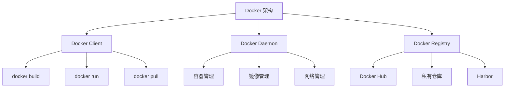

# Docker + Nginx 容器化部署完全指南

Docker 与 Nginx 的结合是现代 Web 应用部署的黄金组合。Docker 提供了一致的运行环境，Nginx 作为高性能的 Web 服务器和反向代理，两者结合能够实现高效、可扩展的应用部署架构。

## 🐳 Docker 基础概念

### Docker 核心概念



### Docker 核心组件

- **镜像 (Image)**: 只读的模板，包含运行应用所需的所有内容
- **容器 (Container)**: 镜像的运行实例，提供隔离的运行环境
- **Dockerfile**: 用于构建镜像的文本文件，包含一系列指令
- **仓库 (Registry)**: 存储和分发镜像的服务

## 🏗️ Dockerfile 最佳实践

### 1. 前端应用 Dockerfile

```dockerfile
# 多阶段构建 - 前端 React/Vue 应用
FROM node:18-alpine AS builder

# 设置工作目录
WORKDIR /app

# 复制 package 文件
COPY package*.json ./

# 安装依赖
RUN npm ci --only=production

# 复制源代码
COPY . .

# 构建应用
RUN npm run build

# 生产阶段 - 使用 Nginx 服务静态文件
FROM nginx:alpine

# 复制自定义 nginx 配置
COPY nginx.conf /etc/nginx/nginx.conf

# 复制构建产物到 nginx 目录
COPY --from=builder /app/dist /usr/share/nginx/html

# 复制 SSL 证书（如果需要）
# COPY ssl/ /etc/nginx/ssl/

# 暴露端口
EXPOSE 80 443

# 健康检查
HEALTHCHECK --interval=30s --timeout=3s --start-period=5s --retries=3 \
  CMD curl -f http://localhost/health || exit 1

# 启动 nginx
CMD ["nginx", "-g", "daemon off;"]
```

### 2. Node.js 后端应用 Dockerfile

```dockerfile
# Node.js 后端应用
FROM node:18-alpine AS base

# 安装 dumb-init 用于信号处理
RUN apk add --no-cache dumb-init

# 创建非 root 用户
RUN addgroup -g 1001 -S nodejs
RUN adduser -S nextjs -u 1001

# 设置工作目录
WORKDIR /app

# 复制 package 文件
COPY package*.json ./

# 依赖安装阶段
FROM base AS deps
RUN npm ci --only=production && npm cache clean --force

# 开发依赖安装阶段
FROM base AS deps-dev
RUN npm ci

# 构建阶段
FROM deps-dev AS builder
COPY . .
RUN npm run build

# 生产阶段
FROM base AS runner

# 复制生产依赖
COPY --from=deps --chown=nextjs:nodejs /app/node_modules ./node_modules

# 复制构建产物
COPY --from=builder --chown=nextjs:nodejs /app/dist ./dist
COPY --from=builder --chown=nextjs:nodejs /app/package.json ./package.json

# 切换到非 root 用户
USER nextjs

# 暴露端口
EXPOSE 3000

# 设置环境变量
ENV NODE_ENV=production
ENV PORT=3000

# 健康检查
HEALTHCHECK --interval=30s --timeout=3s --start-period=5s --retries=3 \
  CMD node healthcheck.js

# 启动应用
ENTRYPOINT ["dumb-init", "--"]
CMD ["node", "dist/index.js"]
```

### 3. 全栈应用 Docker Compose

```yaml
# docker-compose.yml
version: "3.8"

services:
  # 前端服务
  frontend:
    build:
      context: ./frontend
      dockerfile: Dockerfile
      target: production
    container_name: app-frontend
    restart: unless-stopped
    ports:
      - "80:80"
      - "443:443"
    volumes:
      - ./nginx/nginx.conf:/etc/nginx/nginx.conf:ro
      - ./nginx/ssl:/etc/nginx/ssl:ro
      - ./nginx/logs:/var/log/nginx
    depends_on:
      - backend
    networks:
      - app-network
    environment:
      - NODE_ENV=production
    labels:
      - "traefik.enable=true"
      - "traefik.http.routers.frontend.rule=Host(`example.com`)"
      - "traefik.http.routers.frontend.tls=true"

  # 后端服务
  backend:
    build:
      context: ./backend
      dockerfile: Dockerfile
    container_name: app-backend
    restart: unless-stopped
    ports:
      - "3000:3000"
    environment:
      - NODE_ENV=production
      - DATABASE_URL=${DATABASE_URL}
      - REDIS_URL=${REDIS_URL}
      - JWT_SECRET=${JWT_SECRET}
    volumes:
      - ./uploads:/app/uploads
      - ./logs:/app/logs
    depends_on:
      - database
      - redis
    networks:
      - app-network
    healthcheck:
      test: ["CMD", "curl", "-f", "http://localhost:3000/health"]
      interval: 30s
      timeout: 10s
      retries: 3

  # 数据库服务
  database:
    image: postgres:15-alpine
    container_name: app-database
    restart: unless-stopped
    environment:
      - POSTGRES_DB=${DB_NAME}
      - POSTGRES_USER=${DB_USER}
      - POSTGRES_PASSWORD=${DB_PASSWORD}
    volumes:
      - postgres_data:/var/lib/postgresql/data
      - ./database/init.sql:/docker-entrypoint-initdb.d/init.sql
    ports:
      - "5432:5432"
    networks:
      - app-network
    healthcheck:
      test: ["CMD-SHELL", "pg_isready -U ${DB_USER} -d ${DB_NAME}"]
      interval: 10s
      timeout: 5s
      retries: 5

  # Redis 缓存
  redis:
    image: redis:7-alpine
    container_name: app-redis
    restart: unless-stopped
    command: redis-server --appendonly yes --requirepass ${REDIS_PASSWORD}
    volumes:
      - redis_data:/data
      - ./redis/redis.conf:/usr/local/etc/redis/redis.conf
    ports:
      - "6379:6379"
    networks:
      - app-network
    healthcheck:
      test: ["CMD", "redis-cli", "--raw", "incr", "ping"]
      interval: 10s
      timeout: 3s
      retries: 5

  # 监控服务
  monitoring:
    image: prom/prometheus:latest
    container_name: app-monitoring
    restart: unless-stopped
    ports:
      - "9090:9090"
    volumes:
      - ./monitoring/prometheus.yml:/etc/prometheus/prometheus.yml
      - prometheus_data:/prometheus
    networks:
      - app-network
    command:
      - "--config.file=/etc/prometheus/prometheus.yml"
      - "--storage.tsdb.path=/prometheus"
      - "--web.console.libraries=/etc/prometheus/console_libraries"
      - "--web.console.templates=/etc/prometheus/consoles"

# 网络配置
networks:
  app-network:
    driver: bridge
    ipam:
      config:
        - subnet: 172.20.0.0/16

# 数据卷
volumes:
  postgres_data:
    driver: local
  redis_data:
    driver: local
  prometheus_data:
    driver: local
```

## 🌐 Nginx 配置详解

### 1. 基础 Nginx 配置

```nginx
# nginx.conf
user nginx;
worker_processes auto;
error_log /var/log/nginx/error.log warn;
pid /var/run/nginx.pid;

# 优化配置
worker_rlimit_nofile 65535;

events {
    worker_connections 4096;
    use epoll;
    multi_accept on;
}

http {
    # 基础配置
    include /etc/nginx/mime.types;
    default_type application/octet-stream;

    # 日志格式
    log_format main '$remote_addr - $remote_user [$time_local] "$request" '
                    '$status $body_bytes_sent "$http_referer" '
                    '"$http_user_agent" "$http_x_forwarded_for" '
                    '$request_time $upstream_response_time';

    access_log /var/log/nginx/access.log main;

    # 性能优化
    sendfile on;
    tcp_nopush on;
    tcp_nodelay on;
    keepalive_timeout 65;
    keepalive_requests 100;

    # Gzip 压缩
    gzip on;
    gzip_vary on;
    gzip_min_length 1024;
    gzip_proxied any;
    gzip_comp_level 6;
    gzip_types
        text/plain
        text/css
        text/xml
        text/javascript
        application/json
        application/javascript
        application/xml+rss
        application/atom+xml
        image/svg+xml;

    # Brotli 压缩（如果支持）
    # brotli on;
    # brotli_comp_level 6;
    # brotli_types text/plain text/css application/json application/javascript text/xml application/xml application/xml+rss text/javascript;

    # 安全头
    add_header X-Frame-Options "SAMEORIGIN" always;
    add_header X-XSS-Protection "1; mode=block" always;
    add_header X-Content-Type-Options "nosniff" always;
    add_header Referrer-Policy "no-referrer-when-downgrade" always;
    add_header Content-Security-Policy "default-src 'self' http: https: data: blob: 'unsafe-inline'" always;

    # 限制请求大小
    client_max_body_size 100M;
    client_body_buffer_size 128k;
    client_header_buffer_size 3m;
    large_client_header_buffers 4 256k;

    # 超时设置
    client_body_timeout 10;
    client_header_timeout 10;
    send_timeout 10;

    # 缓存设置
    open_file_cache max=100000 inactive=20s;
    open_file_cache_valid 30s;
    open_file_cache_min_uses 2;
    open_file_cache_errors on;

    # 上游服务器配置
    upstream backend {
        least_conn;
        server backend:3000 max_fails=3 fail_timeout=30s;
        # server backend2:3000 max_fails=3 fail_timeout=30s;
        keepalive 32;
    }

    # 限流配置
    limit_req_zone $binary_remote_addr zone=api:10m rate=10r/s;
    limit_req_zone $binary_remote_addr zone=login:10m rate=1r/s;

    # 主服务器配置
    server {
        listen 80;
        server_name example.com www.example.com;

        # HTTP 重定向到 HTTPS
        return 301 https://$server_name$request_uri;
    }

    # HTTPS 服务器配置
    server {
        listen 443 ssl http2;
        server_name example.com www.example.com;

        # SSL 配置
        ssl_certificate /etc/nginx/ssl/cert.pem;
        ssl_certificate_key /etc/nginx/ssl/key.pem;
        ssl_session_cache shared:SSL:1m;
        ssl_session_timeout 5m;
        ssl_ciphers HIGH:!aNULL:!MD5;
        ssl_prefer_server_ciphers on;
        ssl_protocols TLSv1.2 TLSv1.3;

        # HSTS
        add_header Strict-Transport-Security "max-age=63072000" always;

        # 静态文件根目录
        root /usr/share/nginx/html;
        index index.html index.htm;

        # 静态资源缓存
        location ~* \.(jpg|jpeg|png|gif|ico|css|js|woff|woff2|ttf|eot|svg)$ {
            expires 1y;
            add_header Cache-Control "public, immutable";
            add_header Vary Accept-Encoding;
            access_log off;
        }

        # API 代理
        location /api/ {
            limit_req zone=api burst=20 nodelay;

            proxy_pass http://backend;
            proxy_http_version 1.1;
            proxy_set_header Upgrade $http_upgrade;
            proxy_set_header Connection 'upgrade';
            proxy_set_header Host $host;
            proxy_set_header X-Real-IP $remote_addr;
            proxy_set_header X-Forwarded-For $proxy_add_x_forwarded_for;
            proxy_set_header X-Forwarded-Proto $scheme;
            proxy_cache_bypass $http_upgrade;

            # 超时设置
            proxy_connect_timeout 30s;
            proxy_send_timeout 30s;
            proxy_read_timeout 30s;

            # 错误处理
            proxy_next_upstream error timeout invalid_header http_500 http_502 http_503 http_504;
        }

        # WebSocket 支持
        location /ws/ {
            proxy_pass http://backend;
            proxy_http_version 1.1;
            proxy_set_header Upgrade $http_upgrade;
            proxy_set_header Connection "upgrade";
            proxy_set_header Host $host;
            proxy_set_header X-Real-IP $remote_addr;
            proxy_set_header X-Forwarded-For $proxy_add_x_forwarded_for;
            proxy_set_header X-Forwarded-Proto $scheme;
            proxy_read_timeout 86400;
        }

        # 登录限流
        location /api/auth/login {
            limit_req zone=login burst=5 nodelay;
            proxy_pass http://backend;
            include /etc/nginx/proxy_params;
        }

        # 健康检查
        location /health {
            access_log off;
            return 200 "healthy\n";
            add_header Content-Type text/plain;
        }

        # SPA 路由支持
        location / {
            try_files $uri $uri/ /index.html;

            # 缓存控制
            location = /index.html {
                add_header Cache-Control "no-cache, no-store, must-revalidate";
                add_header Pragma "no-cache";
                add_header Expires "0";
            }
        }

        # 安全配置
        location ~ /\. {
            deny all;
            access_log off;
            log_not_found off;
        }

        # 禁止访问敏感文件
        location ~* \.(env|log|ini)$ {
            deny all;
            access_log off;
            log_not_found off;
        }

        # 错误页面
        error_page 404 /404.html;
        error_page 500 502 503 504 /50x.html;

        location = /50x.html {
            root /usr/share/nginx/html;
        }
    }

    # 负载均衡和故障转移
    server {
        listen 8080;
        server_name admin.example.com;

        location / {
            proxy_pass http://backend;

            # 健康检查
            proxy_next_upstream error timeout invalid_header http_500 http_502 http_503;
            proxy_next_upstream_tries 3;
            proxy_next_upstream_timeout 10s;

            include /etc/nginx/proxy_params;
        }
    }
}
```

### 2. 高级 Nginx 配置

```nginx
# advanced-nginx.conf - 高级配置示例

# 全局配置
user nginx;
worker_processes auto;
worker_cpu_affinity auto;
worker_rlimit_nofile 100000;

error_log /var/log/nginx/error.log warn;
pid /var/run/nginx.pid;

events {
    worker_connections 4096;
    use epoll;
    multi_accept on;
    accept_mutex off;
}

http {
    include /etc/nginx/mime.types;
    default_type application/octet-stream;

    # 自定义日志格式
    log_format detailed '$remote_addr - $remote_user [$time_local] '
                       '"$request" $status $bytes_sent '
                       '"$http_referer" "$http_user_agent" '
                       '"$http_x_forwarded_for" $request_id '
                       'rt=$request_time uct="$upstream_connect_time" '
                       'uht="$upstream_header_time" urt="$upstream_response_time"';

    # 性能优化
    sendfile on;
    sendfile_max_chunk 1m;
    tcp_nopush on;
    tcp_nodelay on;

    # 连接保持
    keepalive_timeout 75s;
    keepalive_requests 1000;

    # 缓冲区优化
    client_body_buffer_size 256k;
    client_header_buffer_size 64k;
    large_client_header_buffers 4 64k;
    output_buffers 2 32k;
    postpone_output 1460;

    # 压缩优化
    gzip on;
    gzip_vary on;
    gzip_min_length 1000;
    gzip_proxied any;
    gzip_comp_level 6;
    gzip_types
        text/plain
        text/css
        text/xml
        text/javascript
        text/x-component
        application/json
        application/javascript
        application/x-javascript
        application/xml
        application/xml+rss
        application/xhtml+xml
        application/x-font-ttf
        application/vnd.ms-fontobject
        font/opentype
        image/svg+xml
        image/x-icon;

    # 缓存配置
    proxy_cache_path /var/cache/nginx/proxy levels=1:2 keys_zone=my_cache:10m max_size=10g inactive=60m use_temp_path=off;
    proxy_cache_key "$scheme$request_method$host$request_uri";

    # 限流配置
    limit_req_zone $binary_remote_addr zone=global:10m rate=10r/s;
    limit_req_zone $binary_remote_addr zone=api:10m rate=5r/s;
    limit_req_zone $binary_remote_addr zone=auth:10m rate=1r/s;
    limit_conn_zone $binary_remote_addr zone=conn_limit_per_ip:10m;

    # 上游服务器组
    upstream app_backend {
        least_conn;
        server backend1:3000 weight=3 max_fails=3 fail_timeout=30s;
        server backend2:3000 weight=2 max_fails=3 fail_timeout=30s;
        server backend3:3000 weight=1 max_fails=3 fail_timeout=30s backup;

        keepalive 32;
        keepalive_requests 100;
        keepalive_timeout 60s;
    }

    # 微服务上游
    upstream user_service {
        server user-service:3001;
        keepalive 16;
    }

    upstream order_service {
        server order-service:3002;
        keepalive 16;
    }

    # 地理位置配置
    geo $limit {
        default 1;
        10.0.0.0/8 0;
        192.168.0.0/16 0;
        172.16.0.0/12 0;
    }

    map $limit $limit_key {
        0 "";
        1 $binary_remote_addr;
    }

    # 主服务器配置
    server {
        listen 443 ssl http2;
        server_name api.example.com;

        # SSL 配置
        ssl_certificate /etc/nginx/ssl/api.example.com.crt;
        ssl_certificate_key /etc/nginx/ssl/api.example.com.key;
        ssl_session_cache shared:SSL:50m;
        ssl_session_timeout 1d;
        ssl_session_tickets off;

        # 现代 SSL 配置
        ssl_protocols TLSv1.2 TLSv1.3;
        ssl_ciphers ECDHE-RSA-AES128-GCM-SHA256:ECDHE-RSA-AES256-GCM-SHA384;
        ssl_prefer_server_ciphers off;

        # OCSP Stapling
        ssl_stapling on;
        ssl_stapling_verify on;

        # 安全头
        add_header Strict-Transport-Security "max-age=63072000; includeSubDomains; preload";
        add_header X-Frame-Options DENY;
        add_header X-Content-Type-Options nosniff;
        add_header X-XSS-Protection "1; mode=block";
        add_header Referrer-Policy "strict-origin-when-cross-origin";

        # 全局限流
        limit_req zone=global burst=50 nodelay;
        limit_conn conn_limit_per_ip 20;

        # API 网关配置
        location /api/v1/users {
            limit_req zone=api burst=10 nodelay;

            proxy_pass http://user_service;
            proxy_cache my_cache;
            proxy_cache_valid 200 302 10m;
            proxy_cache_valid 404 1m;
            proxy_cache_bypass $arg_nocache;

            include /etc/nginx/proxy_headers.conf;
        }

        location /api/v1/orders {
            limit_req zone=api burst=10 nodelay;

            proxy_pass http://order_service;
            proxy_cache my_cache;
            proxy_cache_valid 200 5m;

            include /etc/nginx/proxy_headers.conf;
        }

        # 认证服务
        location /api/v1/auth {
            limit_req zone=auth burst=5 nodelay;

            proxy_pass http://app_backend;
            proxy_no_cache 1;
            proxy_cache_bypass 1;

            include /etc/nginx/proxy_headers.conf;
        }

        # 文件上传
        location /api/v1/upload {
            client_max_body_size 50M;
            proxy_request_buffering off;
            proxy_pass http://app_backend;

            include /etc/nginx/proxy_headers.conf;
        }

        # WebSocket 代理
        location /ws {
            proxy_pass http://app_backend;
            proxy_http_version 1.1;
            proxy_set_header Upgrade $http_upgrade;
            proxy_set_header Connection "upgrade";
            proxy_set_header Host $host;
            proxy_set_header X-Real-IP $remote_addr;
            proxy_read_timeout 86400;
        }

        # 健康检查
        location /health {
            access_log off;
            return 200 '{"status":"ok","timestamp":"$time_iso8601"}';
            add_header Content-Type application/json;
        }

        # 监控端点
        location /nginx_status {
            stub_status on;
            access_log off;
            allow 127.0.0.1;
            allow 10.0.0.0/8;
            deny all;
        }
    }

    # CDN 服务器
    server {
        listen 443 ssl http2;
        server_name cdn.example.com;

        ssl_certificate /etc/nginx/ssl/cdn.example.com.crt;
        ssl_certificate_key /etc/nginx/ssl/cdn.example.com.key;

        root /var/www/cdn;

        # 静态资源优化
        location ~* \.(jpg|jpeg|png|gif|ico|webp|avif)$ {
            expires 1y;
            add_header Cache-Control "public, immutable";
            add_header Vary Accept-Encoding;

            # 图片优化
            image_filter_buffer 20M;
            image_filter_jpeg_quality 85;

            access_log off;
        }

        location ~* \.(css|js|woff|woff2|ttf|eot|svg)$ {
            expires 1y;
            add_header Cache-Control "public, immutable";
            gzip_static on;
            access_log off;
        }

        # 防盗链
        location ~* \.(jpg|jpeg|png|gif)$ {
            valid_referers none blocked server_names
                           *.example.com example.com;
            if ($invalid_referer) {
                return 403;
            }
        }
    }
}
```

### 3. Nginx 代理参数配置

```nginx
# proxy_headers.conf - 代理头文件
proxy_http_version 1.1;
proxy_cache_bypass $http_upgrade;

# 基础代理头
proxy_set_header Upgrade $http_upgrade;
proxy_set_header Connection $connection_upgrade;
proxy_set_header Host $host;
proxy_set_header X-Real-IP $remote_addr;
proxy_set_header X-Forwarded-For $proxy_add_x_forwarded_for;
proxy_set_header X-Forwarded-Proto $scheme;
proxy_set_header X-Forwarded-Host $host;
proxy_set_header X-Forwarded-Port $server_port;

# 请求 ID 传递
proxy_set_header X-Request-ID $request_id;

# 超时设置
proxy_connect_timeout 60s;
proxy_send_timeout 60s;
proxy_read_timeout 60s;

# 缓冲设置
proxy_buffering on;
proxy_buffer_size 128k;
proxy_buffers 4 256k;
proxy_busy_buffers_size 256k;

# 错误处理
proxy_next_upstream error timeout invalid_header http_500 http_502 http_503 http_504;
proxy_next_upstream_tries 3;
proxy_next_upstream_timeout 10s;
```

## 🚀 Docker 部署策略

### 1. 蓝绿部署脚本

```bash
#!/bin/bash
# blue-green-deploy.sh - 蓝绿部署脚本

set -e

# 配置变量
IMAGE_NAME="myapp"
VERSION=${1:-latest}
BLUE_CONTAINER="myapp-blue"
GREEN_CONTAINER="myapp-green"
NGINX_CONFIG_DIR="/etc/nginx/conf.d"

# 颜色输出
RED='\033[0;31m'
GREEN='\033[0;32m'
YELLOW='\033[1;33m'
NC='\033[0m'

log() {
    echo -e "${GREEN}[$(date +'%Y-%m-%d %H:%M:%S')] $1${NC}"
}

error() {
    echo -e "${RED}[ERROR] $1${NC}"
    exit 1
}

warn() {
    echo -e "${YELLOW}[WARN] $1${NC}"
}

# 检查当前活跃容器
get_active_container() {
    if docker ps | grep -q $BLUE_CONTAINER; then
        echo "blue"
    elif docker ps | grep -q $GREEN_CONTAINER; then
        echo "green"
    else
        echo "none"
    fi
}

# 获取非活跃容器
get_inactive_container() {
    local active=$(get_active_container)
    if [ "$active" = "blue" ]; then
        echo "green"
    else
        echo "blue"
    fi
}

# 健康检查
health_check() {
    local container=$1
    local port=$2
    local max_attempts=30
    local attempt=1

    log "开始健康检查: $container"

    while [ $attempt -le $max_attempts ]; do
        if curl -f -s "http://localhost:$port/health" > /dev/null; then
            log "健康检查通过: $container"
            return 0
        fi

        log "健康检查失败 ($attempt/$max_attempts), 等待 10 秒..."
        sleep 10
        attempt=$((attempt + 1))
    done

    error "健康检查失败: $container"
}

# 更新 Nginx 配置
update_nginx_config() {
    local target_container=$1
    local target_port

    if [ "$target_container" = "blue" ]; then
        target_port=3001
    else
        target_port=3002
    fi

    log "更新 Nginx 配置指向: $target_container (端口: $target_port)"

    cat > $NGINX_CONFIG_DIR/upstream.conf << EOF
upstream backend {
    server localhost:$target_port;
}
EOF

    # 重新加载 Nginx 配置
    if command -v nginx > /dev/null; then
        nginx -t && nginx -s reload
    else
        docker exec nginx nginx -t && docker exec nginx nginx -s reload
    fi

    log "Nginx 配置更新完成"
}

# 部署新版本
deploy_new_version() {
    local target_env=$(get_inactive_container)
    local target_container
    local target_port

    if [ "$target_env" = "blue" ]; then
        target_container=$BLUE_CONTAINER
        target_port=3001
    else
        target_container=$GREEN_CONTAINER
        target_port=3002
    fi

    log "开始部署到 $target_env 环境"

    # 停止并删除现有容器
    if docker ps -a | grep -q $target_container; then
        log "停止现有容器: $target_container"
        docker stop $target_container || true
        docker rm $target_container || true
    fi

    # 启动新容器
    log "启动新容器: $target_container"
    docker run -d \
        --name $target_container \
        --restart unless-stopped \
        -p $target_port:3000 \
        -e NODE_ENV=production \
        -e PORT=3000 \
        --health-cmd="curl -f http://localhost:3000/health || exit 1" \
        --health-interval=30s \
        --health-timeout=10s \
        --health-retries=3 \
        $IMAGE_NAME:$VERSION

    # 等待容器启动
    sleep 10

    # 健康检查
    health_check $target_container $target_port

    # 切换流量
    update_nginx_config $target_env

    log "部署完成: $target_env"
    return 0
}

# 回滚操作
rollback() {
    local current_active=$(get_active_container)
    local rollback_target

    if [ "$current_active" = "blue" ]; then
        rollback_target="green"
    elif [ "$current_active" = "green" ]; then
        rollback_target="blue"
    else
        error "没有找到可回滚的容器"
    fi

    warn "开始回滚到: $rollback_target"
    update_nginx_config $rollback_target
    log "回滚完成"
}

# 清理旧容器
cleanup() {
    local active_container=$(get_active_container)
    local cleanup_container

    if [ "$active_container" = "blue" ]; then
        cleanup_container=$GREEN_CONTAINER
    else
        cleanup_container=$BLUE_CONTAINER
    fi

    if docker ps | grep -q $cleanup_container; then
        log "清理非活跃容器: $cleanup_container"
        docker stop $cleanup_container
        docker rm $cleanup_container
    fi
}

# 主函数
main() {
    case "${1:-deploy}" in
        "deploy")
            log "开始蓝绿部署: 版本 $VERSION"
            deploy_new_version
            log "部署成功完成"
            ;;
        "rollback")
            rollback
            ;;
        "cleanup")
            cleanup
            ;;
        "status")
            local active=$(get_active_container)
            log "当前活跃环境: $active"
            ;;
        *)
            echo "用法: $0 {deploy|rollback|cleanup|status} [version]"
            exit 1
            ;;
    esac
}

# 执行主函数
main "$@"
```

### 2. Docker Compose 生产环境配置

```yaml
# docker-compose.prod.yml
version: "3.8"

services:
  # Nginx 反向代理
  nginx:
    image: nginx:alpine
    container_name: nginx-proxy
    restart: unless-stopped
    ports:
      - "80:80"
      - "443:443"
    volumes:
      - ./nginx/nginx.conf:/etc/nginx/nginx.conf:ro
      - ./nginx/conf.d:/etc/nginx/conf.d:ro
      - ./nginx/ssl:/etc/nginx/ssl:ro
      - ./nginx/logs:/var/log/nginx
      - nginx_cache:/var/cache/nginx
    depends_on:
      - app-blue
      - app-green
    networks:
      - frontend
      - backend
    healthcheck:
      test: ["CMD", "nginx", "-t"]
      interval: 30s
      timeout: 10s
      retries: 3
    labels:
      - "com.centurylinklabs.watchtower.enable=false"

  # 应用蓝色环境
  app-blue:
    build:
      context: .
      dockerfile: Dockerfile.prod
    container_name: app-blue
    restart: unless-stopped
    environment:
      - NODE_ENV=production
      - PORT=3000
      - DATABASE_URL=${DATABASE_URL}
      - REDIS_URL=${REDIS_URL}
      - JWT_SECRET=${JWT_SECRET}
    volumes:
      - ./uploads:/app/uploads
      - ./logs:/app/logs
    networks:
      - backend
    healthcheck:
      test: ["CMD", "curl", "-f", "http://localhost:3000/health"]
      interval: 30s
      timeout: 10s
      retries: 3
      start_period: 40s
    logging:
      driver: "json-file"
      options:
        max-size: "10m"
        max-file: "3"

  # 应用绿色环境
  app-green:
    build:
      context: .
      dockerfile: Dockerfile.prod
    container_name: app-green
    restart: unless-stopped
    environment:
      - NODE_ENV=production
      - PORT=3000
      - DATABASE_URL=${DATABASE_URL}
      - REDIS_URL=${REDIS_URL}
      - JWT_SECRET=${JWT_SECRET}
    volumes:
      - ./uploads:/app/uploads
      - ./logs:/app/logs
    networks:
      - backend
    healthcheck:
      test: ["CMD", "curl", "-f", "http://localhost:3000/health"]
      interval: 30s
      timeout: 10s
      retries: 3
      start_period: 40s
    logging:
      driver: "json-file"
      options:
        max-size: "10m"
        max-file: "3"

  # 数据库
  database:
    image: postgres:15-alpine
    container_name: postgres-db
    restart: unless-stopped
    environment:
      POSTGRES_DB: ${DB_NAME}
      POSTGRES_USER: ${DB_USER}
      POSTGRES_PASSWORD: ${DB_PASSWORD}
    volumes:
      - postgres_data:/var/lib/postgresql/data
      - ./database/init:/docker-entrypoint-initdb.d
      - ./database/backups:/backups
    networks:
      - backend
    healthcheck:
      test: ["CMD-SHELL", "pg_isready -U ${DB_USER} -d ${DB_NAME}"]
      interval: 10s
      timeout: 5s
      retries: 5
    logging:
      driver: "json-file"
      options:
        max-size: "10m"
        max-file: "3"

  # Redis 缓存
  redis:
    image: redis:7-alpine
    container_name: redis-cache
    restart: unless-stopped
    command: >
      --requirepass ${REDIS_PASSWORD}
      --appendonly yes
      --appendfsync everysec
      --maxmemory 256mb
      --maxmemory-policy allkeys-lru
    volumes:
      - redis_data:/data
      - ./redis/redis.conf:/usr/local/etc/redis/redis.conf
    networks:
      - backend
    healthcheck:
      test: ["CMD", "redis-cli", "--raw", "incr", "ping"]
      interval: 10s
      timeout: 3s
      retries: 5
    logging:
      driver: "json-file"
      options:
        max-size: "10m"
        max-file: "3"

  # 监控 - Prometheus
  prometheus:
    image: prom/prometheus:latest
    container_name: prometheus
    restart: unless-stopped
    command:
      - "--config.file=/etc/prometheus/prometheus.yml"
      - "--storage.tsdb.path=/prometheus"
      - "--web.console.libraries=/etc/prometheus/console_libraries"
      - "--web.console.templates=/etc/prometheus/consoles"
      - "--storage.tsdb.retention.time=200h"
      - "--web.enable-lifecycle"
    ports:
      - "9090:9090"
    volumes:
      - ./monitoring/prometheus:/etc/prometheus
      - prometheus_data:/prometheus
    networks:
      - monitoring
    healthcheck:
      test:
        [
          "CMD",
          "wget",
          "--quiet",
          "--tries=1",
          "--spider",
          "http://localhost:9090/-/healthy",
        ]
      interval: 30s
      timeout: 10s
      retries: 3

  # 监控 - Grafana
  grafana:
    image: grafana/grafana:latest
    container_name: grafana
    restart: unless-stopped
    environment:
      - GF_SECURITY_ADMIN_USER=${GRAFANA_USER}
      - GF_SECURITY_ADMIN_PASSWORD=${GRAFANA_PASSWORD}
      - GF_USERS_ALLOW_SIGN_UP=false
    ports:
      - "3001:3000"
    volumes:
      - grafana_data:/var/lib/grafana
      - ./monitoring/grafana/provisioning:/etc/grafana/provisioning
    networks:
      - monitoring
    healthcheck:
      test: ["CMD-SHELL", "curl -f http://localhost:3000/api/health || exit 1"]
      interval: 30s
      timeout: 10s
      retries: 3

  # 日志收集 - Filebeat
  filebeat:
    image: docker.elastic.co/beats/filebeat:8.5.0
    container_name: filebeat
    restart: unless-stopped
    user: root
    volumes:
      - ./monitoring/filebeat/filebeat.yml:/usr/share/filebeat/filebeat.yml:ro
      - ./logs:/var/log/app
      - /var/lib/docker/containers:/var/lib/docker/containers:ro
      - /var/run/docker.sock:/var/run/docker.sock:ro
    networks:
      - monitoring
    depends_on:
      - app-blue
      - app-green

  # 自动更新服务
  watchtower:
    image: containrrr/watchtower
    container_name: watchtower
    restart: unless-stopped
    volumes:
      - /var/run/docker.sock:/var/run/docker.sock
    environment:
      - WATCHTOWER_CLEANUP=true
      - WATCHTOWER_POLL_INTERVAL=3600
      - WATCHTOWER_INCLUDE_STOPPED=true
      - WATCHTOWER_LABEL_ENABLE=true
    networks:
      - backend

networks:
  frontend:
    driver: bridge
  backend:
    driver: bridge
  monitoring:
    driver: bridge

volumes:
  postgres_data:
    driver: local
  redis_data:
    driver: local
  nginx_cache:
    driver: local
  prometheus_data:
    driver: local
  grafana_data:
    driver: local
```

## 📊 监控和日志管理

### 1. Prometheus 配置

```yaml
# monitoring/prometheus/prometheus.yml
global:
  scrape_interval: 15s
  evaluation_interval: 15s

rule_files:
  - "alert_rules.yml"

alerting:
  alertmanagers:
    - static_configs:
        - targets:
            - alertmanager:9093

scrape_configs:
  # Prometheus 自监控
  - job_name: "prometheus"
    static_configs:
      - targets: ["localhost:9090"]

  # Node Exporter
  - job_name: "node"
    static_configs:
      - targets: ["node-exporter:9100"]

  # Nginx 监控
  - job_name: "nginx"
    static_configs:
      - targets: ["nginx:9113"]
    metrics_path: /metrics

  # 应用监控
  - job_name: "app-blue"
    static_configs:
      - targets: ["app-blue:3000"]
    metrics_path: /metrics
    scrape_interval: 10s

  - job_name: "app-green"
    static_configs:
      - targets: ["app-green:3000"]
    metrics_path: /metrics
    scrape_interval: 10s

  # Docker 监控
  - job_name: "docker"
    static_configs:
      - targets: ["cadvisor:8080"]

  # 数据库监控
  - job_name: "postgres"
    static_configs:
      - targets: ["postgres-exporter:9187"]

  - job_name: "redis"
    static_configs:
      - targets: ["redis-exporter:9121"]
```

### 2. 告警规则配置

```yaml
# monitoring/prometheus/alert_rules.yml
groups:
  - name: application_alerts
    rules:
      # 应用健康检查
      - alert: ApplicationDown
        expr: up{job=~"app-.*"} == 0
        for: 30s
        labels:
          severity: critical
        annotations:
          summary: "Application {{ $labels.job }} is down"
          description: "Application {{ $labels.job }} has been down for more than 30 seconds"

      # 高错误率
      - alert: HighErrorRate
        expr: rate(http_requests_total{status=~"5.."}[5m]) > 0.1
        for: 5m
        labels:
          severity: warning
        annotations:
          summary: "High error rate detected"
          description: "Error rate is {{ $value }} errors per second"

      # 高响应时间
      - alert: HighResponseTime
        expr: histogram_quantile(0.95, rate(http_request_duration_seconds_bucket[5m])) > 1
        for: 5m
        labels:
          severity: warning
        annotations:
          summary: "High response time detected"
          description: "95th percentile response time is {{ $value }} seconds"

  - name: infrastructure_alerts
    rules:
      # 高 CPU 使用率
      - alert: HighCPUUsage
        expr: 100 - (avg by(instance) (irate(node_cpu_seconds_total{mode="idle"}[5m])) * 100) > 80
        for: 5m
        labels:
          severity: warning
        annotations:
          summary: "High CPU usage detected"
          description: "CPU usage is {{ $value }}% on {{ $labels.instance }}"

      # 高内存使用率
      - alert: HighMemoryUsage
        expr: (node_memory_MemTotal_bytes - node_memory_MemAvailable_bytes) / node_memory_MemTotal_bytes * 100 > 85
        for: 5m
        labels:
          severity: warning
        annotations:
          summary: "High memory usage detected"
          description: "Memory usage is {{ $value }}% on {{ $labels.instance }}"

      # 磁盘空间不足
      - alert: LowDiskSpace
        expr: (node_filesystem_avail_bytes / node_filesystem_size_bytes) * 100 < 10
        for: 5m
        labels:
          severity: critical
        annotations:
          summary: "Low disk space"
          description: "Disk space is {{ $value }}% on {{ $labels.instance }}"

  - name: nginx_alerts
    rules:
      # Nginx 高错误率
      - alert: NginxHighErrorRate
        expr: rate(nginx_http_requests_total{status=~"4..|5.."}[5m]) / rate(nginx_http_requests_total[5m]) > 0.05
        for: 5m
        labels:
          severity: warning
        annotations:
          summary: "Nginx high error rate"
          description: "Nginx error rate is {{ $value | humanizePercentage }}"

      # Nginx 连接数过高
      - alert: NginxHighConnections
        expr: nginx_connections_active > 1000
        for: 5m
        labels:
          severity: warning
        annotations:
          summary: "Nginx high connection count"
          description: "Nginx has {{ $value }} active connections"
```

### 3. 日志配置

```yaml
# monitoring/filebeat/filebeat.yml
filebeat.inputs:
  # 应用日志
  - type: log
    enabled: true
    paths:
      - /var/log/app/*.log
    fields:
      service: application
      environment: production
    fields_under_root: true
    multiline.pattern: '^\d{4}-\d{2}-\d{2}'
    multiline.negate: true
    multiline.match: after

  # Nginx 访问日志
  - type: log
    enabled: true
    paths:
      - /var/log/nginx/access.log
    fields:
      service: nginx
      log_type: access
    fields_under_root: true

  # Nginx 错误日志
  - type: log
    enabled: true
    paths:
      - /var/log/nginx/error.log
    fields:
      service: nginx
      log_type: error
    fields_under_root: true

  # Docker 容器日志
  - type: container
    paths:
      - "/var/lib/docker/containers/*/*.log"
    processors:
      - add_docker_metadata:
          host: "unix:///var/run/docker.sock"

# 输出配置
output.elasticsearch:
  hosts: ["elasticsearch:9200"]
  index: "filebeat-%{+yyyy.MM.dd}"
  template.settings:
    index.number_of_shards: 1
    index.number_of_replicas: 0

# 处理器
processors:
  - add_host_metadata:
      when.not.contains.tags: forwarded
  - add_cloud_metadata: ~
  - add_docker_metadata: ~

# 日志级别
logging.level: info
logging.to_files: true
logging.files:
  path: /var/log/filebeat
  name: filebeat
  keepfiles: 7
  permissions: 0644
```

## 🔧 运维脚本和工具

### 1. 部署脚本

```bash
#!/bin/bash
# deploy.sh - 完整部署脚本

set -euo pipefail

# 配置变量
PROJECT_NAME="myapp"
DOCKER_REGISTRY="registry.example.com"
ENVIRONMENT=${1:-staging}
VERSION=${2:-latest}
COMPOSE_FILE="docker-compose.${ENVIRONMENT}.yml"

# 颜色定义
RED='\033[0;31m'
GREEN='\033[0;32m'
YELLOW='\033[1;33m'
BLUE='\033[0;34m'
NC='\033[0m'

# 日志函数
log() {
    echo -e "${GREEN}[$(date +'%Y-%m-%d %H:%M:%S')] $1${NC}"
}

error() {
    echo -e "${RED}[ERROR] $1${NC}"
    exit 1
}

warn() {
    echo -e "${YELLOW}[WARN] $1${NC}"
}

info() {
    echo -e "${BLUE}[INFO] $1${NC}"
}

# 检查依赖
check_dependencies() {
    local deps=("docker" "docker-compose" "curl" "jq")

    for dep in "${deps[@]}"; do
        if ! command -v "$dep" &> /dev/null; then
            error "$dep 未安装"
        fi
    done

    log "依赖检查通过"
}

# 检查环境变量
check_environment() {
    local required_vars=(
        "DATABASE_URL"
        "REDIS_URL"
        "JWT_SECRET"
    )

    for var in "${required_vars[@]}"; do
        if [[ -z "${!var:-}" ]]; then
            error "环境变量 $var 未设置"
        fi
    done

    log "环境变量检查通过"
}

# 构建镜像
build_images() {
    log "开始构建镜像..."

    # 构建应用镜像
    docker build \
        --build-arg VERSION="$VERSION" \
        --build-arg BUILD_DATE="$(date -u +'%Y-%m-%dT%H:%M:%SZ')" \
        --build-arg VCS_REF="$(git rev-parse --short HEAD)" \
        -t "$DOCKER_REGISTRY/$PROJECT_NAME:$VERSION" \
        -t "$DOCKER_REGISTRY/$PROJECT_NAME:latest" \
        .

    # 推送镜像（如果是生产环境）
    if [[ "$ENVIRONMENT" == "production" ]]; then
        log "推送镜像到仓库..."
        docker push "$DOCKER_REGISTRY/$PROJECT_NAME:$VERSION"
        docker push "$DOCKER_REGISTRY/$PROJECT_NAME:latest"
    fi

    log "镜像构建完成"
}

# 数据库迁移
run_migrations() {
    log "运行数据库迁移..."

    docker-compose -f "$COMPOSE_FILE" run --rm \
        -e DATABASE_URL="$DATABASE_URL" \
        app npm run migrate

    log "数据库迁移完成"
}

# 健康检查
health_check() {
    local service=$1
    local port=$2
    local endpoint=${3:-/health}
    local max_attempts=30
    local attempt=1

    log "健康检查: $service"

    while [[ $attempt -le $max_attempts ]]; do
        if curl -f -s "http://localhost:$port$endpoint" > /dev/null; then
            log "$service 健康检查通过"
            return 0
        fi

        info "健康检查 $attempt/$max_attempts 失败，等待 10 秒..."
        sleep 10
        ((attempt++))
    done

    error "$service 健康检查失败"
}

# 部署服务
deploy_services() {
    log "开始部署服务..."

    # 停止旧服务
    docker-compose -f "$COMPOSE_FILE" down --remove-orphans

    # 清理未使用的镜像
    docker image prune -f

    # 启动新服务
    docker-compose -f "$COMPOSE_FILE" up -d

    # 等待服务启动
    sleep 30

    # 健康检查
    health_check "nginx" "80"
    health_check "app" "3000"

    log "服务部署完成"
}

# 备份数据
backup_data() {
    if [[ "$ENVIRONMENT" == "production" ]]; then
        log "开始数据备份..."

        local backup_file="backup_$(date +%Y%m%d_%H%M%S).sql"

        docker-compose -f "$COMPOSE_FILE" exec -T database \
            pg_dump -U "$DB_USER" "$DB_NAME" > "./backups/$backup_file"

        # 压缩备份文件
        gzip "./backups/$backup_file"

        log "数据备份完成: $backup_file.gz"
    fi
}

# 发送通知
send_notification() {
    local status=$1
    local message="部署 $ENVIRONMENT 环境 - 状态: $status"

    if [[ -n "${SLACK_WEBHOOK:-}" ]]; then
        curl -X POST -H 'Content-type: application/json' \
            --data "{\"text\":\"$message\"}" \
            "$SLACK_WEBHOOK"
    fi

    if [[ -n "${EMAIL_RECIPIENT:-}" ]]; then
        echo "$message" | mail -s "部署通知" "$EMAIL_RECIPIENT"
    fi
}

# 回滚函数
rollback() {
    warn "开始回滚操作..."

    # 获取上一个版本
    local previous_version
    previous_version=$(docker images --format "table {{.Repository}}:{{.Tag}}" | \
        grep "$DOCKER_REGISTRY/$PROJECT_NAME" | \
        grep -v latest | \
        head -2 | tail -1 | cut -d: -f2)

    if [[ -z "$previous_version" ]]; then
        error "没有找到可回滚的版本"
    fi

    # 使用上一个版本重新部署
    VERSION="$previous_version" deploy_services

    log "回滚完成，当前版本: $previous_version"
}

# 清理函数
cleanup() {
    log "开始清理..."

    # 清理停止的容器
    docker container prune -f

    # 清理未使用的镜像
    docker image prune -f

    # 清理未使用的网络
    docker network prune -f

    # 清理未使用的卷
    docker volume prune -f

    log "清理完成"
}

# 显示状态
show_status() {
    log "服务状态:"
    docker-compose -f "$COMPOSE_FILE" ps

    log "资源使用情况:"
    docker stats --no-stream --format "table {{.Container}}\t{{.CPUPerc}}\t{{.MemUsage}}\t{{.NetIO}}\t{{.BlockIO}}"
}

# 主函数
main() {
    case "${1:-deploy}" in
        "deploy")
            log "开始部署 $ENVIRONMENT 环境，版本: $VERSION"
            check_dependencies
            check_environment
            backup_data
            build_images
            run_migrations
            deploy_services
            send_notification "成功"
            log "部署完成"
            ;;
        "rollback")
            rollback
            send_notification "回滚完成"
            ;;
        "cleanup")
            cleanup
            ;;
        "status")
            show_status
            ;;
        "health")
            health_check "nginx" "80"
            health_check "app" "3000"
            ;;
        *)
            echo "用法: $0 {deploy|rollback|cleanup|status|health} [environment] [version]"
            echo "  deploy   - 部署应用"
            echo "  rollback - 回滚到上一版本"
            echo "  cleanup  - 清理未使用的资源"
            echo "  status   - 显示服务状态"
            echo "  health   - 运行健康检查"
            exit 1
            ;;
    esac
}

# 错误处理
trap 'error "部署过程中发生错误，行号: $LINENO"' ERR
trap 'log "部署脚本退出"' EXIT

# 执行主函数
main "$@"
```

### 2. 监控脚本

```bash
#!/bin/bash
# monitor.sh - 系统监控脚本

set -euo pipefail

# 配置
COMPOSE_FILE="docker-compose.prod.yml"
LOG_FILE="/var/log/monitor.log"
ALERT_THRESHOLD_CPU=80
ALERT_THRESHOLD_MEMORY=85
ALERT_THRESHOLD_DISK=90

# 日志函数
log() {
    echo "$(date +'%Y-%m-%d %H:%M:%S') - $1" | tee -a "$LOG_FILE"
}

# 检查容器状态
check_containers() {
    log "检查容器状态..."

    local unhealthy_containers=()

    while IFS= read -r container; do
        local status
        status=$(docker inspect --format='{{.State.Health.Status}}' "$container" 2>/dev/null || echo "no-health-check")

        if [[ "$status" == "unhealthy" ]]; then
            unhealthy_containers+=("$container")
        fi
    done < <(docker-compose -f "$COMPOSE_FILE" ps -q)

    if [[ ${#unhealthy_containers[@]} -gt 0 ]]; then
        log "发现不健康容器: ${unhealthy_containers[*]}"
        send_alert "容器健康检查失败" "不健康容器: ${unhealthy_containers[*]}"
        return 1
    fi

    log "所有容器健康状态正常"
    return 0
}

# 检查资源使用情况
check_resources() {
    log "检查资源使用情况..."

    # CPU 使用率
    local cpu_usage
    cpu_usage=$(top -bn1 | grep "Cpu(s)" | awk '{print $2}' | awk -F'%' '{print $1}')

    if (( $(echo "$cpu_usage > $ALERT_THRESHOLD_CPU" | bc -l) )); then
        log "CPU 使用率过高: ${cpu_usage}%"
        send_alert "CPU 使用率告警" "当前 CPU 使用率: ${cpu_usage}%"
    fi

    # 内存使用率
    local memory_usage
    memory_usage=$(free | grep Mem | awk '{printf "%.1f", $3/$2 * 100.0}')

    if (( $(echo "$memory_usage > $ALERT_THRESHOLD_MEMORY" | bc -l) )); then
        log "内存使用率过高: ${memory_usage}%"
        send_alert "内存使用率告警" "当前内存使用率: ${memory_usage}%"
    fi

    # 磁盘使用率
    while IFS= read -r line; do
        local usage
        usage=$(echo "$line" | awk '{print $5}' | sed 's/%//')
        local mount
        mount=$(echo "$line" | awk '{print $6}')

        if [[ "$usage" -gt "$ALERT_THRESHOLD_DISK" ]]; then
            log "磁盘使用率过高: $mount ${usage}%"
            send_alert "磁盘使用率告警" "挂载点 $mount 使用率: ${usage}%"
        fi
    done < <(df -h | grep -E '^/dev/')

    log "资源检查完成"
}

# 检查服务响应
check_service_response() {
    log "检查服务响应..."

    local endpoints=(
        "http://localhost/health"
        "http://localhost/api/health"
    )

    for endpoint in "${endpoints[@]}"; do
        local response_time
        response_time=$(curl -o /dev/null -s -w "%{time_total}" "$endpoint" || echo "0")

        if (( $(echo "$response_time == 0" | bc -l) )); then
            log "服务不可达: $endpoint"
            send_alert "服务不可达" "端点 $endpoint 无响应"
        elif (( $(echo "$response_time > 5" | bc -l) )); then
            log "服务响应缓慢: $endpoint (${response_time}s)"
            send_alert "服务响应缓慢" "端点 $endpoint 响应时间: ${response_time}s"
        fi
    done

    log "服务响应检查完成"
}

# 检查日志错误
check_logs() {
    log "检查应用日志..."

    local error_count
    error_count=$(docker-compose -f "$COMPOSE_FILE" logs --since="5m" 2>&1 | grep -i "error\|exception\|fatal" | wc -l)

    if [[ "$error_count" -gt 10 ]]; then
        log "发现大量错误日志: $error_count 条"
        send_alert "应用错误告警" "最近 5 分钟内发现 $error_count 条错误日志"
    fi

    log "日志检查完成"
}

# 发送告警
send_alert() {
    local title=$1
    local message=$2

    log "发送告警: $title - $message"

    # Slack 通知
    if [[ -n "${SLACK_WEBHOOK:-}" ]]; then
        curl -X POST -H 'Content-type: application/json' \
            --data "{\"text\":\"🚨 $title\\n$message\"}" \
            "$SLACK_WEBHOOK"
    fi

    # 邮件通知
    if [[ -n "${EMAIL_RECIPIENT:-}" ]]; then
        echo "$message" | mail -s "$title" "$EMAIL_RECIPIENT"
    fi

    # 企业微信通知
    if [[ -n "${WECHAT_WEBHOOK:-}" ]]; then
        curl -X POST -H 'Content-type: application/json' \
            --data "{\"msgtype\":\"text\",\"text\":{\"content\":\"$title: $message\"}}" \
            "$WECHAT_WEBHOOK"
    fi
}

# 生成报告
generate_report() {
    log "生成监控报告..."

    local report_file="/tmp/monitor_report_$(date +%Y%m%d_%H%M%S).txt"

    {
        echo "=== 系统监控报告 ==="
        echo "时间: $(date)"
        echo ""

        echo "=== 容器状态 ==="
        docker-compose -f "$COMPOSE_FILE" ps
        echo ""

        echo "=== 资源使用情况 ==="
        echo "CPU: $(top -bn1 | grep "Cpu(s)" | awk '{print $2}')"
        echo "内存: $(free -h | grep Mem)"
        echo "磁盘: $(df -h | grep -E '^/dev/')"
        echo ""

        echo "=== 网络连接 ==="
        netstat -tuln | head -20
        echo ""

        echo "=== 最近错误日志 ==="
        docker-compose -f "$COMPOSE_FILE" logs --since="1h" 2>&1 | grep -i "error\|exception\|fatal" | tail -10

    } > "$report_file"

    log "监控报告生成: $report_file"

    # 如果是每日报告，发送邮件
    if [[ "${1:-}" == "daily" ]]; then
        if [[ -n "${EMAIL_RECIPIENT:-}" ]]; then
            mail -s "每日监控报告" "$EMAIL_RECIPIENT" < "$report_file"
        fi
    fi
}

# 自动修复
auto_fix() {
    log "开始自动修复..."

    # 重启不健康的容器
    local unhealthy_containers
    unhealthy_containers=$(docker ps --filter "health=unhealthy" --format "{{.Names}}")

    if [[ -n "$unhealthy_containers" ]]; then
        log "重启不健康容器: $unhealthy_containers"
        echo "$unhealthy_containers" | xargs -r docker restart

        # 等待容器重启
        sleep 30

        # 再次检查
        if ! check_containers; then
            send_alert "自动修复失败" "容器重启后仍然不健康"
        else
            log "容器自动修复成功"
        fi
    fi

    # 清理磁盘空间
    if (( $(df / | tail -1 | awk '{print $5}' | sed 's/%//') > 85 )); then
        log "清理磁盘空间..."
        docker system prune -f
        docker volume prune -f

        # 清理日志文件
        find /var/log -name "*.log" -type f -size +100M -exec truncate -s 50M {} \;

        log "磁盘清理完成"
    fi
}

# 主函数
main() {
    case "${1:-check}" in
        "check")
            log "开始系统检查..."
            check_containers
            check_resources
            check_service_response
            check_logs
            log "系统检查完成"
            ;;
        "fix")
            auto_fix
            ;;
        "report")
            generate_report "${2:-}"
            ;;
        "alert-test")
            send_alert "测试告警" "这是一个测试告警消息"
            ;;
        *)
            echo "用法: $0 {check|fix|report|alert-test}"
            echo "  check      - 运行系统检查"
            echo "  fix        - 自动修复问题"
            echo "  report     - 生成监控报告"
            echo "  alert-test - 测试告警功能"
            exit 1
            ;;
    esac
}

# 创建日志目录
mkdir -p "$(dirname "$LOG_FILE")"

# 执行主函数
main "$@"
```

## 🔒 安全配置

### 1. Docker 安全配置

```dockerfile
# Dockerfile.security - 安全加固版本
FROM node:18-alpine AS base

# 安全更新
RUN apk update && apk upgrade && apk add --no-cache dumb-init

# 创建非特权用户
RUN addgroup -g 1001 -S nodejs && \
    adduser -S nodejs -u 1001 -G nodejs

# 设置工作目录
WORKDIR /app

# 复制依赖文件
COPY package*.json ./

# 安装依赖
RUN npm ci --only=production && \
    npm cache clean --force && \
    rm -rf /tmp/*

# 复制应用代码
COPY --chown=nodejs:nodejs . .

# 设置正确的权限
RUN chown -R nodejs:nodejs /app && \
    chmod -R 755 /app

# 切换到非特权用户
USER nodejs

# 暴露端口
EXPOSE 3000

# 健康检查
HEALTHCHECK --interval=30s --timeout=3s --start-period=5s --retries=3 \
    CMD node healthcheck.js

# 安全启动
ENTRYPOINT ["dumb-init", "--"]
CMD ["node", "index.js"]
```

### 2. Nginx 安全配置

```nginx
# security.conf - Nginx 安全配置
# 隐藏版本信息
server_tokens off;

# 安全头
add_header X-Frame-Options "SAMEORIGIN" always;
add_header X-XSS-Protection "1; mode=block" always;
add_header X-Content-Type-Options "nosniff" always;
add_header Referrer-Policy "strict-origin-when-cross-origin" always;
add_header Permissions-Policy "geolocation=(), microphone=(), camera=()" always;

# CSP 策略
add_header Content-Security-Policy "
    default-src 'self';
    script-src 'self' 'unsafe-inline' 'unsafe-eval' https://cdn.jsdelivr.net;
    style-src 'self' 'unsafe-inline' https://fonts.googleapis.com;
    img-src 'self' data: https:;
    font-src 'self' https://fonts.gstatic.com;
    connect-src 'self' https://api.example.com;
    frame-ancestors 'none';
    base-uri 'self';
    form-action 'self';
" always;

# HSTS
add_header Strict-Transport-Security "max-age=31536000; includeSubDomains; preload" always;

# 限制请求方法
if ($request_method !~ ^(GET|HEAD|POST|PUT|DELETE|OPTIONS)$) {
    return 405;
}

# 限制文件上传大小
client_max_body_size 10M;

# 禁止访问隐藏文件
location ~ /\. {
    deny all;
    access_log off;
    log_not_found off;
}

# 禁止访问备份文件
location ~* \.(bak|backup|old|orig|original|tmp|temp|~)$ {
    deny all;
    access_log off;
    log_not_found off;
}

# 限制特定 User-Agent
if ($http_user_agent ~* (bot|crawler|scanner|spider)) {
    return 403;
}

# IP 白名单（管理接口）
location /admin {
    allow 192.168.1.0/24;
    allow 10.0.0.0/8;
    deny all;

    proxy_pass http://backend;
    include /etc/nginx/proxy_headers.conf;
}

# 防止 SQL 注入和 XSS
location / {
    # 检查恶意参数
    if ($args ~* "(\<|%3C).*script.*(\>|%3E)") {
        return 403;
    }
    if ($args ~* "UNION.*SELECT") {
        return 403;
    }
    if ($args ~* "INSERT.*INTO") {
        return 403;
    }
    if ($args ~* "DELETE.*FROM") {
        return 403;
    }
    if ($args ~* "DROP.*TABLE") {
        return 403;
    }

    try_files $uri $uri/ /index.html;
}
```

## 📈 性能优化

### 1. Docker 镜像优化

```dockerfile
# Dockerfile.optimized - 优化版本
# 使用多阶段构建
FROM node:18-alpine AS builder

# 设置工作目录
WORKDIR /app

# 安装构建依赖
RUN apk add --no-cache python3 make g++

# 复制 package 文件并安装依赖
COPY package*.json ./
RUN npm ci --include=dev

# 复制源代码并构建
COPY . .
RUN npm run build && npm prune --production

# 生产镜像
FROM node:18-alpine AS production

# 安装运行时依赖
RUN apk add --no-cache dumb-init curl && \
    addgroup -g 1001 -S nodejs && \
    adduser -S nodejs -u 1001 -G nodejs

# 设置工作目录
WORKDIR /app

# 从构建阶段复制文件
COPY --from=builder --chown=nodejs:nodejs /app/dist ./dist
COPY --from=builder --chown=nodejs:nodejs /app/node_modules ./node_modules
COPY --from=builder --chown=nodejs:nodejs /app/package*.json ./

# 切换用户
USER nodejs

# 健康检查
HEALTHCHECK --interval=30s --timeout=3s --start-period=5s --retries=3 \
    CMD curl -f http://localhost:3000/health || exit 1

# 启动应用
ENTRYPOINT ["dumb-init", "--"]
CMD ["node", "dist/index.js"]
```

### 2. Nginx 性能优化

```nginx
# performance.conf - 性能优化配置
# 工作进程优化
worker_processes auto;
worker_cpu_affinity auto;
worker_rlimit_nofile 65535;

events {
    worker_connections 4096;
    use epoll;
    multi_accept on;
    accept_mutex off;
}

http {
    # 基础优化
    sendfile on;
    sendfile_max_chunk 1m;
    tcp_nopush on;
    tcp_nodelay on;

    # 连接优化
    keepalive_timeout 65;
    keepalive_requests 1000;

    # 缓冲区优化
    client_body_buffer_size 256k;
    client_header_buffer_size 64k;
    large_client_header_buffers 4 64k;
    output_buffers 2 32k;
    postpone_output 1460;

    # 压缩优化
    gzip on;
    gzip_vary on;
    gzip_min_length 1000;
    gzip_comp_level 6;
    gzip_types
        text/plain
        text/css
        text/xml
        text/javascript
        application/json
        application/javascript
        application/xml+rss
        application/atom+xml
        image/svg+xml;

    # 缓存优化
    open_file_cache max=100000 inactive=20s;
    open_file_cache_valid 30s;
    open_file_cache_min_uses 2;
    open_file_cache_errors on;

    # 代理缓存
    proxy_cache_path /var/cache/nginx/proxy
                     levels=1:2
                     keys_zone=my_cache:10m
                     max_size=10g
                     inactive=60m
                     use_temp_path=off;

    # 上游连接池
    upstream backend {
        least_conn;
        server backend:3000 max_fails=3 fail_timeout=30s;
        keepalive 32;
        keepalive_requests 100;
        keepalive_timeout 60s;
    }

    server {
        listen 443 ssl http2;
        server_name example.com;

        # SSL 会话缓存
        ssl_session_cache shared:SSL:50m;
        ssl_session_timeout 1d;
        ssl_session_tickets off;

        # 静态文件缓存
        location ~* \.(css|js|png|jpg|jpeg|gif|ico|svg|woff|woff2|ttf|eot)$ {
            expires 1y;
            add_header Cache-Control "public, immutable";
            add_header Vary Accept-Encoding;

            # 启用 gzip 静态文件
            gzip_static on;

            # 关闭访问日志
            access_log off;

            # 预压缩文件支持
            location ~* \.css$ {
                add_header Content-Type text/css;
            }
            location ~* \.js$ {
                add_header Content-Type application/javascript;
            }
        }

        # API 缓存
        location /api/public/ {
            proxy_pass http://backend;
            proxy_cache my_cache;
            proxy_cache_valid 200 302 10m;
            proxy_cache_valid 404 1m;
            proxy_cache_key "$scheme$request_method$host$request_uri";
            proxy_cache_bypass $arg_nocache;

            add_header X-Cache-Status $upstream_cache_status;

            include /etc/nginx/proxy_headers.conf;
        }

        # 主要代理配置
        location / {
            proxy_pass http://backend;
            proxy_buffering on;
            proxy_buffer_size 128k;
            proxy_buffers 4 256k;
            proxy_busy_buffers_size 256k;

            include /etc/nginx/proxy_headers.conf;
        }
    }
}
```

---

## 🎯 总结

Docker + Nginx 的组合为现代 Web 应用提供了强大而灵活的部署解决方案：

### Docker 优势：

- **环境一致性**：开发、测试、生产环境完全一致
- **资源隔离**：容器间互不干扰，提高安全性
- **弹性扩展**：轻松实现水平扩展和负载均衡
- **快速部署**：镜像化部署，回滚便捷

### Nginx 优势：

- **高性能**：事件驱动架构，高并发处理能力
- **反向代理**：负载均衡、SSL 终止、缓存加速
- **安全防护**：访问控制、限流、安全头设置
- **灵活配置**：丰富的模块和配置选项

### 最佳实践要点：

1. **安全第一**：

   - 使用非 root 用户运行容器
   - 定期更新基础镜像和依赖
   - 配置安全头和访问控制

2. **性能优化**：

   - 多阶段构建减小镜像体积
   - 启用压缩和缓存
   - 合理配置连接池和缓冲区

3. **监控告警**：

   - 健康检查和自动重启
   - 资源监控和性能指标
   - 日志聚合和错误告警

4. **部署策略**：
   - 蓝绿部署零停机更新
   - 自动化部署和回滚
   - 环境隔离和配置管理

这套 Docker + Nginx 解决方案能够满足从小型应用到大型企业级系统的各种部署需求，提供高可用、高性能、易维护的生产环境！

---

🎯 **下一步**: 掌握 Docker + Nginx 后，建议学习 Kubernetes 容器编排和服务网格 Istio 来构建更大规模的云原生应用！
