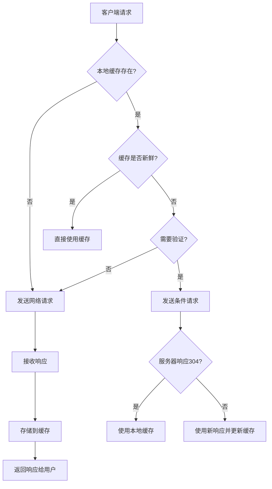

# HTTP 缓存策略详解

HTTP 缓存是 Web 性能优化的核心技术之一，通过合理的缓存策略可以显著减少网络请求、降低服务器负载、提升用户体验。本文将深入解析 HTTP 缓存的工作原理和最佳实践。

## 💾 HTTP 缓存基础

### 缓存的工作流程



### 缓存的层级结构

```
缓存层级（由近到远）:
┌─────────────────┐
│   浏览器缓存     │ ← 最快，容量小
├─────────────────┤
│   代理缓存      │ ← 企业/ISP 代理
├─────────────────┤
│   CDN 缓存      │ ← 边缘节点
├─────────────────┤
│   反向代理缓存   │ ← 服务器前端
├─────────────────┤
│   应用缓存      │ ← 应用层缓存
├─────────────────┤
│   数据库缓存     │ ← 数据层缓存
└─────────────────┘
```

## 🚀 强缓存机制

### Cache-Control 指令详解

#### 基础指令
```http
# 私有缓存，最大缓存时间 1 小时
Cache-Control: private, max-age=3600

# 公共缓存，最大缓存时间 1 天
Cache-Control: public, max-age=86400

# 禁止缓存
Cache-Control: no-cache, no-store, must-revalidate

# 允许过期缓存，但需要重新验证
Cache-Control: max-age=3600, must-revalidate
```

#### 高级指令详解

| 指令 | 描述 | 使用场景 |
|------|------|----------|
| **max-age** | 缓存最大有效期（秒） | 静态资源版本控制 |
| **s-maxage** | 共享缓存最大有效期 | CDN 缓存控制 |
| **public** | 允许任何缓存存储 | 静态资源 |
| **private** | 仅允许浏览器缓存 | 用户特定内容 |
| **no-cache** | 必须验证后使用 | 需要实时性的内容 |
| **no-store** | 禁止任何缓存 | 敏感信息 |
| **must-revalidate** | 过期后必须验证 | 重要业务数据 |
| **proxy-revalidate** | 代理过期后必须验证 | 代理缓存控制 |
| **immutable** | 内容不会改变 | 带版本号的静态资源 |

### 实际应用示例

#### 静态资源缓存策略
```javascript
// Express.js 静态资源缓存配置
app.use('/static', express.static('public', {
  maxAge: '1y',  // 1年强缓存
  immutable: true,  // 内容不可变
  setHeaders: (res, path) => {
    if (path.endsWith('.html')) {
      // HTML 文件短缓存
      res.setHeader('Cache-Control', 'public, max-age=300');
    } else if (path.match(/\.(css|js)$/)) {
      // CSS/JS 文件长缓存（带版本号）
      res.setHeader('Cache-Control', 'public, max-age=31536000, immutable');
    } else if (path.match(/\.(jpg|jpeg|png|gif|webp)$/)) {
      // 图片文件中等缓存
      res.setHeader('Cache-Control', 'public, max-age=2592000');
    }
  }
}));

// API 响应缓存策略
app.get('/api/config', (req, res) => {
  // 配置信息短缓存
  res.setHeader('Cache-Control', 'private, max-age=300');
  res.json({ config: getConfig() });
});

app.get('/api/user/profile', requireAuth, (req, res) => {
  // 用户信息私有缓存
  res.setHeader('Cache-Control', 'private, max-age=600');
  res.json({ user: getUserProfile(req.user.id) });
});
```

#### 前端缓存控制
```javascript
// Service Worker 缓存策略
self.addEventListener('fetch', event => {
  const { request } = event;
  const url = new URL(request.url);
  
  // 不同资源的缓存策略
  if (url.pathname.startsWith('/api/')) {
    // API 请求：网络优先，失败时使用缓存
    event.respondWith(networkFirstStrategy(request));
  } else if (url.pathname.match(/\.(css|js|png|jpg)$/)) {
    // 静态资源：缓存优先
    event.respondWith(cacheFirstStrategy(request));
  } else if (url.pathname.endsWith('.html')) {
    // HTML 页面：先尝试网络，快速回退到缓存
    event.respondWith(staleWhileRevalidateStrategy(request));
  }
});

// 缓存优先策略
async function cacheFirstStrategy(request) {
  const cachedResponse = await caches.match(request);
  if (cachedResponse) {
    return cachedResponse;
  }
  
  const networkResponse = await fetch(request);
  const cache = await caches.open('static-v1');
  cache.put(request, networkResponse.clone());
  return networkResponse;
}

// 网络优先策略
async function networkFirstStrategy(request) {
  try {
    const networkResponse = await fetch(request);
    const cache = await caches.open('api-v1');
    cache.put(request, networkResponse.clone());
    return networkResponse;
  } catch (error) {
    const cachedResponse = await caches.match(request);
    return cachedResponse || new Response('Network error', { status: 503 });
  }
}

// 更新时使用缓存策略
async function staleWhileRevalidateStrategy(request) {
  const cache = await caches.open('pages-v1');
  const cachedResponse = await cache.match(request);
  
  const networkResponsePromise = fetch(request).then(response => {
    cache.put(request, response.clone());
    return response;
  }).catch(() => cachedResponse);
  
  return cachedResponse || networkResponsePromise;
}
```

### Expires 头部

```javascript
// 设置绝对过期时间
app.get('/legacy-api', (req, res) => {
  const expiryDate = new Date();
  expiryDate.setDate(expiryDate.getDate() + 1); // 1天后过期
  
  res.setHeader('Expires', expiryDate.toUTCString());
  res.setHeader('Cache-Control', 'max-age=86400'); // Cache-Control 优先级更高
  res.json({ data: 'legacy response' });
});

// 处理时钟偏差问题
function setExpiresHeader(res, seconds) {
  const now = new Date();
  const expiry = new Date(now.getTime() + seconds * 1000);
  
  // 确保过期时间不会因为时钟偏差而立即过期
  res.setHeader('Expires', expiry.toUTCString());
  res.setHeader('Cache-Control', `max-age=${seconds}`);
}
```

## 🔄 协商缓存机制

### ETag 与 If-None-Match

```javascript
// 服务器端 ETag 生成
const crypto = require('crypto');
const fs = require('fs');

class ETaggerMiddleware {
  constructor() {
    this.etagCache = new Map();
  }
  
  generateETag(content) {
    // 强 ETag：基于内容的哈希
    return `"${crypto.createHash('md5').update(content).digest('hex')}"`;
  }
  
  generateWeakETag(stats) {
    // 弱 ETag：基于修改时间和大小
    return `W/"${stats.mtime.getTime().toString(16)}-${stats.size.toString(16)}"`;
  }
  
  middleware() {
    return async (req, res, next) => {
      const originalSend = res.send;
      
      res.send = function(body) {
        if (res.statusCode === 200 && body) {
          const etag = this.generateETag(body);
          res.setHeader('ETag', etag);
          
          // 检查客户端 ETag
          const clientETag = req.headers['if-none-match'];
          if (clientETag === etag) {
            res.status(304).end();
            return;
          }
        }
        
        originalSend.call(this, body);
      }.bind(this);
      
      next();
    };
  }
}

// 文件服务器 ETag 实现
app.get('/file/:filename', async (req, res) => {
  const filename = req.params.filename;
  const filePath = path.join(__dirname, 'files', filename);
  
  try {
    const stats = await fs.promises.stat(filePath);
    const etag = `"${stats.mtime.getTime()}-${stats.size}"`;
    
    res.setHeader('ETag', etag);
    res.setHeader('Cache-Control', 'public, max-age=0, must-revalidate');
    
    // 检查 If-None-Match
    if (req.headers['if-none-match'] === etag) {
      res.status(304).end();
      return;
    }
    
    // 发送文件
    const fileStream = fs.createReadStream(filePath);
    fileStream.pipe(res);
  } catch (error) {
    res.status(404).send('File not found');
  }
});
```

### Last-Modified 与 If-Modified-Since

```javascript
// Last-Modified 缓存实现
app.get('/api/data/:id', async (req, res) => {
  const dataId = req.params.id;
  
  try {
    const data = await getDataFromDatabase(dataId);
    const lastModified = new Date(data.updatedAt);
    
    res.setHeader('Last-Modified', lastModified.toUTCString());
    res.setHeader('Cache-Control', 'public, max-age=0, must-revalidate');
    
    // 检查 If-Modified-Since
    const ifModifiedSince = req.headers['if-modified-since'];
    if (ifModifiedSince) {
      const clientDate = new Date(ifModifiedSince);
      if (lastModified <= clientDate) {
        res.status(304).end();
        return;
      }
    }
    
    res.json(data);
  } catch (error) {
    res.status(500).json({ error: 'Internal server error' });
  }
});

// 结合 ETag 和 Last-Modified
app.get('/api/resource/:id', async (req, res) => {
  const resource = await getResource(req.params.id);
  
  const lastModified = new Date(resource.updatedAt);
  const etag = `"${resource.id}-${resource.version}"`;
  
  res.setHeader('Last-Modified', lastModified.toUTCString());
  res.setHeader('ETag', etag);
  
  // 优先检查 ETag
  const ifNoneMatch = req.headers['if-none-match'];
  const ifModifiedSince = req.headers['if-modified-since'];
  
  if (ifNoneMatch && ifNoneMatch === etag) {
    res.status(304).end();
    return;
  }
  
  if (!ifNoneMatch && ifModifiedSince) {
    const clientDate = new Date(ifModifiedSince);
    if (lastModified <= clientDate) {
      res.status(304).end();
      return;
    }
  }
  
  res.json(resource);
});
```

## 🌐 CDN 缓存策略

### 多层缓存架构

```javascript
// CDN 缓存配置类
class CDNCacheStrategy {
  constructor() {
    this.strategies = {
      static: {
        ttl: 31536000, // 1年
        behavior: 'cache-first',
        purgeOnDeploy: true
      },
      api: {
        ttl: 300, // 5分钟
        behavior: 'cache-with-revalidation',
        varyHeaders: ['Authorization', 'Accept-Language']
      },
      html: {
        ttl: 3600, // 1小时
        behavior: 'stale-while-revalidate',
        edgeIncludes: true
      }
    };
  }
  
  getCacheConfig(path, contentType) {
    if (path.match(/\.(css|js|png|jpg|woff2)$/)) {
      return this.strategies.static;
    } else if (path.startsWith('/api/')) {
      return this.strategies.api;
    } else if (contentType === 'text/html') {
      return this.strategies.html;
    }
    
    return { ttl: 0, behavior: 'no-cache' };
  }
  
  generateCacheKey(request) {
    const url = new URL(request.url);
    const baseKey = `${request.method}:${url.pathname}`;
    
    // 根据 Vary 头部添加变化因子
    const varyFactors = [];
    const config = this.getCacheConfig(url.pathname, request.headers['content-type']);
    
    if (config.varyHeaders) {
      config.varyHeaders.forEach(header => {
        const value = request.headers[header.toLowerCase()];
        if (value) {
          varyFactors.push(`${header}:${value}`);
        }
      });
    }
    
    return varyFactors.length > 0 
      ? `${baseKey}?${varyFactors.join('&')}`
      : baseKey;
  }
}

// Edge Worker 缓存逻辑
class EdgeCacheWorker {
  async handleRequest(request) {
    const cache = caches.default;
    const cacheKey = this.generateCacheKey(request);
    
    // 尝试从边缘缓存获取
    let response = await cache.match(cacheKey);
    
    if (response) {
      const age = this.getCacheAge(response);
      const config = this.getCacheConfig(request);
      
      if (config.behavior === 'stale-while-revalidate' && age > config.ttl / 2) {
        // 后台更新缓存
        this.backgroundRefresh(request, cacheKey);
      }
      
      return response;
    }
    
    // 缓存未命中，获取新内容
    response = await fetch(request);
    
    if (response.ok) {
      // 存储到边缘缓存
      const cacheResponse = response.clone();
      await cache.put(cacheKey, cacheResponse);
    }
    
    return response;
  }
  
  async backgroundRefresh(request, cacheKey) {
    try {
      const response = await fetch(request);
      if (response.ok) {
        const cache = caches.default;
        await cache.put(cacheKey, response);
      }
    } catch (error) {
      console.error('Background refresh failed:', error);
    }
  }
}
```

### 缓存预热策略

```javascript
// 缓存预热实现
class CacheWarmupService {
  constructor() {
    this.warmupQueue = [];
    this.isWarming = false;
  }
  
  async warmupCriticalResources() {
    const criticalUrls = [
      '/',
      '/api/config',
      '/api/user/session',
      '/css/critical.css',
      '/js/app.js'
    ];
    
    console.log('开始预热关键资源...');
    
    await Promise.allSettled(
      criticalUrls.map(url => this.warmupUrl(url))
    );
    
    console.log('关键资源预热完成');
  }
  
  async warmupUrl(url) {
    try {
      const response = await fetch(url, {
        method: 'HEAD', // 只获取头部信息
        cache: 'reload'  // 强制刷新缓存
      });
      
      if (response.ok) {
        console.log(`预热成功: ${url}`);
      } else {
        console.warn(`预热失败: ${url} - ${response.status}`);
      }
    } catch (error) {
      console.error(`预热错误: ${url} - ${error.message}`);
    }
  }
  
  // 智能预热：基于用户行为预测
  async predictiveWarmup(userActions) {
    const predictions = this.analyzePredictions(userActions);
    
    for (const prediction of predictions) {
      if (prediction.confidence > 0.7) {
        this.scheduleWarmup(prediction.url, prediction.priority);
      }
    }
  }
  
  analyzePredictions(userActions) {
    // 基于用户行为分析预测需要的资源
    const patterns = this.identifyPatterns(userActions);
    
    return patterns.map(pattern => ({
      url: pattern.nextUrl,
      confidence: pattern.probability,
      priority: pattern.frequency > 0.8 ? 'high' : 'medium'
    }));
  }
  
  scheduleWarmup(url, priority) {
    const delay = priority === 'high' ? 0 : 5000;
    
    setTimeout(() => {
      this.warmupUrl(url);
    }, delay);
  }
}
```

## 🔧 缓存失效与更新

### 版本化缓存策略

```javascript
// 资源版本管理
class AssetVersionManager {
  constructor() {
    this.manifestPath = './public/manifest.json';
    this.manifest = this.loadManifest();
  }
  
  loadManifest() {
    try {
      return JSON.parse(fs.readFileSync(this.manifestPath, 'utf8'));
    } catch (error) {
      return {};
    }
  }
  
  generateVersionedUrl(originalPath) {
    const hash = this.manifest[originalPath];
    if (hash) {
      const ext = path.extname(originalPath);
      const base = path.basename(originalPath, ext);
      const dir = path.dirname(originalPath);
      return `${dir}/${base}.${hash}${ext}`;
    }
    return originalPath;
  }
  
  // Webpack 插件集成
  generateManifest(compilation) {
    const manifest = {};
    
    for (const [name, asset] of compilation.assets) {
      const content = asset.source();
      const hash = crypto.createHash('md5').update(content).digest('hex').slice(0, 8);
      manifest[name] = hash;
    }
    
    fs.writeFileSync(this.manifestPath, JSON.stringify(manifest, null, 2));
  }
}

// HTML 模板中使用版本化资源
function renderTemplate(templatePath, data) {
  const versionManager = new AssetVersionManager();
  let html = fs.readFileSync(templatePath, 'utf8');
  
  // 替换静态资源路径
  html = html.replace(/\{\{asset:(.+?)\}\}/g, (match, assetPath) => {
    return versionManager.generateVersionedUrl(assetPath);
  });
  
  return html;
}
```

### 缓存清除策略

```javascript
// 缓存清除服务
class CachePurgeService {
  constructor() {
    this.cdnEndpoints = [
      'https://api.cloudflare.com/client/v4',
      'https://api.fastly.com'
    ];
  }
  
  async purgeCache(paths, tags) {
    const purgePromises = [];
    
    // 按路径清除
    if (paths && paths.length > 0) {
      purgePromises.push(this.purgeByPaths(paths));
    }
    
    // 按标签清除
    if (tags && tags.length > 0) {
      purgePromises.push(this.purgeByTags(tags));
    }
    
    const results = await Promise.allSettled(purgePromises);
    return this.aggregateResults(results);
  }
  
  async purgeByPaths(paths) {
    // Cloudflare 清除示例
    const response = await fetch(`${this.cdnEndpoints[0]}/zones/${ZONE_ID}/purge_cache`, {
      method: 'POST',
      headers: {
        'Authorization': `Bearer ${CF_API_TOKEN}`,
        'Content-Type': 'application/json'
      },
      body: JSON.stringify({
        files: paths.map(path => `https://example.com${path}`)
      })
    });
    
    return await response.json();
  }
  
  async purgeByTags(tags) {
    const response = await fetch(`${this.cdnEndpoints[0]}/zones/${ZONE_ID}/purge_cache`, {
      method: 'POST',
      headers: {
        'Authorization': `Bearer ${CF_API_TOKEN}`,
        'Content-Type': 'application/json'
      },
      body: JSON.stringify({
        tags: tags
      })
    });
    
    return await response.json();
  }
  
  // 自动化清除：基于部署事件
  async onDeployment(deploymentInfo) {
    const affectedPaths = this.analyzeAffectedPaths(deploymentInfo);
    const affectedTags = this.analyzeAffectedTags(deploymentInfo);
    
    console.log('开始清除缓存...');
    const result = await this.purgeCache(affectedPaths, affectedTags);
    
    if (result.success) {
      console.log('缓存清除成功');
    } else {
      console.error('缓存清除失败:', result.errors);
    }
  }
  
  analyzeAffectedPaths(deploymentInfo) {
    const paths = [];
    
    // 分析修改的文件
    deploymentInfo.changedFiles.forEach(file => {
      if (file.endsWith('.html')) {
        paths.push(`/${file}`);
      } else if (file.startsWith('api/')) {
        paths.push(`/${file}`);
      }
    });
    
    return paths;
  }
}
```

## 📊 缓存性能监控

### 缓存命中率监控

```javascript
// 缓存性能监控器
class CacheMonitor {
  constructor() {
    this.metrics = {
      hits: 0,
      misses: 0,
      errors: 0,
      totalSize: 0,
      responseTime: []
    };
  }
  
  recordCacheHit(key, size, responseTime) {
    this.metrics.hits++;
    this.metrics.totalSize += size;
    this.metrics.responseTime.push(responseTime);
    
    this.emitMetric('cache.hit', {
      key,
      size,
      responseTime,
      hitRate: this.getHitRate()
    });
  }
  
  recordCacheMiss(key, responseTime) {
    this.metrics.misses++;
    this.metrics.responseTime.push(responseTime);
    
    this.emitMetric('cache.miss', {
      key,
      responseTime,
      hitRate: this.getHitRate()
    });
  }
  
  getHitRate() {
    const total = this.metrics.hits + this.metrics.misses;
    return total > 0 ? (this.metrics.hits / total) * 100 : 0;
  }
  
  getAverageResponseTime() {
    const times = this.metrics.responseTime;
    return times.length > 0 
      ? times.reduce((a, b) => a + b, 0) / times.length 
      : 0;
  }
  
  generateReport() {
    return {
      hitRate: `${this.getHitRate().toFixed(2)}%`,
      totalRequests: this.metrics.hits + this.metrics.misses,
      averageResponseTime: `${this.getAverageResponseTime().toFixed(2)}ms`,
      totalCacheSize: this.formatBytes(this.metrics.totalSize),
      recommendations: this.generateRecommendations()
    };
  }
  
  generateRecommendations() {
    const recommendations = [];
    const hitRate = this.getHitRate();
    
    if (hitRate < 60) {
      recommendations.push('缓存命中率偏低，建议增加缓存时间或优化缓存策略');
    }
    
    if (this.getAverageResponseTime() > 1000) {
      recommendations.push('响应时间较长，建议优化缓存层级或增加缓存预热');
    }
    
    if (this.metrics.totalSize > 100 * 1024 * 1024) { // 100MB
      recommendations.push('缓存占用空间较大，建议实施缓存清理策略');
    }
    
    return recommendations;
  }
  
  formatBytes(bytes) {
    const sizes = ['Bytes', 'KB', 'MB', 'GB'];
    if (bytes === 0) return '0 Bytes';
    const i = Math.floor(Math.log(bytes) / Math.log(1024));
    return `${(bytes / Math.pow(1024, i)).toFixed(2)} ${sizes[i]}`;
  }
}

// Service Worker 中的缓存监控
self.addEventListener('fetch', event => {
  const startTime = performance.now();
  
  event.respondWith(
    caches.match(event.request).then(cachedResponse => {
      const responseTime = performance.now() - startTime;
      
      if (cachedResponse) {
        // 缓存命中
        monitor.recordCacheHit(
          event.request.url, 
          cachedResponse.headers.get('content-length') || 0,
          responseTime
        );
        return cachedResponse;
      }
      
      // 缓存未命中，请求网络
      return fetch(event.request).then(networkResponse => {
        const totalTime = performance.now() - startTime;
        monitor.recordCacheMiss(event.request.url, totalTime);
        
        // 存储到缓存
        const cache = caches.open('dynamic-v1');
        cache.then(c => c.put(event.request, networkResponse.clone()));
        
        return networkResponse;
      });
    })
  );
});
```

## 📱 移动端缓存优化

### 应用缓存 (Application Cache) - 已废弃

```html
<!-- 已废弃，仅供了解 -->
<html manifest="app.manifest">
...
</html>
```

### Service Worker 缓存策略

```javascript
// 移动端优化的 Service Worker
class MobileCacheStrategy {
  constructor() {
    this.cacheNames = {
      core: 'core-v1',      // 核心资源
      pages: 'pages-v1',    // 页面缓存
      api: 'api-v1',        // API 缓存
      images: 'images-v1'   // 图片缓存
    };
  }
  
  async install() {
    // 预缓存核心资源
    const coreCache = await caches.open(this.cacheNames.core);
    return coreCache.addAll([
      '/',
      '/css/app.css',
      '/js/app.js',
      '/icons/icon-192.png'
    ]);
  }
  
  async handleFetch(request) {
    const url = new URL(request.url);
    
    // 核心资源：缓存优先
    if (this.isCoreResource(url.pathname)) {
      return this.cacheFirstStrategy(request, this.cacheNames.core);
    }
    
    // API 请求：网络优先
    if (url.pathname.startsWith('/api/')) {
      return this.networkFirstStrategy(request, this.cacheNames.api);
    }
    
    // 图片：缓存优先，网络回退
    if (this.isImageRequest(request)) {
      return this.cacheFirstWithNetworkFallback(request, this.cacheNames.images);
    }
    
    // 其他页面：更新时使用缓存
    return this.staleWhileRevalidateStrategy(request, this.cacheNames.pages);
  }
  
  async networkFirstStrategy(request, cacheName) {
    const cache = await caches.open(cacheName);
    
    try {
      // 设置超时，移动网络可能不稳定
      const networkResponse = await this.fetchWithTimeout(request, 3000);
      
      // 只缓存成功的响应
      if (networkResponse.ok) {
        cache.put(request, networkResponse.clone());
      }
      
      return networkResponse;
    } catch (error) {
      // 网络失败，尝试缓存
      const cachedResponse = await cache.match(request);
      if (cachedResponse) {
        return cachedResponse;
      }
      
      // 返回离线页面
      return this.getOfflineResponse(request);
    }
  }
  
  async fetchWithTimeout(request, timeout) {
    const controller = new AbortController();
    const timeoutId = setTimeout(() => controller.abort(), timeout);
    
    try {
      const response = await fetch(request, {
        signal: controller.signal
      });
      clearTimeout(timeoutId);
      return response;
    } catch (error) {
      clearTimeout(timeoutId);
      throw error;
    }
  }
  
  getOfflineResponse(request) {
    if (request.headers.get('accept').includes('text/html')) {
      return caches.match('/offline.html');
    }
    
    return new Response('Offline', {
      status: 503,
      statusText: 'Service Unavailable'
    });
  }
}
```

---

💾 **合理的 HTTP 缓存策略是提升 Web 应用性能的关键，需要根据不同资源类型和业务需求制定相应的缓存策略！**
