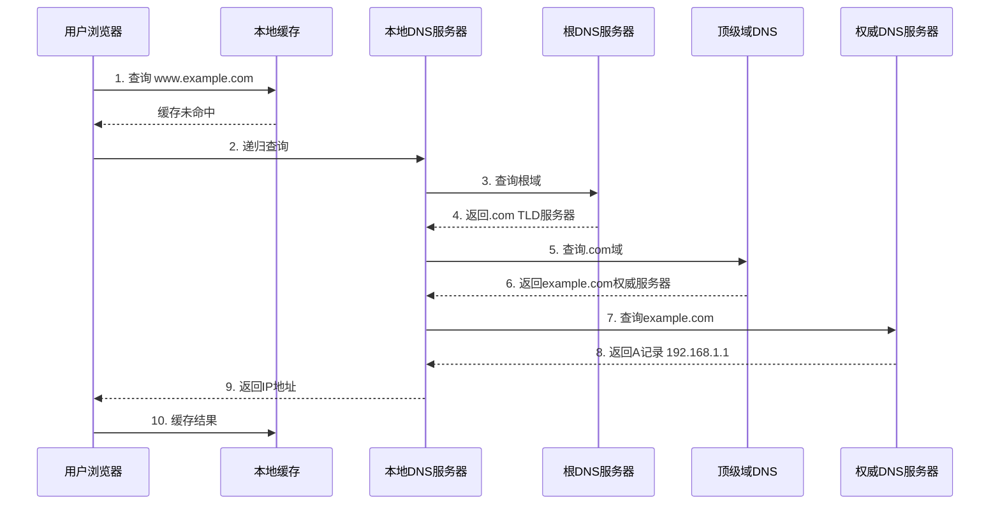

# DNS 域名解析系统详解

DNS（Domain Name System）是互联网的"电话簿"，负责将人类可读的域名转换为 IP 地址。理解 DNS 的工作原理对于网站性能优化和问题排查至关重要。

## 🌍 DNS 基础概念

### DNS 层次结构

```
完整域名解析层次:
.                          (根域)
├── com.                   (顶级域 TLD)
│   ├── example.com.       (二级域)
│   │   ├── www.example.com.     (三级域/主机名)
│   │   ├── api.example.com.
│   │   └── cdn.example.com.
│   └── google.com.
├── org.
├── cn.
│   ├── com.cn.
│   └── edu.cn.
└── ...
```

### DNS 记录类型

| 记录类型 | 描述 | 示例 |
|----------|------|------|
| **A** | IPv4 地址记录 | `example.com → 192.168.1.1` |
| **AAAA** | IPv6 地址记录 | `example.com → 2001:db8::1` |
| **CNAME** | 别名记录 | `www.example.com → example.com` |
| **MX** | 邮件交换记录 | `example.com → mail.example.com` |
| **TXT** | 文本记录 | `SPF, DKIM, 验证记录` |
| **NS** | 名称服务器记录 | `example.com → ns1.nameserver.com` |
| **PTR** | 反向解析记录 | `192.168.1.1 → example.com` |
| **SRV** | 服务记录 | `_sip._tcp.example.com` |
| **CAA** | 证书颁发机构授权 | `example.com → letsencrypt.org` |

## 🔄 DNS 解析过程

### 完整解析流程



### 查询类型详解

#### 递归查询 (Recursive Query)
```javascript
// 客户端发起递归查询
// DNS 服务器负责完整解析过程
async function recursiveQuery(domain) {
  // 客户端只需发送一次请求
  const result = await dnsLookup(domain);
  return result; // 返回最终 IP 地址
}

// 特点：
// - 客户端简单，只发送一次请求
// - DNS 服务器负责所有查询工作
// - 服务器返回最终结果或错误
```

#### 迭代查询 (Iterative Query)
```javascript
// DNS 服务器之间的迭代查询
async function iterativeQuery(domain) {
  let currentServer = getRootServers();
  
  while (true) {
    const response = await queryServer(currentServer, domain);
    
    if (response.type === 'ANSWER') {
      return response.answer;
    } else if (response.type === 'REFERRAL') {
      currentServer = response.nextServer;
    } else {
      throw new Error('DNS 解析失败');
    }
  }
}

// 特点：
// - 每次查询返回下一步信息
// - 需要多次查询才能得到结果
// - 客户端需要处理中间步骤
```

### 缓存机制

#### 浏览器 DNS 缓存
```javascript
// 浏览器缓存策略
class BrowserDNSCache {
  constructor() {
    this.cache = new Map();
    this.defaultTTL = 300; // 5分钟默认 TTL
  }
  
  lookup(domain) {
    const cached = this.cache.get(domain);
    
    if (cached && Date.now() < cached.expiry) {
      console.log('命中浏览器缓存:', domain);
      return Promise.resolve(cached.ip);
    }
    
    // 缓存未命中，发起 DNS 查询
    return this.performLookup(domain);
  }
  
  async performLookup(domain) {
    try {
      // 实际的 DNS 查询
      const result = await fetch(`/api/dns-lookup?domain=${domain}`);
      const data = await result.json();
      
      // 缓存结果
      this.cache.set(domain, {
        ip: data.ip,
        expiry: Date.now() + (data.ttl || this.defaultTTL) * 1000
      });
      
      return data.ip;
    } catch (error) {
      throw new Error(`DNS 解析失败: ${error.message}`);
    }
  }
  
  // 清除缓存
  clearCache() {
    this.cache.clear();
  }
  
  // 预解析
  prefetch(domains) {
    domains.forEach(domain => {
      this.lookup(domain).catch(() => {
        // 预解析失败不影响主流程
      });
    });
  }
}
```

#### 操作系统 DNS 缓存
```bash
# Windows DNS 缓存操作
ipconfig /displaydns    # 显示 DNS 缓存
ipconfig /flushdns      # 清空 DNS 缓存

# macOS DNS 缓存操作
sudo dscacheutil -flushcache  # 清空 DNS 缓存
dscacheutil -q host -a name example.com  # 查询域名

# Linux DNS 缓存操作
sudo systemctl restart systemd-resolved  # 重启 DNS 服务
resolvectl flush-caches  # 清空缓存
```

## 🚀 DNS 性能优化

### DNS 预解析 (DNS Prefetch)

```html
<!-- HTML 预解析指令 -->
<link rel="dns-prefetch" href="//api.example.com">
<link rel="dns-prefetch" href="//cdn.example.com">
<link rel="dns-prefetch" href="//fonts.googleapis.com">
<link rel="dns-prefetch" href="//analytics.google.com">

<!-- 预连接（包含 DNS 解析、TCP 握手、TLS 握手） -->
<link rel="preconnect" href="https://fonts.gstatic.com" crossorigin>
<link rel="preconnect" href="https://api.example.com">
```

```javascript
// JavaScript 动态预解析
function prefetchDNS(domains) {
  domains.forEach(domain => {
    const link = document.createElement('link');
    link.rel = 'dns-prefetch';
    link.href = `//${domain}`;
    document.head.appendChild(link);
  });
}

// 预解析关键域名
prefetchDNS([
  'api.example.com',
  'cdn.example.com',
  'static.example.com'
]);

// 监听用户交互，提前预解析
document.addEventListener('mouseover', (event) => {
  const link = event.target.closest('a[href]');
  if (link) {
    const url = new URL(link.href);
    if (url.hostname !== location.hostname) {
      prefetchDNS([url.hostname]);
    }
  }
});
```

### DNS over HTTPS (DoH)

```javascript
// 使用 DoH 进行安全 DNS 查询
class DoHResolver {
  constructor(resolver = 'https://1.1.1.1/dns-query') {
    this.resolver = resolver;
  }
  
  async resolve(domain, type = 'A') {
    const params = new URLSearchParams({
      name: domain,
      type: type
    });
    
    try {
      const response = await fetch(`${this.resolver}?${params}`, {
        headers: {
          'Accept': 'application/dns-json'
        }
      });
      
      const data = await response.json();
      return this.parseResponse(data);
    } catch (error) {
      throw new Error(`DoH 查询失败: ${error.message}`);
    }
  }
  
  parseResponse(data) {
    if (data.Status !== 0) {
      throw new Error(`DNS 查询错误: ${data.Status}`);
    }
    
    return data.Answer?.map(record => ({
      name: record.name,
      type: record.type,
      data: record.data,
      ttl: record.TTL
    })) || [];
  }
}

// 使用示例
const resolver = new DoHResolver();
const records = await resolver.resolve('example.com', 'A');
console.log('A 记录:', records);
```

### 智能 DNS 解析

```javascript
// 基于地理位置的智能解析
class GeoDNSResolver {
  constructor() {
    this.servers = {
      'us-east': ['1.2.3.4', '1.2.3.5'],
      'us-west': ['2.3.4.5', '2.3.4.6'],
      'eu-west': ['3.4.5.6', '3.4.5.7'],
      'ap-southeast': ['4.5.6.7', '4.5.6.8']
    };
  }
  
  async getOptimalServer(clientIP) {
    // 根据客户端 IP 确定地理位置
    const location = await this.getClientLocation(clientIP);
    
    // 选择最近的服务器
    const region = this.selectRegion(location);
    const servers = this.servers[region];
    
    // 健康检查，选择最佳服务器
    return await this.selectBestServer(servers);
  }
  
  async getClientLocation(ip) {
    try {
      const response = await fetch(`/api/geoip/${ip}`);
      return await response.json();
    } catch (error) {
      return { country: 'US', region: 'us-east' }; // 默认值
    }
  }
  
  selectRegion(location) {
    const regionMap = {
      'US': 'us-east',
      'CA': 'us-east',
      'GB': 'eu-west',
      'DE': 'eu-west',
      'CN': 'ap-southeast',
      'JP': 'ap-southeast'
    };
    
    return regionMap[location.country] || 'us-east';
  }
  
  async selectBestServer(servers) {
    const healthChecks = servers.map(async (server) => {
      const start = performance.now();
      try {
        await fetch(`http://${server}/health`, { 
          mode: 'no-cors',
          timeout: 2000 
        });
        const latency = performance.now() - start;
        return { server, latency, healthy: true };
      } catch (error) {
        return { server, latency: Infinity, healthy: false };
      }
    });
    
    const results = await Promise.all(healthChecks);
    const healthyServers = results.filter(r => r.healthy);
    
    if (healthyServers.length === 0) {
      throw new Error('所有服务器都不可用');
    }
    
    // 选择延迟最低的服务器
    return healthyServers.reduce((best, current) => 
      current.latency < best.latency ? current : best
    ).server;
  }
}
```

### CDN 与 DNS

```javascript
// CDN 智能调度
class CDNScheduler {
  constructor() {
    this.cdnNodes = [
      { id: 'us-east-1', endpoint: 'us-e1.cdn.example.com', location: 'Virginia' },
      { id: 'us-west-1', endpoint: 'us-w1.cdn.example.com', location: 'California' },
      { id: 'eu-west-1', endpoint: 'eu-w1.cdn.example.com', location: 'Ireland' },
      { id: 'ap-southeast-1', endpoint: 'ap-se1.cdn.example.com', location: 'Singapore' }
    ];
  }
  
  async selectOptimalNode(userLocation) {
    // 获取各节点的实时状态
    const nodeStatus = await Promise.all(
      this.cdnNodes.map(node => this.checkNodeStatus(node))
    );
    
    // 计算最优节点
    const scoredNodes = nodeStatus.map(node => ({
      ...node,
      score: this.calculateScore(node, userLocation)
    }));
    
    // 选择分数最高的节点
    const bestNode = scoredNodes.reduce((best, current) => 
      current.score > best.score ? current : best
    );
    
    return bestNode.endpoint;
  }
  
  async checkNodeStatus(node) {
    try {
      const start = performance.now();
      const response = await fetch(`https://${node.endpoint}/status`);
      const status = await response.json();
      const latency = performance.now() - start;
      
      return {
        ...node,
        latency,
        load: status.load,
        available: true
      };
    } catch (error) {
      return {
        ...node,
        latency: Infinity,
        load: 100,
        available: false
      };
    }
  }
  
  calculateScore(node, userLocation) {
    if (!node.available) return 0;
    
    // 考虑延迟、负载、地理距离
    const latencyScore = Math.max(0, 100 - node.latency);
    const loadScore = Math.max(0, 100 - node.load);
    const distanceScore = this.calculateDistanceScore(node, userLocation);
    
    return (latencyScore * 0.4) + (loadScore * 0.3) + (distanceScore * 0.3);
  }
  
  calculateDistanceScore(node, userLocation) {
    // 简化的地理距离计算
    const distances = {
      'Virginia': { 'US': 90, 'EU': 30, 'AS': 10 },
      'California': { 'US': 80, 'EU': 20, 'AS': 40 },
      'Ireland': { 'US': 30, 'EU': 90, 'AS': 20 },
      'Singapore': { 'US': 20, 'EU': 30, 'AS': 90 }
    };
    
    return distances[node.location]?.[userLocation.region] || 50;
  }
}
```

## 🔧 DNS 调试工具

### 命令行工具

```bash
# nslookup - 基础 DNS 查询
nslookup example.com
nslookup example.com 8.8.8.8  # 指定 DNS 服务器

# dig - 高级 DNS 查询工具
dig example.com                # 查询 A 记录
dig example.com MX             # 查询 MX 记录
dig example.com ANY            # 查询所有记录
dig @8.8.8.8 example.com       # 指定 DNS 服务器
dig +trace example.com         # 跟踪解析过程
dig +short example.com         # 简短输出
dig -x 192.168.1.1             # 反向解析

# host - 简单的 DNS 查询
host example.com
host -t MX example.com         # 查询特定记录类型
host -a example.com            # 查询所有记录
```

### JavaScript DNS 调试

```javascript
// 浏览器中的 DNS 调试工具
class DNSDebugger {
  constructor() {
    this.results = [];
  }
  
  async diagnose(domain) {
    console.log(`开始诊断域名: ${domain}`);
    
    const tests = [
      this.testBasicResolution(domain),
      this.testDNSServers(domain),
      this.testRecordTypes(domain),
      this.testCacheStatus(domain),
      this.testLoadTime(domain)
    ];
    
    const results = await Promise.allSettled(tests);
    
    return this.generateReport(domain, results);
  }
  
  async testBasicResolution(domain) {
    const start = performance.now();
    try {
      // 模拟基础解析测试
      const response = await fetch(`https://${domain}`, { 
        mode: 'no-cors',
        signal: AbortSignal.timeout(5000)
      });
      const duration = performance.now() - start;
      
      return {
        test: '基础解析',
        status: 'success',
        duration: `${duration.toFixed(2)}ms`,
        message: '域名解析正常'
      };
    } catch (error) {
      return {
        test: '基础解析',
        status: 'error',
        duration: `${(performance.now() - start).toFixed(2)}ms`,
        message: `解析失败: ${error.message}`
      };
    }
  }
  
  async testDNSServers(domain) {
    const dnsServers = [
      { name: 'Cloudflare', ip: '1.1.1.1' },
      { name: 'Google', ip: '8.8.8.8' },
      { name: 'OpenDNS', ip: '208.67.222.222' }
    ];
    
    const results = await Promise.all(
      dnsServers.map(async (server) => {
        try {
          // 使用不同 DNS 服务器查询
          const result = await this.queryDNSServer(domain, server.ip);
          return {
            server: server.name,
            status: 'success',
            result: result
          };
        } catch (error) {
          return {
            server: server.name,
            status: 'error',
            error: error.message
          };
        }
      })
    );
    
    return {
      test: 'DNS 服务器测试',
      results: results
    };
  }
  
  async testRecordTypes(domain) {
    const recordTypes = ['A', 'AAAA', 'CNAME', 'MX', 'TXT', 'NS'];
    
    const results = await Promise.all(
      recordTypes.map(async (type) => {
        try {
          const records = await this.queryRecordType(domain, type);
          return {
            type: type,
            status: records.length > 0 ? 'found' : 'not_found',
            count: records.length,
            records: records.slice(0, 3) // 只显示前3条
          };
        } catch (error) {
          return {
            type: type,
            status: 'error',
            error: error.message
          };
        }
      })
    );
    
    return {
      test: '记录类型检查',
      results: results
    };
  }
  
  async testCacheStatus(domain) {
    // 检查各级缓存状态
    const cacheTests = [
      { level: '浏览器缓存', method: this.checkBrowserCache },
      { level: '本地DNS缓存', method: this.checkLocalDNSCache },
      { level: 'CDN缓存', method: this.checkCDNCache }
    ];
    
    const results = await Promise.all(
      cacheTests.map(async (test) => {
        try {
          const result = await test.method.call(this, domain);
          return {
            level: test.level,
            status: result.cached ? 'cached' : 'not_cached',
            ttl: result.ttl
          };
        } catch (error) {
          return {
            level: test.level,
            status: 'error',
            error: error.message
          };
        }
      })
    );
    
    return {
      test: '缓存状态检查',
      results: results
    };
  }
  
  async testLoadTime(domain) {
    const iterations = 5;
    const times = [];
    
    for (let i = 0; i < iterations; i++) {
      const start = performance.now();
      try {
        await fetch(`https://${domain}`, { 
          mode: 'no-cors',
          cache: 'no-store'
        });
        times.push(performance.now() - start);
      } catch (error) {
        times.push(null);
      }
      
      // 等待一段时间再进行下次测试
      await new Promise(resolve => setTimeout(resolve, 1000));
    }
    
    const validTimes = times.filter(t => t !== null);
    const average = validTimes.reduce((a, b) => a + b, 0) / validTimes.length;
    const min = Math.min(...validTimes);
    const max = Math.max(...validTimes);
    
    return {
      test: '加载时间测试',
      iterations: iterations,
      success: validTimes.length,
      average: `${average.toFixed(2)}ms`,
      min: `${min.toFixed(2)}ms`,
      max: `${max.toFixed(2)}ms`,
      times: validTimes
    };
  }
  
  generateReport(domain, results) {
    return {
      domain: domain,
      timestamp: new Date().toISOString(),
      summary: this.generateSummary(results),
      details: results,
      recommendations: this.generateRecommendations(results)
    };
  }
  
  generateSummary(results) {
    const successful = results.filter(r => r.status === 'fulfilled').length;
    const total = results.length;
    const successRate = (successful / total * 100).toFixed(1);
    
    return {
      totalTests: total,
      successful: successful,
      successRate: `${successRate}%`,
      overallStatus: successRate > 80 ? 'good' : successRate > 50 ? 'warning' : 'error'
    };
  }
  
  generateRecommendations(results) {
    const recommendations = [];
    
    // 基于测试结果生成建议
    results.forEach(result => {
      if (result.status === 'rejected' || 
          (result.value && result.value.status === 'error')) {
        recommendations.push({
          type: 'error',
          message: '发现DNS解析问题，建议检查域名配置'
        });
      }
    });
    
    if (recommendations.length === 0) {
      recommendations.push({
        type: 'success',
        message: 'DNS 配置正常，无需优化'
      });
    }
    
    return recommendations;
  }
}

// 使用示例
const debugger = new DNSDebugger();
const report = await debugger.diagnose('example.com');
console.log('DNS 诊断报告:', report);
```

## 🛡️ DNS 安全

### DNS 劫持防护

```javascript
// DNS 劫持检测
class DNSHijackDetector {
  constructor() {
    this.trustedServers = ['1.1.1.1', '8.8.8.8', '9.9.9.9'];
    this.knownDomains = {
      'google.com': ['172.217.0.0/16'],
      'facebook.com': ['157.240.0.0/16'],
      'twitter.com': ['104.244.42.0/24']
    };
  }
  
  async detectHijacking(domain) {
    const results = await Promise.all(
      this.trustedServers.map(server => 
        this.queryTrustedServer(domain, server)
      )
    );
    
    // 检查结果一致性
    const uniqueIPs = new Set(results.map(r => r.ip));
    
    if (uniqueIPs.size > 1) {
      return {
        hijacked: true,
        evidence: results,
        message: '不同 DNS 服务器返回了不同的 IP 地址'
      };
    }
    
    // 检查 IP 是否在已知范围内
    const ip = results[0].ip;
    const expectedRanges = this.knownDomains[domain];
    
    if (expectedRanges && !this.isIPInRanges(ip, expectedRanges)) {
      return {
        hijacked: true,
        evidence: { domain, ip, expectedRanges },
        message: 'IP 地址不在预期范围内'
      };
    }
    
    return {
      hijacked: false,
      message: 'DNS 解析正常'
    };
  }
  
  isIPInRanges(ip, ranges) {
    // 简化的 IP 范围检查
    return ranges.some(range => {
      // 实际应用中需要更完善的 CIDR 检查
      const [network, prefix] = range.split('/');
      return ip.startsWith(network.split('.').slice(0, parseInt(prefix) / 8).join('.'));
    });
  }
}
```

### DNSSEC 验证

```javascript
// DNSSEC 签名验证
class DNSSECValidator {
  async validateDomain(domain) {
    try {
      // 获取 DNSSEC 记录
      const dnsKeyRecord = await this.getDNSKEYRecord(domain);
      const rrsigRecord = await this.getRRSIGRecord(domain);
      
      // 验证签名
      const isValid = await this.verifySignature(
        dnsKeyRecord, 
        rrsigRecord
      );
      
      return {
        domain: domain,
        dnssecEnabled: true,
        signatureValid: isValid,
        keyTag: dnsKeyRecord.keyTag,
        algorithm: dnsKeyRecord.algorithm
      };
    } catch (error) {
      return {
        domain: domain,
        dnssecEnabled: false,
        error: error.message
      };
    }
  }
  
  async getDNSKEYRecord(domain) {
    // 查询 DNSKEY 记录
    const response = await this.queryDNS(domain, 'DNSKEY');
    return this.parseDNSKEYRecord(response);
  }
  
  async getRRSIGRecord(domain) {
    // 查询 RRSIG 记录
    const response = await this.queryDNS(domain, 'RRSIG');
    return this.parseRRSIGRecord(response);
  }
  
  async verifySignature(dnsKey, rrsig) {
    // 实际的 DNSSEC 签名验证
    // 这里需要加密库支持
    try {
      const publicKey = this.extractPublicKey(dnsKey);
      const signature = this.extractSignature(rrsig);
      const data = this.prepareSignedData(rrsig);
      
      return await crypto.subtle.verify(
        { name: 'RSASSA-PKCS1-v1_5' },
        publicKey,
        signature,
        data
      );
    } catch (error) {
      console.error('DNSSEC 验证失败:', error);
      return false;
    }
  }
}
```

---

🌍 **DNS 是互联网基础设施的核心组件，优化 DNS 解析能显著提升网站性能和用户体验！**
