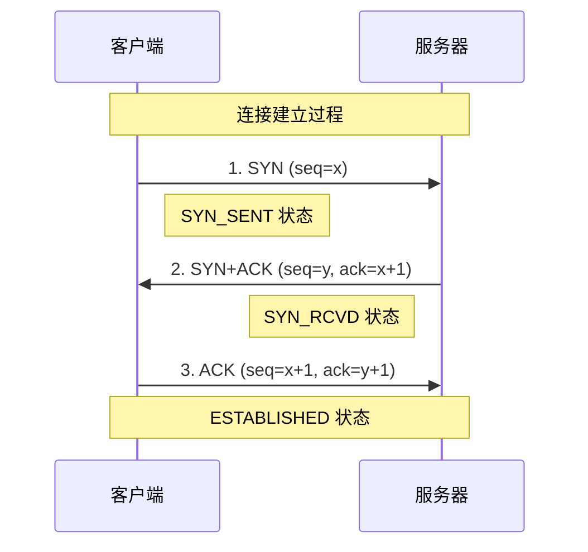
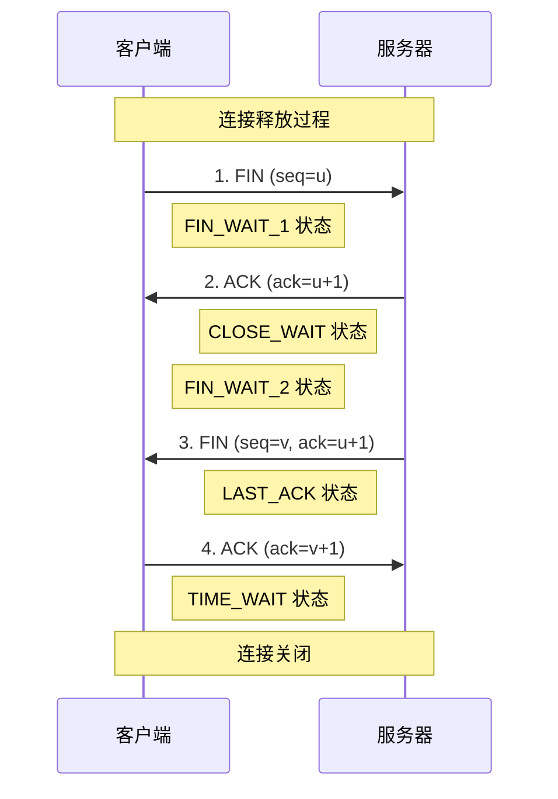

# TCP/UDP 传输层协议对比

传输层协议是网络通信的核心，TCP 和 UDP 两种协议各有特点和应用场景。深入理解它们的工作原理对于前端网络编程和性能优化至关重要。

## 🔄 TCP 协议详解

### TCP 核心特性

| 特性         | 描述           | 实现方式           |
| ------------ | -------------- | ------------------ |
| **面向连接** | 通信前建立连接 | 三次握手           |
| **可靠传输** | 保证数据完整性 | 确认应答、重传机制 |
| **有序传输** | 数据按序到达   | 序列号排序         |
| **流量控制** | 控制发送速度   | 滑动窗口           |
| **拥塞控制** | 网络拥塞处理   | 慢启动、拥塞避免   |

### TCP 三次握手



**握手过程详解**

1. **第一次握手 (SYN)**

   ```
   客户端发送: SYN=1, seq=x
   含义: 请求建立连接，初始序列号为 x
   ```

2. **第二次握手 (SYN+ACK)**

   ```
   服务器发送: SYN=1, ACK=1, seq=y, ack=x+1
   含义: 同意连接，确认客户端序列号，发送自己的序列号
   ```

3. **第三次握手 (ACK)**
   ```
   客户端发送: ACK=1, seq=x+1, ack=y+1
   含义: 确认服务器序列号，连接建立完成
   ```

**为什么需要三次握手？**

```javascript
// 防止失效连接请求突然又传送到服务器
// 场景：客户端发送连接请求，网络延迟导致重复发送
// 如果只有两次握手，服务器可能会建立多个无效连接
```

### TCP 四次挥手



**挥手过程详解**

1. **第一次挥手 (FIN)**

   ```
   客户端: FIN=1, seq=u
   含义: 数据发送完毕，请求关闭连接
   ```

2. **第二次挥手 (ACK)**

   ```
   服务器: ACK=1, ack=u+1
   含义: 确认关闭请求，但可能还有数据要发送
   ```

3. **第三次挥手 (FIN)**

   ```
   服务器: FIN=1, seq=v, ack=u+1
   含义: 数据发送完毕，同意关闭连接
   ```

4. **第四次挥手 (ACK)**
   ```
   客户端: ACK=1, ack=v+1
   含义: 确认关闭，进入 TIME_WAIT 状态
   ```

### TCP 可靠传输机制

#### 序列号与确认应答

```
发送数据: [seq=1000, 数据长度=100]
接收确认: [ack=1100] (期望下一个字节的序列号)

数据分片示例:
片段1: seq=1000, len=500  → ack=1500
片段2: seq=1500, len=300  → ack=1800
片段3: seq=1800, len=200  → ack=2000
```

#### 超时重传机制

```javascript
// 重传定时器算法
RTT = (1-α) × RTT + α × 新RTT样本
RTO = RTT + 4 × RTTVAR

// 指数退避
第1次重传: RTO
第2次重传: 2 × RTO
第3次重传: 4 × RTO
```

#### 快速重传

```
发送序列: 1, 2, 3, 4, 5, 6
接收序列: 1, 3, 4, 5, 6 (丢失了2)
ACK响应:   1, 1, 1, 1, 1 (重复ACK)

当收到3个重复ACK时，立即重传丢失的数据段
```

### TCP 流量控制

#### 滑动窗口机制

```
发送窗口:
┌─────────────┬─────────────┬─────────────┬─────────────┐
│ 已发送已确认 │ 已发送未确认 │   可以发送   │   不能发送   │
└─────────────┴─────────────┴─────────────┴─────────────┘
              ↑                          ↑
           发送窗口左边界              发送窗口右边界

接收窗口:
┌─────────────┬─────────────┬─────────────┬─────────────┐
│ 已接收已确认 │   可以接收   │   不能接收   │     ···     │
└─────────────┴─────────────┴─────────────┴─────────────┘
              ↑                          ↑
           接收窗口左边界              接收窗口右边界
```

#### 窗口大小调整

```javascript
// 零窗口问题
if (接收缓冲区满) {
  window_size = 0; // 通告窗口为0
  // 发送方停止发送数据
}

// 窗口更新
if (接收缓冲区有空间) {
  window_size = 可用缓冲区大小;
  // 发送窗口更新报文
}
```

### TCP 拥塞控制

#### 慢启动算法

```javascript
// 拥塞窗口初始化
cwnd = 1 MSS;  // 最大报文段长度

// 每收到一个ACK，窗口指数增长
for (每个ACK) {
  cwnd += 1 MSS;
}

// 增长过程: 1 → 2 → 4 → 8 → 16 → ...
```

#### 拥塞避免算法

```javascript
// 达到慢启动阈值后
if (cwnd >= ssthresh) {
  // 线性增长
  cwnd += (1 MSS / cwnd) 每个RTT;
}

// 增长过程: 16 → 17 → 18 → 19 → ...
```

#### 快重传与快恢复

```javascript
// 检测到丢包
if (收到3个重复ACK) {
  ssthresh = cwnd / 2; // 阈值减半
  cwnd = ssthresh + 3; // 快恢复
  // 重传丢失的数据段
}

// 收到新的ACK
cwnd = ssthresh; // 进入拥塞避免
```

## ⚡ UDP 协议详解

### UDP 核心特性

| 特性         | 描述           | 优势     |
| ------------ | -------------- | -------- |
| **无连接**   | 无需建立连接   | 低延迟   |
| **不可靠**   | 不保证数据到达 | 低开销   |
| **无序**     | 数据可能乱序   | 简单高效 |
| **轻量级**   | 头部开销小     | 高性能   |
| **支持多播** | 一对多通信     | 广播能力 |

### UDP 报文格式

```
UDP 头部 (8字节):
┌────────────────┬────────────────┐
│   源端口号      │   目标端口号    │ (各2字节)
├────────────────┼────────────────┤
│   UDP长度      │    校验和      │ (各2字节)
├────────────────┴────────────────┤
│             数据部分             │
└─────────────────────────────────┘

对比 TCP 头部: 20-60字节
```

### UDP 应用场景

#### 实时通信应用

```javascript
// WebRTC 数据通道 (基于UDP)
const dataChannel = peerConnection.createDataChannel("gameData", {
  ordered: false, // 允许乱序
  maxRetransmits: 0, // 不重传
});

// 游戏状态同步
dataChannel.send(
  JSON.stringify({
    type: "playerPosition",
    x: player.x,
    y: player.y,
    timestamp: Date.now(),
  })
);
```

#### DNS 查询

```javascript
// DNS 查询通常使用 UDP
// 查询时间短，重试成本低
dig example.com @8.8.8.8

// 如果 UDP 包太大，自动切换到 TCP
// EDNS 扩展允许更大的 UDP 包
```

#### 实时音视频传输

```javascript
// WebRTC 音视频传输
const stream = await navigator.mediaDevices.getUserMedia({
  video: true,
  audio: true,
});

// 使用 UDP 传输，允许少量丢包
// 在网络不稳定时会自动降低质量
```

#### 简单的请求响应

```javascript
// DHCP 协议 (基于UDP)
// 客户端广播请求IP地址
// 服务器响应可用IP配置

// SNMP 网络管理 (基于UDP)
// 网络设备状态查询
// 快速响应，简单协议
```

## 🔍 TCP vs UDP 详细对比

### 性能对比

| 指标         | TCP                 | UDP             | 说明               |
| ------------ | ------------------- | --------------- | ------------------ |
| **连接开销** | 高 (3 次握手)       | 无              | UDP 可立即发送数据 |
| **传输开销** | 高 (20-60 字节头部) | 低 (8 字节头部) | UDP 头部更小       |
| **可靠性**   | 高 (保证送达)       | 低 (可能丢失)   | 取决于应用需求     |
| **延迟**     | 较高                | 低              | UDP 无需等待确认   |
| **吞吐量**   | 中等                | 高              | UDP 无流量控制限制 |

### 使用场景选择

#### 选择 TCP 的场景

```javascript
// 1. Web 应用 (HTTP/HTTPS)
fetch("/api/data"); // 必须保证数据完整性

// 2. 文件传输
const fileTransfer = new XMLHttpRequest();
fileTransfer.upload.onprogress = (e) => {
  // 需要保证文件完整性
};

// 3. 邮件传输 (SMTP)
// 4. 安全的数据传输
// 5. 数据库连接
```

#### 选择 UDP 的场景

```javascript
// 1. 在线游戏
socket.send(gameState); // 丢失一帧可以接受

// 2. 视频流
// 丢失几个视频帧影响不大
const rtcConnection = new RTCPeerConnection();

// 3. DNS 查询
// 查询失败可以重试
const dns = require("dns");
dns.lookup("example.com", callback);

// 4. 实时监控
// 偶尔丢失数据点可以接受
setInterval(() => {
  sendMetrics(getCurrentStats());
}, 1000);
```

### 应用层可靠性保障

#### UDP 上的可靠性实现

```javascript
// 自定义可靠 UDP 协议
class ReliableUDP {
  constructor() {
    this.socket = dgram.createSocket("udp4");
    this.sequenceNumber = 0;
    this.pendingACKs = new Map();
    this.receivedPackets = new Set();
  }

  send(data, address, port) {
    const packet = {
      seq: this.sequenceNumber++,
      data: data,
      timestamp: Date.now(),
    };

    // 发送数据包
    this.socket.send(JSON.stringify(packet), port, address);

    // 设置重传定时器
    const timer = setTimeout(() => {
      if (this.pendingACKs.has(packet.seq)) {
        this.send(data, address, port); // 重传
      }
    }, 1000);

    this.pendingACKs.set(packet.seq, timer);
  }

  onReceive(message) {
    const packet = JSON.parse(message);

    if (!this.receivedPackets.has(packet.seq)) {
      this.receivedPackets.add(packet.seq);
      this.processData(packet.data);
    }

    // 发送 ACK
    this.sendACK(packet.seq);
  }

  onACK(ackSeq) {
    if (this.pendingACKs.has(ackSeq)) {
      clearTimeout(this.pendingACKs.get(ackSeq));
      this.pendingACKs.delete(ackSeq);
    }
  }
}
```

## 🌐 在前端开发中的应用

### WebSocket 中的 TCP

```javascript
// WebSocket 基于 TCP 连接
const socket = new WebSocket("wss://example.com/socket");

socket.onopen = () => {
  console.log("TCP 连接建立");
  // 发送的消息会按顺序到达
  socket.send("message1");
  socket.send("message2");
  socket.send("message3");
};

socket.onmessage = (event) => {
  // 消息按发送顺序接收
  console.log("收到消息:", event.data);
};

// TCP 的可靠性保证了消息的完整性和顺序
```

### WebRTC 中的 UDP

```javascript
// WebRTC 数据通道基于 UDP
const pc = new RTCPeerConnection();
const dataChannel = pc.createDataChannel("data", {
  ordered: false, // 允许消息乱序
  maxRetransmits: 0, // 不重传，降低延迟
});

dataChannel.onopen = () => {
  // 高频率发送游戏状态
  setInterval(() => {
    dataChannel.send(
      JSON.stringify({
        position: player.position,
        timestamp: performance.now(),
      })
    );
  }, 16); // 60 FPS
};

dataChannel.onmessage = (event) => {
  const data = JSON.parse(event.data);
  // 即使丢包也能保持流畅的游戏体验
  updatePlayerPosition(data.position);
};
```

### HTTP/3 中的 UDP (QUIC)

```javascript
// HTTP/3 基于 QUIC (UDP)
// 解决了 TCP 的队头阻塞问题

// 传统 HTTP/2 (TCP) 的问题
fetch("/api/slow-endpoint"); // 慢请求阻塞了
fetch("/api/fast-endpoint"); // 快请求被迫等待

// HTTP/3 (QUIC/UDP) 的优势
// 多个独立的逻辑流，互不阻塞
fetch("/api/slow-endpoint"); // 流 1
fetch("/api/fast-endpoint"); // 流 2，不会被流 1 阻塞
```

## 🔧 网络调试与优化

### TCP 性能调优

#### 连接复用

```javascript
// HTTP/1.1 Keep-Alive
const agent = new https.Agent({
  keepAlive: true,
  keepAliveMsecs: 1000,
  maxSockets: 50,
});

// 复用现有连接，避免重复握手
fetch("/api/data", { agent });
```

#### 窗口大小优化

```bash
# Linux 系统 TCP 窗口优化
echo 'net.core.rmem_max = 16777216' >> /etc/sysctl.conf
echo 'net.core.wmem_max = 16777216' >> /etc/sysctl.conf
echo 'net.ipv4.tcp_rmem = 4096 87380 16777216' >> /etc/sysctl.conf
```

### UDP 优化策略

#### 缓冲区大小

```javascript
// Node.js UDP socket 优化
const socket = dgram.createSocket({
  type: "udp4",
  recvBufferSize: 1024 * 1024, // 1MB 接收缓冲区
  sendBufferSize: 1024 * 1024, // 1MB 发送缓冲区
});
```

#### 数据包大小控制

```javascript
// 避免 IP 分片
const MAX_UDP_SIZE = 1472; // 1500 (MTU) - 20 (IP) - 8 (UDP)

function sendLargeData(data) {
  const chunks = chunkData(data, MAX_UDP_SIZE);
  chunks.forEach((chunk, index) => {
    socket.send(chunk, port, host);
  });
}
```

## 📊 性能监控

### TCP 连接监控

```javascript
// 监控 TCP 连接状态
const perfObserver = new PerformanceObserver((list) => {
  for (const entry of list.getEntries()) {
    if (entry.entryType === "navigation") {
      const tcpTime = entry.connectEnd - entry.connectStart;
      const tlsTime = entry.connectEnd - entry.secureConnectionStart;

      console.log(`TCP 连接时间: ${tcpTime}ms`);
      console.log(`TLS 握手时间: ${tlsTime}ms`);
    }
  }
});

perfObserver.observe({ entryTypes: ["navigation"] });
```

### 网络质量检测

```javascript
// 检测网络质量
class NetworkQualityDetector {
  async detectQuality() {
    const start = performance.now();

    try {
      // 小文件测试延迟
      await fetch("/ping", { cache: "no-store" });
      const latency = performance.now() - start;

      // 大文件测试带宽
      const bandwidthTest = await this.testBandwidth();

      return {
        latency,
        bandwidth: bandwidthTest,
        quality: this.calculateQuality(latency, bandwidthTest),
      };
    } catch (error) {
      return { error: "网络检测失败" };
    }
  }

  calculateQuality(latency, bandwidth) {
    if (latency < 100 && bandwidth > 10) return "excellent";
    if (latency < 300 && bandwidth > 5) return "good";
    if (latency < 1000 && bandwidth > 1) return "fair";
    return "poor";
  }
}
```

---

🔄 **掌握 TCP 和 UDP 的特性与应用场景，是构建高性能网络应用的基础！**
